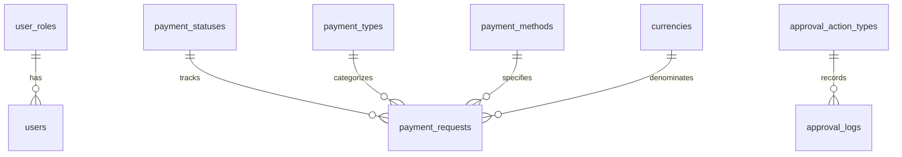
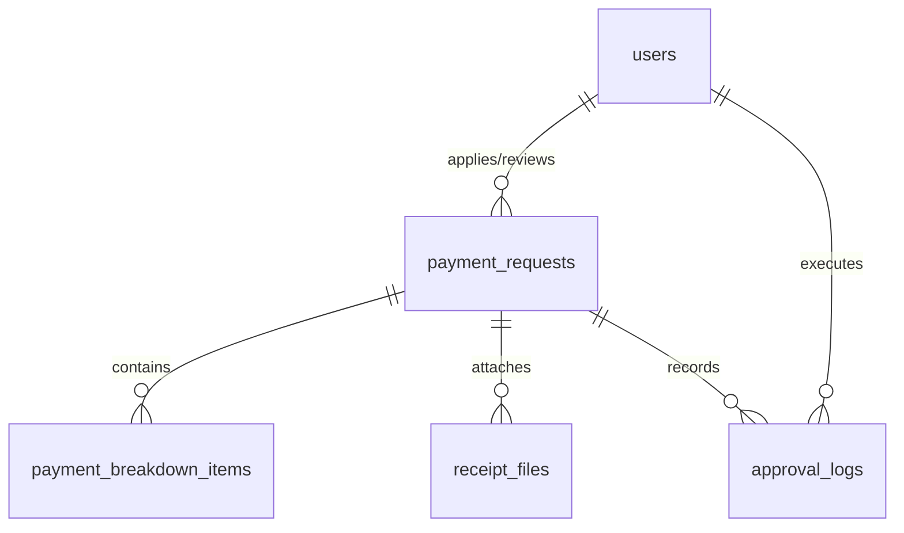

# Database Design Specification

**System:** Payment Request Workflow Management System  
**Phase:** Technical Design  
**Version:** 1.1  
**Date:** 2026-06-11  
**Author:** Lead Database Engineer  
**Status:** Released (Draft for Approval)

---

## Document History

| Version | Date | Author | Changes |
| :--- | :--- | :--- | :--- |
| 1.1 | 2026-06-11 | Lead Database Engineer | Updated schemas for dynamic line manager selection and draft soft-deletion capabilities. (動的ラインマネージャー選択機能および下書き状態における論理削除機能追加に伴うスキーマ改定) |
| 1.0 | 2026-06-10 | Senior Database Architect & Lead Backend Engineer | Initial technical design specification (新規作成) |

---

## 1. Database Overview & Naming Conventions

### 1.1 Database Engine Constraints
* **Primary Database:** PostgreSQL 13+
* **Storage Engine:** PostgreSQL Default Heap Storage with transaction support (InnoDB-equivalent ACID compliant).
* **Isolation Level:** Read Committed (Default, ensures prevention of dirty reads while keeping high concurrency).
* **Encoding:** `UTF8` for multi-language compatibility (including Japanese character inputs for employee names, departments, and breakdown descriptions).
* **Collation:** `C` or `ja_JP.utf8` for localized sorting rules.

### 1.2 Naming Conventions
To ensure consistency across the enterprise, the database adheres to strict snake_case conventions:
* **Tables:** Pluralized, lowercase, separated by underscores (e.g., `payment_requests`, `receipt_files`).
* **Columns:** Lowercase, singular, separated by underscores (e.g., `payment_request_id`, `employee_number`).
* **Primary Keys:** Standardized as `<table_singular>_id` (e.g., `user_id`, `payment_request_id`). Large transaction tables like logs use `BIGINT`.
* **Foreign Keys:** Named as `<referenced_table_singular>_id` (e.g., `role_id` referencing `user_roles`).
* **Indexes:** Prefixed with `idx_` followed by the table name and columns indexed (e.g., `idx_payment_requests_status_id`). Unique indexes use the `uq_` prefix.
* **Constraints:** Prefixed with `chk_` for check constraints, `fk_` for foreign keys, and `pk_` for primary keys.

### 1.3 Timezone & Temporal Configuration
* All datetime columns must use `TIMESTAMP WITH TIME ZONE` (or `TIMESTAMPTZ` in PostgreSQL).
* **Storage Standard:** All timestamps are normalized and stored in **UTC** (Coordinated Universal Time) at the database layer.
* **Application Handling:** The NestJS/TypeORM backend is responsible for receiving and querying dates in UTC, while local time zone conversions (e.g., Japan Standard Time - JST, UTC+9 or Myanmar Time - MMT, UTC+6:30) are performed in the presentation/client layer.
* **Dates without time:** Columns tracking calendar dates without hours/minutes (like expense date and payment request deadline) must use the `DATE` type.

---

## 2. Master / Lookup Tables DDL (Enums Support)

The lookup tables represent the master data that drives workflow states, roles, currency types, and other categorical classifications. These tables are enforced via database-level foreign keys to protect data integrity and avoid orphaned states.



### 2.1 SQL DDL Scripts

```sql
-- =========================================================================
-- 1. USER ROLES LOOKUP TABLE
-- =========================================================================
CREATE TABLE user_roles (
    role_id SERIAL,
    role_code VARCHAR(20) NOT NULL,
    role_name VARCHAR(50) NOT NULL,
    description VARCHAR(500),
    is_active BOOLEAN NOT NULL DEFAULT TRUE,
    created_date TIMESTAMP WITH TIME ZONE NOT NULL DEFAULT CURRENT_TIMESTAMP,
    CONSTRAINT pk_user_roles PRIMARY KEY (role_id),
    CONSTRAINT uq_user_roles_role_code UNIQUE (role_code),
    CONSTRAINT uq_user_roles_role_name UNIQUE (role_name)
);

-- =========================================================================
-- 2. PAYMENT STATUSES LOOKUP TABLE
-- =========================================================================
CREATE TABLE payment_statuses (
    status_id SERIAL,
    status_code VARCHAR(30) NOT NULL,
    status_name VARCHAR(50) NOT NULL,
    display_order INTEGER NOT NULL,
    is_editable_state BOOLEAN NOT NULL DEFAULT FALSE,
    is_terminal_state BOOLEAN NOT NULL DEFAULT FALSE,
    description VARCHAR(500),
    CONSTRAINT pk_payment_statuses PRIMARY KEY (status_id),
    CONSTRAINT uq_payment_statuses_status_code UNIQUE (status_code),
    CONSTRAINT uq_payment_statuses_status_name UNIQUE (status_name)
);

-- =========================================================================
-- 3. PAYMENT TYPES LOOKUP TABLE
-- =========================================================================
CREATE TABLE payment_types (
    payment_type_id SERIAL,
    payment_type_code VARCHAR(30) NOT NULL,
    payment_type_name VARCHAR(100) NOT NULL,
    is_active BOOLEAN NOT NULL DEFAULT TRUE,
    created_date TIMESTAMP WITH TIME ZONE NOT NULL DEFAULT CURRENT_TIMESTAMP,
    CONSTRAINT pk_payment_types PRIMARY KEY (payment_type_id),
    CONSTRAINT uq_payment_types_payment_type_code UNIQUE (payment_type_code),
    CONSTRAINT uq_payment_types_payment_type_name UNIQUE (payment_type_name)
);

-- =========================================================================
-- 4. PAYMENT METHODS LOOKUP TABLE
-- =========================================================================
CREATE TABLE payment_methods (
    payment_method_id SERIAL,
    payment_method_code VARCHAR(20) NOT NULL,
    payment_method_name VARCHAR(50) NOT NULL,
    is_active BOOLEAN NOT NULL DEFAULT TRUE,
    created_date TIMESTAMP WITH TIME ZONE NOT NULL DEFAULT CURRENT_TIMESTAMP,
    CONSTRAINT pk_payment_methods PRIMARY KEY (payment_method_id),
    CONSTRAINT uq_payment_methods_payment_method_code UNIQUE (payment_method_code),
    CONSTRAINT uq_payment_methods_payment_method_name UNIQUE (payment_method_name)
);

-- =========================================================================
-- 5. CURRENCIES LOOKUP TABLE
-- =========================================================================
CREATE TABLE currencies (
    currency_id SERIAL,
    currency_code VARCHAR(3) NOT NULL,
    currency_name VARCHAR(100) NOT NULL,
    is_active BOOLEAN NOT NULL DEFAULT TRUE,
    created_date TIMESTAMP WITH TIME ZONE NOT NULL DEFAULT CURRENT_TIMESTAMP,
    CONSTRAINT pk_currencies PRIMARY KEY (currency_id),
    CONSTRAINT uq_currencies_currency_code UNIQUE (currency_code)
);

-- =========================================================================
-- 6. APPROVAL ACTION TYPES LOOKUP TABLE
-- =========================================================================
CREATE TABLE approval_action_types (
    action_type_id SERIAL,
    action_code VARCHAR(30) NOT NULL,
    action_type VARCHAR(50) NOT NULL,
    description VARCHAR(500),
    CONSTRAINT pk_approval_action_types PRIMARY KEY (action_type_id),
    CONSTRAINT uq_approval_action_types_action_code UNIQUE (action_code),
    CONSTRAINT uq_approval_action_types_action_type UNIQUE (action_type)
);
```

### 2.2 DML Master Seeding Scripts

```sql
-- Seed User Roles
INSERT INTO user_roles (role_code, role_name, description, is_active) VALUES
('APPLICANT', 'Applicant', 'Employee submitting payment requests and managing own drafts', TRUE),
('MANAGER', 'Manager', 'First-level verifier of payment requests', TRUE),
('APPROVER', 'Final Approver', 'Second-level ultimate approver of payment requests', TRUE),
('ACCOUNTING', 'Accounting', 'Finance processing team for approved requests', TRUE),
('ADMIN', 'System Administrator', 'IT system administrator managing users and configurations', TRUE);

-- Seed Payment Statuses (Workflow lifecycle tracking)
INSERT INTO payment_statuses (status_code, status_name, display_order, is_editable_state, is_terminal_state, description) VALUES
('DRAFT', 'Draft', 1, TRUE, FALSE, 'Initial state; applicant is composing the request'),
('SUBMITTED_MANAGER', 'Submitted to Manager', 2, FALSE, FALSE, 'Applicant submitted; awaiting Manager verification'),
('MANAGER_REVIEWING', 'Manager Reviewing', 3, FALSE, FALSE, 'Manager is actively reviewing (triggered on open)'),
('MANAGER_VERIFIED', 'Manager Verified (OK)', 4, FALSE, FALSE, 'Manager verified; awaiting Applicant to submit to Approver'),
('REJECTED_MANAGER', 'Rejected by Manager', 5, TRUE, FALSE, 'Manager rejected request; Applicant can modify and resubmit'),
('SUBMITTED_APPROVER', 'Submitted to Approver', 6, FALSE, FALSE, 'Ready for Final Approver review'),
('APPROVER_REVIEWING', 'Approver Reviewing', 7, FALSE, FALSE, 'Final Approver is actively reviewing (triggered on open)'),
('APPROVED', 'Approved', 8, FALSE, FALSE, 'Final approved; sent to Accounting for payment processing'),
('REJECTED_APPROVER', 'Rejected by Approver', 9, TRUE, FALSE, 'Final Approver rejected; restarts workflow back to Manager'),
('PAID', 'Paid (Completed)', 10, FALSE, TRUE, 'Payment process completed by Accounting; terminal state');

-- Seed Payment Types
INSERT INTO payment_types (payment_type_code, payment_type_name, is_active) VALUES
('EXPENSE_REIMBURSE', 'Expense Reimbursement', TRUE),
('SERVICE_PAYMENT', 'Service Payment', TRUE),
('ADVANCE_PAYMENT', 'Advance Payment', TRUE),
('OTHER', 'Other', TRUE);

-- Seed Payment Methods
INSERT INTO payment_methods (payment_method_code, payment_method_name, is_active) VALUES
('BANK_TRANSFER', 'Bank Transfer', TRUE),
('CASH', 'Cash', TRUE),
('CHECK', 'Check', TRUE);

-- Seed Currencies
INSERT INTO currencies (currency_code, currency_name, is_active) VALUES
('MMK', 'Myanmar Kyat', TRUE),
('USD', 'US Dollar', TRUE),
('JPY', 'Japanese Yen', TRUE),
('THB', 'Thai Baht', TRUE);

-- Seed Approval Action Types (Auditing logs classifications)
INSERT INTO approval_action_types (action_code, action_type, description) VALUES
('CREATED', 'Created', 'Payment request draft initialized'),
('EDITED', 'Edited', 'Draft or rejected request details modified by applicant'),
('SUBMITTED', 'Submitted', 'Request submitted by applicant for review'),
('MGR_REVIEW_START', 'Manager Review Started', 'System changed status to Manager Reviewing upon entry'),
('MGR_VERIFIED', 'Manager Verified', 'Manager completed verification successfully'),
('MGR_REJECTED', 'Manager Rejected', 'Manager rejected request back to applicant'),
('APPR_REVIEW_START', 'Approver Review Started', 'System changed status to Approver Reviewing upon entry'),
('APPROVED', 'Approved', 'Final Approver authorized the payment request'),
('APPR_REJECTED', 'Approver Rejected', 'Final Approver rejected request back to applicant'),
('PAYMENT_COMPLETED', 'Payment Completed', 'Accounting completed bank transfer or cash payout');
```

---

## 3. Core Entity Tables DDL & Structural Integrity

Transactional entities handle user credentials, payment requests, item lists, uploaded receipt files, and history logging. The relationships are designed to prevent orphan records while keeping clear histories.



### 3.1 Users Table (`users` - ユーザーマスタ)
Manages system user information.

#### Data Dictionary
| No (項番) | Logical Name (論理名) | Physical Name (物理名) | Data Type & Length (データ型・桁数) | PK | FK | Nullable (NULL許容) | Default Value (初期値) | Constraints & Remarks (制約・備考) |
|---|---|---|---|---|---|---|---|---|
| 1 | ユーザーID | `user_id` | SERIAL | Y | - | N | - | Primary key. System auto-increment. |
| 2 | メールアドレス | `email` | VARCHAR(255) | - | - | N | - | Unique key (`uq_users_email`). Used as login ID. |
| 3 | パスワードハッシュ | `password_hash` | VARCHAR(512) | - | - | N | - | Encrypted password hash for authentication. |
| 4 | フルネーム | `full_name` | VARCHAR(200) | - | - | N | - | Full name of the user. |
| 5 | 社員番号 | `employee_number` | VARCHAR(20) | - | - | N | - | Unique key (`uq_users_employee_number`). |
| 6 | 部署名 | `department` | VARCHAR(100) | - | - | Y | NULL | Assigned department. |
| 7 | 支店名 | `branch` | VARCHAR(100) | - | - | N | - | Assigned branch. |
| 8 | ロールID | `role_id` | INT | - | Y | N | - | Foreign key (`fk_users_role`). References `user_roles(role_id)`. ON DELETE RESTRICT ON UPDATE CASCADE. |
| 9 | 有効フラグ | `is_active` | BOOLEAN | - | - | N | TRUE | Account active (TRUE) or inactive (FALSE) status. |
| 10 | 作成日時 | `created_date` | TIMESTAMPTZ | - | - | N | CURRENT_TIMESTAMP | Record creation timestamp. |
| 11 | 更新日時 | `modified_date` | TIMESTAMPTZ | - | - | N | CURRENT_TIMESTAMP | Record last modification timestamp. |
| 12 | 最終ログイン日時 | `last_login_date` | TIMESTAMPTZ | - | - | Y | NULL | System timestamp of the user's last login. |

#### Reference SQL DDL
```sql
CREATE TABLE users (
    user_id SERIAL,
    email VARCHAR(255) NOT NULL,
    password_hash VARCHAR(512) NOT NULL,
    full_name VARCHAR(200) NOT NULL,
    employee_number VARCHAR(20) NOT NULL,
    department VARCHAR(100),
    branch VARCHAR(100) NOT NULL,
    role_id INTEGER NOT NULL,
    is_active BOOLEAN NOT NULL DEFAULT TRUE,
    created_date TIMESTAMP WITH TIME ZONE NOT NULL DEFAULT CURRENT_TIMESTAMP,
    modified_date TIMESTAMP WITH TIME ZONE NOT NULL DEFAULT CURRENT_TIMESTAMP,
    last_login_date TIMESTAMP WITH TIME ZONE,
    CONSTRAINT pk_users PRIMARY KEY (user_id),
    CONSTRAINT uq_users_email UNIQUE (email),
    CONSTRAINT uq_users_employee_number UNIQUE (employee_number),
    CONSTRAINT fk_users_role FOREIGN KEY (role_id) 
        REFERENCES user_roles(role_id) 
        ON DELETE RESTRICT 
        ON UPDATE CASCADE
);
```

---

### 3.2 Payment Requests Table (`payment_requests` - 支払申請テーブル)
Manages payment request header information and workflow status.

#### Data Dictionary
| No (項番) | Logical Name (論理名) | Physical Name (物理名) | Data Type & Length (データ型・桁数) | PK | FK | Nullable (NULL許容) | Default Value (初期値) | Constraints & Remarks (制約・備考) |
|---|---|---|---|---|---|---|---|---|
| 1 | 支払申請ID | `payment_request_id` | SERIAL | Y | - | N | - | Primary key. System auto-increment. |
| 2 | 申請番号 | `request_number` | VARCHAR(50) | - | - | N | - | Unique key (`uq_payment_requests_number`). Format constraint: `^PRF-[0-9]{4}-[0-9]{3,6}$` |
| 3 | 申請者ユーザーID | `applicant_user_id` | INT | - | Y | N | - | Foreign key (`fk_payment_requests_applicant`). References `users(user_id)`. ON DELETE RESTRICT ON UPDATE CASCADE. |
| 4 | 承認者マネージャーID | `manager_user_id` | INT | - | Y | Y | NULL | Foreign key (`fk_payment_requests_manager`). References `users(user_id)`. **[New Business Rule]** Dynamically set to the active manager selected by the applicant from the UI dropdown. ON DELETE SET NULL ON UPDATE CASCADE. |
| 5 | 最終承認者ユーザーID | `final_approver_user_id` | INT | - | Y | Y | NULL | Foreign key (`fk_payment_requests_approver`). References `users(user_id)`. ON DELETE SET NULL ON UPDATE CASCADE. |
| 6 | 経理担当ユーザーID | `accounting_user_id` | INT | - | Y | Y | NULL | Foreign key (`fk_payment_requests_accounting`). References `users(user_id)`. ON DELETE SET NULL ON UPDATE CASCADE. |
| 7 | 現在の処理担当者ID | `current_assigned_to_user_id` | INT | - | Y | Y | NULL | Foreign key (`fk_payment_requests_assigned`). References `users(user_id)`. **[New Business Rule]** Dynamically assigned based on current workflow status and manager selections. ON DELETE SET NULL ON UPDATE CASCADE. |
| 8 | 申請日 | `application_date` | DATE | - | - | N | - | Calendar date when the application was submitted. |
| 9 | 希望支払日 | `desired_payment_date` | DATE | - | - | N | - | Calendar deadline for desired payment. |
| 10 | 合計金額 | `total_amount` | NUMERIC(12,2) | - | - | N | - | Check constraint (`chk_payment_requests_total_amount`): `total_amount > 0` |
| 11 | 通貨ID | `currency_id` | INT | - | Y | N | - | Foreign key (`fk_payment_requests_currency`). References `currencies(currency_id)`. ON DELETE RESTRICT ON UPDATE CASCADE. |
| 12 | 支払種別ID | `payment_type_id` | INT | - | Y | N | - | Foreign key (`fk_payment_requests_type`). References `payment_types(payment_type_id)`. ON DELETE RESTRICT ON UPDATE CASCADE. |
| 13 | 支払方法ID | `payment_method_id` | INT | - | Y | N | - | Foreign key (`fk_payment_requests_method`). References `payment_methods(payment_method_id)`. ON DELETE RESTRICT ON UPDATE CASCADE. |
| 14 | 申請目的・用途 | `purpose` | VARCHAR(500) | - | - | N | - | Business purpose and usage of the payment request. |
| 15 | 銀行口座情報 | `bank_account_info` | VARCHAR(200) | - | - | Y | NULL | Bank account information for the transfer. |
| 16 | 申請内容詳細 | `request_content` | TEXT | - | - | N | - | Detailed description content of the request. |
| 17 | 領収書添付有無 | `has_receipt` | BOOLEAN | - | - | N | TRUE | Flag indicating if a receipt file is attached. |
| 18 | ステータスID | `status_id` | INT | - | Y | N | - | Foreign key (`fk_payment_requests_status`). References `payment_statuses(status_id)`. ON DELETE RESTRICT ON UPDATE CASCADE. |
| 19 | マネージャー提出日時 | `submitted_to_manager_date` | TIMESTAMPTZ | - | - | Y | NULL | Timestamp when applicant submitted to manager. |
| 20 | マネージャー確認日時 | `manager_verification_date` | TIMESTAMPTZ | - | - | Y | NULL | Timestamp when manager verified/completed verification. |
| 21 | 最終承認者提出日時 | `submitted_to_approver_date` | TIMESTAMPTZ | - | - | Y | NULL | Timestamp when request was submitted to final approver. |
| 22 | 最終承認日時 | `approval_date` | TIMESTAMPTZ | - | - | Y | NULL | Timestamp when final approver approved. |
| 23 | 支払処理完了日時 | `payment_completed_date` | TIMESTAMPTZ | - | - | Y | NULL | Timestamp when accounting marked payment as completed. |
| 24 | 作成日時 | `created_date` | TIMESTAMPTZ | - | - | N | CURRENT_TIMESTAMP | Record creation timestamp. |
| 25 | 更新日時 | `modified_date` | TIMESTAMPTZ | - | - | N | CURRENT_TIMESTAMP | Record last modification timestamp. |
| 26 | 論理削除フラグ | `is_deleted` | BOOLEAN | - | - | N | FALSE | **[New Business Rule]** Soft delete flag. Can only be mutated to TRUE when status is DRAFT by the Applicant actor. Mutating in other statuses is strictly restricted. |

#### Reference SQL DDL
```sql
CREATE TABLE payment_requests (
    payment_request_id SERIAL,
    request_number VARCHAR(50) NOT NULL,
    applicant_user_id INTEGER NOT NULL,
    manager_user_id INTEGER,
    final_approver_user_id INTEGER,
    accounting_user_id INTEGER,
    current_assigned_to_user_id INTEGER,
    application_date DATE NOT NULL,
    desired_payment_date DATE NOT NULL,
    total_amount NUMERIC(12, 2) NOT NULL,
    currency_id INTEGER NOT NULL,
    payment_type_id INTEGER NOT NULL,
    payment_method_id INTEGER NOT NULL,
    purpose VARCHAR(500) NOT NULL,
    bank_account_info VARCHAR(200),
    request_content TEXT NOT NULL,
    has_receipt BOOLEAN NOT NULL DEFAULT TRUE,
    status_id INTEGER NOT NULL,
    submitted_to_manager_date TIMESTAMP WITH TIME ZONE,
    manager_verification_date TIMESTAMP WITH TIME ZONE,
    submitted_to_approver_date TIMESTAMP WITH TIME ZONE,
    approval_date TIMESTAMP WITH TIME ZONE,
    payment_completed_date TIMESTAMP WITH TIME ZONE,
    created_date TIMESTAMP WITH TIME ZONE NOT NULL DEFAULT CURRENT_TIMESTAMP,
    modified_date TIMESTAMP WITH TIME ZONE NOT NULL DEFAULT CURRENT_TIMESTAMP,
    is_deleted BOOLEAN NOT NULL DEFAULT FALSE,
    
    CONSTRAINT pk_payment_requests PRIMARY KEY (payment_request_id),
    CONSTRAINT uq_payment_requests_number UNIQUE (request_number),
    CONSTRAINT chk_payment_requests_number_format CHECK (request_number ~ '^PRF-[0-9]{4}-[0-9]{3,6}$'),
    CONSTRAINT chk_payment_requests_total_amount CHECK (total_amount > 0),
    
    CONSTRAINT fk_payment_requests_applicant FOREIGN KEY (applicant_user_id)
        REFERENCES users(user_id) ON DELETE RESTRICT ON UPDATE CASCADE,
    CONSTRAINT fk_payment_requests_manager FOREIGN KEY (manager_user_id)
        REFERENCES users(user_id) ON DELETE SET NULL ON UPDATE CASCADE,
    CONSTRAINT fk_payment_requests_approver FOREIGN KEY (final_approver_user_id)
        REFERENCES users(user_id) ON DELETE SET NULL ON UPDATE CASCADE,
    CONSTRAINT fk_payment_requests_accounting FOREIGN KEY (accounting_user_id)
        REFERENCES users(user_id) ON DELETE SET NULL ON UPDATE CASCADE,
    CONSTRAINT fk_payment_requests_assigned FOREIGN KEY (current_assigned_to_user_id)
        REFERENCES users(user_id) ON DELETE SET NULL ON UPDATE CASCADE,
    CONSTRAINT fk_payment_requests_currency FOREIGN KEY (currency_id)
        REFERENCES currencies(currency_id) ON DELETE RESTRICT ON UPDATE CASCADE,
    CONSTRAINT fk_payment_requests_type FOREIGN KEY (payment_type_id)
        REFERENCES payment_types(payment_type_id) ON DELETE RESTRICT ON UPDATE CASCADE,
    CONSTRAINT fk_payment_requests_method FOREIGN KEY (payment_method_id)
        REFERENCES payment_methods(payment_method_id) ON DELETE RESTRICT ON UPDATE CASCADE,
    CONSTRAINT fk_payment_requests_status FOREIGN KEY (status_id)
        REFERENCES payment_statuses(status_id) ON DELETE RESTRICT ON UPDATE CASCADE
);
```

---

### 3.3 Payment Breakdown Items Table (`payment_breakdown_items` - 支払明細テーブル)
Manages individual line-item breakdowns associated with each payment request.

#### Data Dictionary
| No (項番) | Logical Name (論理名) | Physical Name (物理名) | Data Type & Length (データ型・桁数) | PK | FK | Nullable (NULL許容) | Default Value (初期値) | Constraints & Remarks (制約・備考) |
|---|---|---|---|---|---|---|---|---|
| 1 | 支払明細ID | `payment_breakdown_item_id` | SERIAL | Y | - | N | - | Primary key. System auto-increment. |
| 2 | 支払申請ID | `payment_request_id` | INT | - | Y | N | - | Foreign key (`fk_payment_breakdown_items_request`). References `payment_requests(payment_request_id)`. Part of compound unique constraint: `(payment_request_id, line_number)`. ON DELETE CASCADE ON UPDATE CASCADE. |
| 3 | 行番号 | `line_number` | INT | - | - | N | - | Line number sequence. Check constraint (`chk_payment_breakdown_items_line_range`): `line_number >= 1 AND line_number <= 15` (limited to 1-15 items per request). |
| 4 | 利用日 | `item_date` | DATE | - | - | N | - | Calendar date of expense usage or payment occurrence. |
| 5 | 内容説明 | `description` | VARCHAR(200) | - | - | N | - | Detailed description of the line item. |
| 6 | 金額 | `amount` | NUMERIC(10,2) | - | - | N | - | Line item amount. Check constraint: `amount > 0`. |
| 7 | 数量 | `quantity` | NUMERIC(10,2) | - | - | Y | 1.00 | Purchase quantity. Default is 1.00. |
| 8 | 単価 | `unit_price` | NUMERIC(10,2) | - | - | Y | NULL | Unit price of the item or service. |
| 9 | 作成日時 | `created_date` | TIMESTAMPTZ | - | - | N | CURRENT_TIMESTAMP | Record creation timestamp. |
| 10 | 更新日時 | `modified_date` | TIMESTAMPTZ | - | - | N | CURRENT_TIMESTAMP | Record last modification timestamp. |

#### Reference SQL DDL
```sql
CREATE TABLE payment_breakdown_items (
    payment_breakdown_item_id SERIAL,
    payment_request_id INTEGER NOT NULL,
    line_number INTEGER NOT NULL,
    item_date DATE NOT NULL,
    description VARCHAR(200) NOT NULL,
    amount NUMERIC(10, 2) NOT NULL,
    quantity NUMERIC(10, 2) DEFAULT 1.00,
    unit_price NUMERIC(10, 2),
    created_date TIMESTAMP WITH TIME ZONE NOT NULL DEFAULT CURRENT_TIMESTAMP,
    modified_date TIMESTAMP WITH TIME ZONE NOT NULL DEFAULT CURRENT_TIMESTAMP,
    
    CONSTRAINT pk_payment_breakdown_items PRIMARY KEY (payment_breakdown_item_id),
    CONSTRAINT uq_payment_breakdown_items_line UNIQUE (payment_request_id, line_number),
    CONSTRAINT chk_payment_breakdown_items_line_range CHECK (line_number >= 1 AND line_number <= 15),
    CONSTRAINT chk_payment_breakdown_items_amount CHECK (amount > 0),
    CONSTRAINT fk_payment_breakdown_items_request FOREIGN KEY (payment_request_id)
        REFERENCES payment_requests(payment_request_id) ON DELETE CASCADE ON UPDATE CASCADE
);
```

---

### 3.4 Approval Logs Table (`approval_logs` - 承認履歴ログテーブル)
Persists the workflow action and state transition history for payment requests.

#### Data Dictionary
| No (項番) | Logical Name (論理名) | Physical Name (物理名) | Data Type & Length (データ型・桁数) | PK | FK | Nullable (NULL許容) | Default Value (初期値) | Constraints & Remarks (制約・備考) |
|---|---|---|---|---|---|---|---|---|
| 1 | 承認履歴ログID | `approval_log_id` | BIGSERIAL | Y | - | N | - | Primary key. Auto-increment (BIGINT type for high-volume audit logs). |
| 2 | 支払申請ID | `payment_request_id` | INT | - | Y | N | - | Foreign key (`fk_approval_logs_request`). References `payment_requests(payment_request_id)`. ON DELETE CASCADE ON UPDATE CASCADE. |
| 3 | 実行者ユーザーID | `action_taken_by_user_id` | INT | - | Y | N | - | Foreign key (`fk_approval_logs_user`). References `users(user_id)` representing the actor performing the action. ON DELETE RESTRICT ON UPDATE CASCADE. |
| 4 | アクション種別ID | `action_type_id` | INT | - | Y | N | - | Foreign key (`fk_approval_logs_action`). References `approval_action_types(action_type_id)`. ON DELETE RESTRICT ON UPDATE CASCADE. |
| 5 | 前状態ステータスID | `previous_status_id` | INT | - | Y | Y | NULL | Foreign key (`fk_approval_logs_prev_status`). References `payment_statuses(status_id)` (previous status). ON DELETE SET NULL ON UPDATE CASCADE. |
| 6 | 後状態ステータスID | `new_status_id` | INT | - | Y | Y | NULL | Foreign key (`fk_approval_logs_new_status`). References `payment_statuses(status_id)` (new status). ON DELETE SET NULL ON UPDATE CASCADE. |
| 7 | コメント | `comment` | TEXT | - | - | Y | NULL | Optional audit comment (e.g. rejection or send-back reason). |
| 8 | IPアドレス | `ip_address` | VARCHAR(50) | - | - | N | - | IP address of the client device executing the action. |
| 9 | ユーザーエージェント | `user_agent` | VARCHAR(500) | - | - | N | - | Browser User Agent string of the client device. |
| 10 | 実行日時 | `timestamp` | TIMESTAMPTZ | - | - | N | CURRENT_TIMESTAMP | Timestamp when the action was processed. |

* **Immutability Constraint**: This table is append-only. The database-level trigger `trg_approval_logs_immutable` blocks all `UPDATE` and `DELETE` requests to ensure absolute audit protection (minimum 5-year retention requirement).

#### Reference SQL DDL
```sql
CREATE TABLE approval_logs (
    approval_log_id BIGSERIAL,
    payment_request_id INTEGER NOT NULL,
    action_taken_by_user_id INTEGER NOT NULL,
    action_type_id INTEGER NOT NULL,
    previous_status_id INTEGER,
    new_status_id INTEGER,
    comment TEXT,
    ip_address VARCHAR(50) NOT NULL,
    user_agent VARCHAR(500) NOT NULL,
    timestamp TIMESTAMP WITH TIME ZONE NOT NULL DEFAULT CURRENT_TIMESTAMP,
    
    CONSTRAINT pk_approval_logs PRIMARY KEY (approval_log_id),
    CONSTRAINT fk_approval_logs_request FOREIGN KEY (payment_request_id)
        REFERENCES payment_requests(payment_request_id) ON DELETE CASCADE ON UPDATE CASCADE,
    CONSTRAINT fk_approval_logs_user FOREIGN KEY (action_taken_by_user_id)
        REFERENCES users(user_id) ON DELETE RESTRICT ON UPDATE CASCADE,
    CONSTRAINT fk_approval_logs_action FOREIGN KEY (action_type_id)
        REFERENCES approval_action_types(action_type_id) ON DELETE RESTRICT ON UPDATE CASCADE,
    CONSTRAINT fk_approval_logs_prev_status FOREIGN KEY (previous_status_id)
        REFERENCES payment_statuses(status_id) ON DELETE SET NULL ON UPDATE CASCADE,
    CONSTRAINT fk_approval_logs_new_status FOREIGN KEY (new_status_id)
        REFERENCES payment_statuses(status_id) ON DELETE SET NULL ON UPDATE CASCADE
);

-- PL/pgSQL Immutability Protection Trigger
CREATE OR REPLACE FUNCTION protect_approval_logs_immutability()
RETURNS TRIGGER AS $$
BEGIN
    RAISE EXCEPTION 'Table "approval_logs" is immutable. Updates or deletions are strictly prohibited.';
END;
$$ LANGUAGE plpgsql;

CREATE TRIGGER trg_approval_logs_immutable
BEFORE UPDATE OR DELETE ON approval_logs
FOR EACH ROW
EXECUTE FUNCTION protect_approval_logs_immutability();
```

---

### 3.5 Receipt Files Table (`receipt_files` - 領収書ファイルテーブル)
Manages storage association metadata for receipt attachments (images, PDFs) linked to payment requests.

#### Data Dictionary
| No (項番) | Logical Name (論理名) | Physical Name (物理名) | Data Type & Length (データ型・桁数) | PK | FK | Nullable (NULL許容) | Default Value (初期値) | Constraints & Remarks (制約・備考) |
|---|---|---|---|---|---|---|---|---|
| 1 | 領収書ファイルID | `receipt_file_id` | SERIAL | Y | - | N | - | Primary key. System auto-increment. |
| 2 | 支払申請ID | `payment_request_id` | INT | - | Y | N | - | Foreign key (`fk_receipt_files_request`). References `payment_requests(payment_request_id)`. ON DELETE CASCADE ON UPDATE CASCADE. |
| 3 | 元ファイル名 | `original_file_name` | VARCHAR(255) | - | - | N | - | Original filename as uploaded by the user. |
| 4 | 保存ファイル名 | `stored_file_name` | VARCHAR(255) | - | - | N | - | Unique generated filename used on physical storage to avoid collisions. |
| 5 | ファイル格納パス | `file_storage_path` | VARCHAR(500) | - | - | N | - | Directory storage path where the file resides. |
| 6 | ファイルサイズ | `file_size` | BIGINT | - | - | N | - | File size in bytes. Check constraint (`chk_receipt_files_file_size`): `file_size > 0 AND file_size <= 10485760` (Max 10MB). |
| 7 | MIMEタイプ | `mime_type` | VARCHAR(100) | - | - | N | - | MIME type format (e.g. application/pdf, image/png). |
| 8 | アップロードユーザーID | `uploaded_by_user_id` | INT | - | Y | N | - | Foreign key (`fk_receipt_files_uploader`). References `users(user_id)` (uploader). ON DELETE RESTRICT ON UPDATE CASCADE. |
| 9 | アップロード日時 | `uploaded_date` | TIMESTAMPTZ | - | - | N | CURRENT_TIMESTAMP | Timestamp when file upload was processed. |
| 10 | 論理削除フラグ | `is_deleted` | BOOLEAN | - | - | N | FALSE | Soft delete flag indicating if the attachment has been deactivated. |

#### Reference SQL DDL
```sql
CREATE TABLE receipt_files (
    receipt_file_id SERIAL,
    payment_request_id INTEGER NOT NULL,
    original_file_name VARCHAR(255) NOT NULL,
    stored_file_name VARCHAR(255) NOT NULL,
    file_storage_path VARCHAR(500) NOT NULL,
    file_size BIGINT NOT NULL,
    mime_type VARCHAR(100) NOT NULL,
    uploaded_by_user_id INTEGER NOT NULL,
    uploaded_date TIMESTAMP WITH TIME ZONE NOT NULL DEFAULT CURRENT_TIMESTAMP,
    is_deleted BOOLEAN NOT NULL DEFAULT FALSE,
    
    CONSTRAINT pk_receipt_files PRIMARY KEY (receipt_file_id),
    CONSTRAINT chk_receipt_files_file_size CHECK (file_size > 0 AND file_size <= 10485760),
    CONSTRAINT fk_receipt_files_request FOREIGN KEY (payment_request_id)
        REFERENCES payment_requests(payment_request_id) ON DELETE CASCADE ON UPDATE CASCADE,
    CONSTRAINT fk_receipt_files_uploader FOREIGN KEY (uploaded_by_user_id)
        REFERENCES users(user_id) ON DELETE RESTRICT ON UPDATE CASCADE
);
```

---

## 4. Performance Optimization Layer (Indexes)

To satisfy non-functional requirement **NFR-004** (sub-second query response speeds) and optimize lookup times under concurrent access, we define specific B-Tree index structures.

### 4.1 Index Mapping Matrix

| No | Index Physical Name | Target Table | Key Columns | Target Optimization Purpose |
|---|---|---|---|---|
| 1 | `idx_users_email` | `users` | `email` | Optimizes email lookups during login and uniqueness validations. |
| 2 | `idx_users_employee_number` | `users` | `employee_number` | Optimizes employee identity matching. |
| 3 | `idx_users_role_id` | `users` | `role_id` | Optimizes user role joining and permission sorting. |
| 4 | `idx_users_branch` | `users` | `branch` | Optimizes lookup grouping by physical corporate branch location. |
| 5 | `idx_users_is_active` | `users` | `is_active` | Speeds up lookups filtering active users. |
| 6 | `idx_payment_requests_applicant_id` | `payment_requests` | `applicant_user_id` | Speeds up dashboard queries displaying requests made by the current user. |
| 7 | `idx_payment_requests_manager_id` | `payment_requests` | `manager_user_id` | Speeds up retrieval of requests assigned to managers for review. |
| 8 | `idx_payment_requests_approver_id` | `payment_requests` | `final_approver_user_id` | Speeds up retrieval of requests assigned to the final approver. |
| 9 | `idx_payment_requests_accounting_id` | `payment_requests` | `accounting_user_id` | Speeds up queries listing requests for payment processing. |
| 10 | `idx_payment_requests_assigned_to` | `payment_requests` | `current_assigned_to_user_id` | Optimizes personal worklist queue queries. |
| 11 | `idx_payment_requests_status_id` | `payment_requests` | `status_id` | Accelerates filtering by workflow status. |
| 12 | `idx_payment_requests_is_deleted` | `payment_requests` | `is_deleted` | Speeds up exclusion of logically deleted records. |
| 13 | `idx_payment_requests_status_created` | `payment_requests` | `status_id`, `created_date DESC` | Avoids sort overhead on dashboard queries grouping by status sorted by date (compound index). |
| 14 | `idx_payment_requests_number` | `payment_requests` | `request_number` | Optimizes exact lookups by formatted request number. |
| 15 | `idx_payment_requests_assigned_status` | `payment_requests` | `current_assigned_to_user_id`, `status_id` | Speeds up personal task lists grouped by workflow stage (compound index). |
| 16 | `idx_payment_requests_active_created` | `payment_requests` | `created_date DESC` | Partial index for sorting active request lists (`WHERE is_deleted = FALSE`). |
| 17 | `idx_payment_breakdown_items_request_id` | `payment_breakdown_items` | `payment_request_id` | Optimizes line item retrieval when rendering a request details page. |
| 18 | `idx_payment_breakdown_items_item_date` | `payment_breakdown_items` | `item_date` | Speeds up aggregate reporting and range scans by expense usage date. |
| 19 | `idx_approval_logs_request_id` | `approval_logs` | `payment_request_id` | Optimizes retrieval of a request's status audit timeline. |
| 20 | `idx_approval_logs_user_id` | `approval_logs` | `action_taken_by_user_id` | Speeds up audit reviews tracking actions by specific system actors. |
| 21 | `idx_approval_logs_timestamp` | `approval_logs` | `timestamp DESC` | Speeds up global historical event streams. |
| 22 | `idx_approval_logs_request_timestamp` | `approval_logs` | `payment_request_id`, `timestamp DESC` | Compound index for sorting audit trail history chronologically. |
| 23 | `idx_receipt_files_request_id` | `receipt_files` | `payment_request_id` | Optimizes loading document receipt metadata on details pages. |
| 24 | `idx_receipt_files_uploaded_date` | `receipt_files` | `uploaded_date DESC` | Speeds up document upload audits. |

### 4.2 DDL Index Scripts

```sql
-- Indexes for Users Table
CREATE INDEX idx_users_email ON users (email);
CREATE INDEX idx_users_employee_number ON users (employee_number);
CREATE INDEX idx_users_role_id ON users (role_id);
CREATE INDEX idx_users_branch ON users (branch);
CREATE INDEX idx_users_is_active ON users (is_active);

-- Indexes for Payment Requests Table
CREATE INDEX idx_payment_requests_applicant_id ON payment_requests (applicant_user_id);
CREATE INDEX idx_payment_requests_manager_id ON payment_requests (manager_user_id);
CREATE INDEX idx_payment_requests_approver_id ON payment_requests (final_approver_user_id);
CREATE INDEX idx_payment_requests_accounting_id ON payment_requests (accounting_user_id);
CREATE INDEX idx_payment_requests_assigned_to ON payment_requests (current_assigned_to_user_id);
CREATE INDEX idx_payment_requests_status_id ON payment_requests (status_id);
CREATE INDEX idx_payment_requests_is_deleted ON payment_requests (is_deleted);
CREATE INDEX idx_payment_requests_number ON payment_requests (request_number);

-- Compound Indexes
CREATE INDEX idx_payment_requests_status_created ON payment_requests (status_id, created_date DESC);
CREATE INDEX idx_payment_requests_assigned_status ON payment_requests (current_assigned_to_user_id, status_id);

-- Partial Indexing for Active Items (Soft Delete Filters)
CREATE INDEX idx_payment_requests_active_created ON payment_requests (created_date DESC) 
WHERE is_deleted = FALSE;

-- Indexes for Child Entities
CREATE INDEX idx_payment_breakdown_items_request_id ON payment_breakdown_items (payment_request_id);
CREATE INDEX idx_payment_breakdown_items_item_date ON payment_breakdown_items (item_date);

CREATE INDEX idx_approval_logs_request_id ON approval_logs (payment_request_id);
CREATE INDEX idx_approval_logs_user_id ON approval_logs (action_taken_by_user_id);
CREATE INDEX idx_approval_logs_timestamp ON approval_logs (timestamp DESC);
CREATE INDEX idx_approval_logs_request_timestamp ON approval_logs (payment_request_id, timestamp DESC);

CREATE INDEX idx_receipt_files_request_id ON receipt_files (payment_request_id);
CREATE INDEX idx_receipt_files_uploaded_date ON receipt_files (uploaded_date DESC);
```

---

## 5. Redis Caching Layout Architecture

To satisfy performance metrics, Redis 6+ is utilized as a shared, high-speed in-memory store. Caching mitigates PostgreSQL load by dividing memory partitions into Session Management, Master Table Lookups, and high-frequency Payment Request view caches.

```
┌──────────────────────────────────────────────────────────────────┐
│                          Redis Memory                            │
├───────────────────┬──────────────────────────┬───────────────────┤
│ Sessions Hash     │ Lookups String           │ Payloads String   │
│ TTL: 1h / 24h     │ TTL: 24h                 │ TTL: 10m          │
│ session:<token>   │ lookup:<table_name>      │ payment_req:payload:<id>│
└───────────────────┴──────────────────────────┴───────────────────┘
```

### 5.1 Key Namespace & Schema Design

| Cache Domain | Key Pattern | Redis Data Type | Serialized Format | TTL Expiration | Cache Invalidation Trigger |
| :--- | :--- | :--- | :--- | :--- | :--- |
| **User Session** | `session:<session_token>` | **Hash** | Field-value pairs (user details, permissions, timestamp) | `3600s` (1 hour, sliding window) | Session expiration or explicit user logout event. |
| **Master Tables Cache** | `lookup:<table_name>` (e.g., `lookup:user_roles`, `lookup:payment_statuses`) | **String** | JSON Array of objects | `86400s` (24 hours) | Configuration or metadata modification by system administrator. |
| **Live Request Payload** | `payment_request:payload:<payment_request_id>` | **String** | JSON Object containing full schema representation | `600s` (10 minutes) | Expiration OR status transition, update, or action taken on request. |
| **Active Sockets Mapping** | `websocket:user:<user_id>:sockets` | **Set** | Set of Socket Connection IDs | `7200s` (2 hours) | Client connection teardown event. |
| **API Rate Limiter** | `ratelimit:<ip_address>:<endpoint>` | **String** | Integer Counter | `60s` (1 minute) | Automatic sliding window expiration. |

### 5.2 Cache Invalidation & Event Sync Workflows

1. **Write-Through / Evict Strategy for Payments:**
   To ensure data integrity, updates are always persisted to the relational database first. Upon transaction commit, the backend evicts the corresponding key from Redis via `DEL`, then dispatches real-time WebSocket notifications to assignees and observers.
   ```
   [NestJS Backend] ─► 1. Save changes to PostgreSQL
                    ─► 2. Evict cache key: DEL payment_request:payload:<id>
                    ─► 3. Broadcast WebSocket notification to rooms
   ```

2. **Master Lookup Hot Caching:**
   Static configurations and lookups are managed using the Cache-Aside pattern. The application checks Redis first; on cache miss, it reads from PostgreSQL and seeds Redis with a 24-hour TTL.

3. **Active WebSockets Tracking:**
   To support multi-instance horizontal scaling, active WebSocket connection IDs per user are managed inside a Redis Set. This allows cross-instance event dispatching.

---

## 6. TypeORM Integration Mapping Notes

Important implementation instructions for constructing NestJS backend entities:

1. **Type Mapping:** 
   * PostgreSQL `NUMERIC` columns map to JavaScript `string` in TypeORM to avoid float precision rounding issues. Use custom decimal transformers for arithmetic.
   * `TIMESTAMPTZ` columns accurately map to JS `Date` instances.

2. **Cascades:**
   * Avoid TypeORM-level application cascades (`cascade: true`) to prevent unintended side effects and memory leaks.
   * Referential integrity actions (e.g., cascading deletes) are delegated to PostgreSQL constraints (`ON DELETE CASCADE` and `ON DELETE RESTRICT`).

3. **Soft Deletes:**
   * Soft deletes for `payment_requests` must be filtered by checking `is_deleted = FALSE` on queries.
