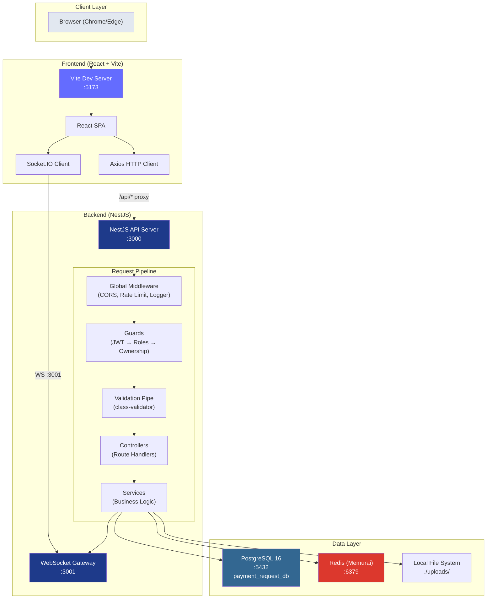
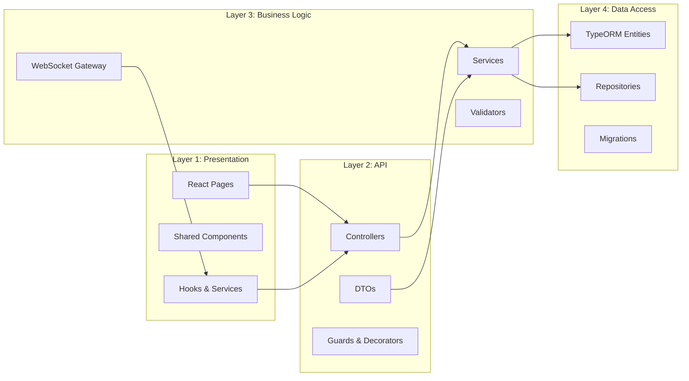
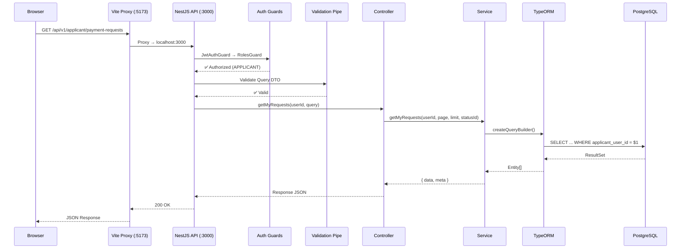
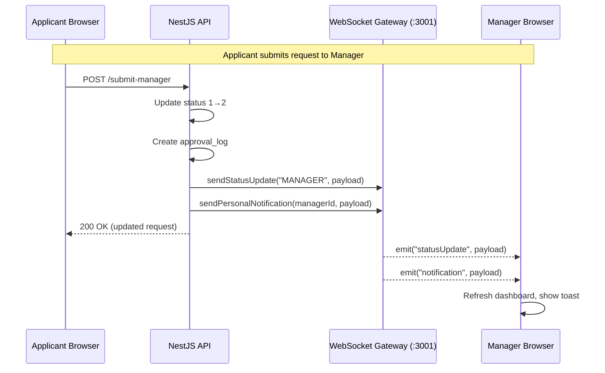
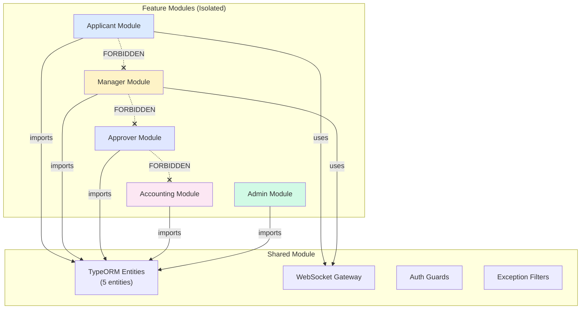
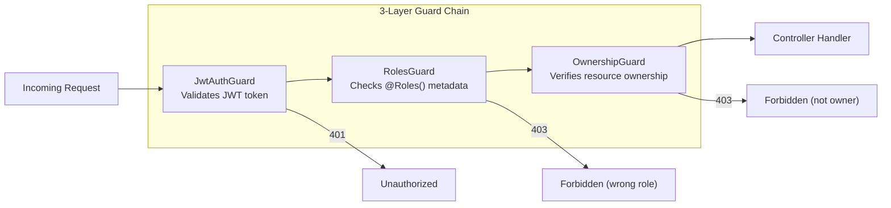

# DD_COMMON_01 — Architecture Overview

> **Doc ID:** PRWM-DD-COM-001 | **Version:** 1.0 | **Status:** Released  
> **Last Updated:** 2026-06-16

---

## 1. System Overview

The Payment Request Workflow Management (PRWM) system is a dual-application architecture — a **NestJS REST API backend** and a **React SPA frontend** — connected via HTTP and WebSocket protocols.

### 1.1 Technology Stack

| Layer | Technology | Version | Purpose |
|-------|-----------|---------|---------|
| **Backend Framework** | NestJS | 11.x | REST API, dependency injection, modular architecture |
| **Backend Language** | TypeScript | 5.7+ | Strict mode, type safety |
| **ORM** | TypeORM | 0.3.20 | PostgreSQL entity mapping, query builder, migrations |
| **Database** | PostgreSQL | 16 | Primary data store, ACID transactions |
| **Cache / Session** | Redis (Memurai) | 4+ | Session storage, caching, rate limiting |
| **Auth** | Passport + JWT | RS256 | Authentication, role-based access control |
| **Validation** | class-validator / class-transformer | 0.14+ | DTO validation, input sanitization |
| **WebSocket** | Socket.IO | 4.8+ | Real-time status notifications |
| **Frontend Framework** | React | 19 | Component-based SPA |
| **Frontend Build** | Vite | 8.x | Dev server, bundling, HMR |
| **Frontend CSS** | Tailwind CSS | 3.x | Utility-first styling |
| **Frontend Routing** | react-router-dom | 7.x | Client-side routing |
| **HTTP Client** | Axios | 1.7+ | API communication |
| **Icons** | lucide-react | 0.469+ | Icon library |
| **Testing** | Jest + Supertest | 30+ | Unit, integration, E2E tests |

---

## 2. System Architecture Diagram

---

## 3. Four-Layer Architecture

### Layer Responsibilities

| Layer | Responsibility | Allowed Dependencies |
|-------|---------------|---------------------|
| **Presentation** | UI rendering, form handling, client-side state, API calls | Layer 2 (via HTTP/WS), shared types |
| **API** | Route handling, request validation, response formatting | Layer 3, DTOs, Guards |
| **Business Logic** | Core business rules, status transitions, audit logging, notifications | Layer 4, shared services |
| **Data Access** | Database queries, transactions, entity definitions | PostgreSQL, Redis |

### Dependency Rules

| ✅ Allowed | ❌ Forbidden |
|------------|-------------|
| Layer 1 → Layer 2 (via HTTP) | Layer 2 → Layer 1 |
| Layer 2 → Layer 3 | Layer 4 → Layer 3 |
| Layer 3 → Layer 4 | Layer 1 → Layer 4 (direct DB access) |
| Any layer → Shared types/enums | Cross-module imports (e.g., applicant → manager) |

---

## 4. Request/Response Flow

### 4.1 REST API Call Flow

### 4.2 WebSocket Notification Flow

---

## 5. Module Communication Architecture

### 5.1 Module Isolation

### 5.2 Communication Rules

| Rule | Description |
|------|-------------|
| **Import Shared** | ✅ All modules may import from `SharedModule` (entities, gateway) |
| **Cross-Module Import** | ❌ FORBIDDEN. `applicant.service.ts` must NEVER import from `manager.service.ts` |
| **Cross-Module Communication** | Use WebSocket events or shared database records only |
| **Shared Layer Modification** | Requires Project Leader approval + regression test of all modules |

---

## 6. Environment & Port Allocation

| Service | Default Port | Config Variable |
|---------|-------------|----------------|
| NestJS API Server | 3000 | `APP_PORT` |
| WebSocket Gateway | 3001 | `WS_PORT` |
| Vite Dev Server | 5173 | `vite.config.ts → server.port` |
| PostgreSQL | 5432 | `DB_PORT` |
| Redis (Memurai) | 6379 | `REDIS_PORT` |

### Vite Proxy Configuration

| Frontend Path | Proxied To | Purpose |
|--------------|-----------|---------|
| `/api/*` | `http://localhost:3000` | All REST API calls |
| `/socket.io/*` | `http://localhost:3001` (WebSocket) | Socket.IO transport |

---

## 7. Security Architecture

| Security Layer | Implementation | Details |
|---------------|---------------|---------|
| **Authentication** | JWT (RS256) | Access token: 15min, Refresh token: 7 days (HttpOnly cookie) |
| **Password** | bcrypt | 12 salt rounds |
| **Session** | Redis | `session:{token}`, 1h sliding TTL |
| **Authorization** | RBAC | 5 roles, guard chain per endpoint |
| **Input Validation** | class-validator | On every DTO |
| **File Upload** | MIME whitelist | PDF, JPEG, JPG, PNG; max 10MB/file |
| **CORS** | Whitelist | Via environment variable |
| **Rate Limiting** | Redis counter | 100/min global, 10/min auth |

---

## 8. Cross-References

| Related Document | Purpose |
|-----------------|---------|
| [DD_COMMON_02](./DD_COMMON_02_PROJECT_STRUCTURE.md) | Detailed file/folder structure |
| [DD_COMMON_07](./DD_COMMON_07_AUTH_AND_MIDDLEWARE.md) | Full auth/middleware specification |
| [DD_COMMON_09](./DD_COMMON_09_DATABASE_ACCESS_PATTERNS.md) | TypeORM patterns and transactions |
| [Development Rules](../../core_ja/02_開発ルール_DEVELOPMENT_RULES.md) | Binding coding standards |
| [Environment Setup](../../guides/ENVIRONMENT_SETUP_GUIDE.md) | Local development setup |
