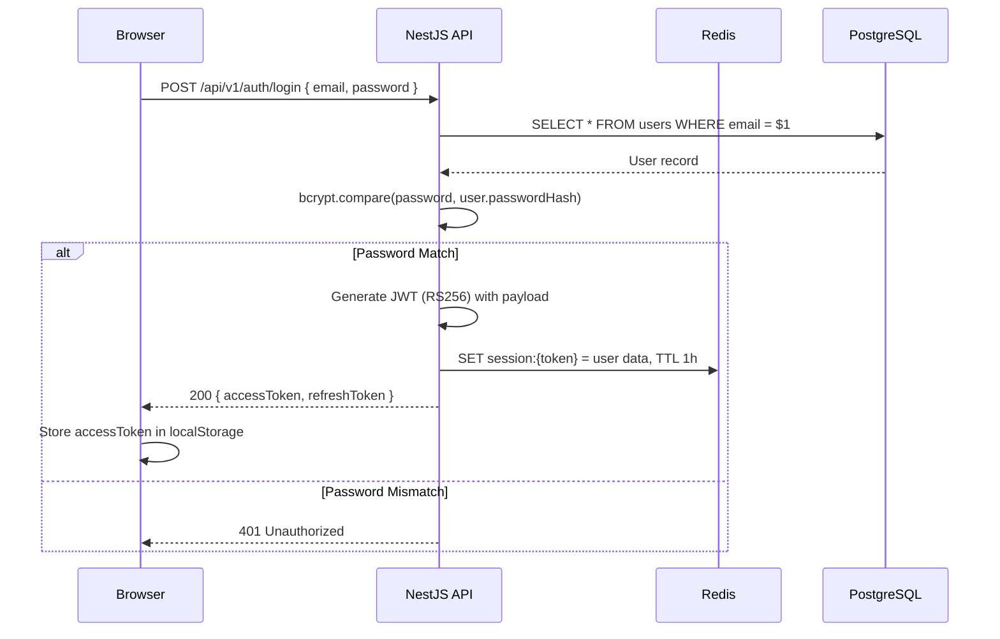

# DD_COMMON_07 — Authentication & Middleware

> **Doc ID:** PRWM-DD-COM-007 | **Version:** 1.0 | **Status:** Released  
> **Last Updated:** 2026-06-16

---

## 1. Authentication Flow

### 1.1 Login Flow



### 1.2 JWT Payload Structure

```typescript
{
  sub: 42,                           // user_id
  email: "soe@bankr.com",
  role: "APPLICANT",                 // role_code
  roleId: 1,                        // role_id
  branch: "Yangon",
  employeeNumber: "EMP-001",
  fullName: "Soe Htet Lin",
  iat: 1718524800,                   // Issued at
  exp: 1718525700,                   // Expires (15 min later)
}
```

### 1.3 Token Configuration

| Token | Algorithm | Expiration | Storage |
|-------|-----------|-----------|---------|
| Access Token | RS256 | 15 minutes (`JWT_EXPIRATION`) | `localStorage` |
| Refresh Token | RS256 | 7 days (`JWT_REFRESH_EXPIRATION`) | HttpOnly cookie |

---

## 2. Auth Module (`src/modules/auth/`)

### 2.1 Module Structure

```
src/modules/auth/
├── auth.module.ts              NestJS module (imports PassportModule, JwtModule)
├── auth.controller.ts          POST /login, POST /refresh, POST /logout
├── auth.service.ts             validateUser, generateTokens, refreshTokens
├── strategies/
│   ├── jwt.strategy.ts         Passport JWT strategy (extracts from Bearer header)
│   └── local.strategy.ts       Passport local strategy (email + password)
└── dto/
    ├── login.dto.ts            { email: string, password: string }
    └── auth-response.dto.ts    { accessToken: string, refreshToken: string }
```

### 2.2 Auth Controller Endpoints

| Method | URL | Body | Response | Description |
|--------|-----|------|----------|-------------|
| POST | `/api/v1/auth/login` | `{ email, password }` | `{ accessToken, refreshToken }` | Authenticate user |
| POST | `/api/v1/auth/refresh` | Cookie: refreshToken | `{ accessToken }` | Refresh access token |
| POST | `/api/v1/auth/logout` | — | `{ success: true }` | Invalidate session |

### 2.3 JWT Strategy

```typescript
// src/modules/auth/strategies/jwt.strategy.ts
import { Injectable } from '@nestjs/common';
import { PassportStrategy } from '@nestjs/passport';
import { ExtractJwt, Strategy } from 'passport-jwt';
import { ConfigService } from '@nestjs/config';

@Injectable()
export class JwtStrategy extends PassportStrategy(Strategy) {
  constructor(private configService: ConfigService) {
    super({
      jwtFromRequest: ExtractJwt.fromAuthHeaderAsBearerToken(),
      ignoreExpiration: false,
      secretOrKey: configService.get<string>('jwt.secret'),
    });
  }

  async validate(payload: JwtPayload): Promise<JwtPayload> {
    // payload is already decoded. Return it to attach to request.user
    return payload;
  }
}
```

---

## 3. Guards (`src/modules/shared/guards/`)

### 3.1 Guard Chain

Every protected endpoint uses this chain:

```
Request → JwtAuthGuard → RolesGuard → [OwnershipGuard] → Controller
```

### 3.2 JwtAuthGuard

```typescript
// src/modules/shared/guards/jwt-auth.guard.ts
import { Injectable, ExecutionContext } from '@nestjs/common';
import { AuthGuard } from '@nestjs/passport';
import { Reflector } from '@nestjs/core';
import { IS_PUBLIC_KEY } from '../decorators/public.decorator';

@Injectable()
export class JwtAuthGuard extends AuthGuard('jwt') {
  constructor(private reflector: Reflector) { super(); }

  canActivate(context: ExecutionContext) {
    const isPublic = this.reflector.getAllAndOverride<boolean>(IS_PUBLIC_KEY, [
      context.getHandler(), context.getClass(),
    ]);
    if (isPublic) return true;
    return super.canActivate(context);
  }
}
```

### 3.3 RolesGuard

```typescript
// src/modules/shared/guards/roles.guard.ts
import { Injectable, CanActivate, ExecutionContext, ForbiddenException } from '@nestjs/common';
import { Reflector } from '@nestjs/core';
import { ROLES_KEY } from '../decorators/roles.decorator';

@Injectable()
export class RolesGuard implements CanActivate {
  constructor(private reflector: Reflector) {}

  canActivate(context: ExecutionContext): boolean {
    const requiredRoles = this.reflector.getAllAndOverride<string[]>(ROLES_KEY, [
      context.getHandler(), context.getClass(),
    ]);
    if (!requiredRoles) return true;

    const { user } = context.switchToHttp().getRequest();
    if (!requiredRoles.includes(user.role)) {
      throw new ForbiddenException('この操作を実行する権限がありません');
    }
    return true;
  }
}
```

### 3.4 OwnershipGuard

```typescript
// src/modules/shared/guards/ownership.guard.ts
import { Injectable, CanActivate, ExecutionContext, ForbiddenException, NotFoundException } from '@nestjs/common';
import { InjectRepository } from '@nestjs/typeorm';
import { Repository } from 'typeorm';
import { PaymentRequest } from '../entities/payment-request.entity';

@Injectable()
export class OwnershipGuard implements CanActivate {
  constructor(
    @InjectRepository(PaymentRequest)
    private readonly repo: Repository<PaymentRequest>,
  ) {}

  async canActivate(context: ExecutionContext): Promise<boolean> {
    const request = context.switchToHttp().getRequest();
    const userId = request.user.sub;
    const requestId = parseInt(request.params.id, 10);

    if (!requestId) return true; // No :id param (e.g., list, create)

    const paymentRequest = await this.repo.findOne({
      where: { paymentRequestId: requestId, isDeleted: false },
    });

    if (!paymentRequest) throw new NotFoundException('指定された申請が見つかりません');
    if (paymentRequest.applicantUserId !== userId) {
      throw new ForbiddenException('この操作を実行する権限がありません');
    }

    // Attach to request for use in controller/service
    request.paymentRequest = paymentRequest;
    return true;
  }
}
```

---

## 4. Custom Decorators (`src/modules/shared/decorators/`)

```typescript
// roles.decorator.ts
import { SetMetadata } from '@nestjs/common';
export const ROLES_KEY = 'roles';
export const Roles = (...roles: string[]) => SetMetadata(ROLES_KEY, roles);

// current-user.decorator.ts
import { createParamDecorator, ExecutionContext } from '@nestjs/common';
export const CurrentUser = createParamDecorator(
  (data: string | undefined, ctx: ExecutionContext) => {
    const request = ctx.switchToHttp().getRequest();
    return data ? request.user?.[data] : request.user;
  },
);

// public.decorator.ts
import { SetMetadata } from '@nestjs/common';
export const IS_PUBLIC_KEY = 'isPublic';
export const Public = () => SetMetadata(IS_PUBLIC_KEY, true);
```

---

## 5. RBAC Matrix

| Route | Method | APPLICANT | MANAGER | APPROVER | ACCOUNTING | ADMIN |
|-------|--------|:---------:|:-------:|:--------:|:----------:|:-----:|
| `/auth/login` | POST | ✅ | ✅ | ✅ | ✅ | ✅ |
| `/applicant/payment-requests` | GET | ✅ | ❌ | ❌ | ❌ | ❌ |
| `/applicant/payment-requests` | POST | ✅ | ❌ | ❌ | ❌ | ❌ |
| `/applicant/payment-requests/:id` | GET | ✅* | ❌ | ❌ | ❌ | ❌ |
| `/applicant/payment-requests/:id` | PATCH | ✅* | ❌ | ❌ | ❌ | ❌ |
| `/applicant/payment-requests/:id` | DELETE | ✅* | ❌ | ❌ | ❌ | ❌ |
| `/applicant/.../submit-manager` | POST | ✅* | ❌ | ❌ | ❌ | ❌ |
| `/applicant/.../submit-approver` | POST | ✅* | ❌ | ❌ | ❌ | ❌ |
| `/manager/payment-requests` | GET | ❌ | ✅ | ❌ | ❌ | ❌ |
| `/approver/payment-requests` | GET | ❌ | ❌ | ✅ | ❌ | ❌ |
| `/accounting/payment-requests` | GET | ❌ | ❌ | ❌ | ✅ | ❌ |
| `/admin/*` | ALL | ❌ | ❌ | ❌ | ❌ | ✅ |

`*` = Ownership check also applies (must be the original applicant)

---

## 6. Redis Session Management

| Key Pattern | Value | TTL | Purpose |
|------------|-------|-----|---------|
| `session:{jwtToken}` | JSON: `{ userId, role, branch }` | 1h (sliding) | Session validation |
| `ratelimit:{ip}:{endpoint}` | Counter | 60s | Rate limiting |
| `lookup:{tableName}` | JSON array | 24h | Master data cache |

---

## 7. Middleware Configuration

### 7.1 Global Middleware (in `main.ts`)

```typescript
// CORS
app.enableCors({
  origin: process.env.WS_CORS_ORIGIN || 'http://localhost:5173',
  credentials: true,
});

// Global prefix
app.setGlobalPrefix('api/v1');

// Global pipes
app.useGlobalPipes(new ValidationPipe({ whitelist: true, transform: true }));

// Global filters
app.useGlobalFilters(new HttpExceptionFilter());

// Global guards (applied via APP_GUARD)
// JwtAuthGuard and RolesGuard registered as providers in AppModule
```

---

## 8. Frontend Auth Integration

### 8.1 ProtectedRoute Component

```typescript
// frontend/src/components/shared/ProtectedRoute.tsx
interface ProtectedRouteProps {
  allowedRoles?: string[];
  children: React.ReactNode;
}

export function ProtectedRoute({ allowedRoles, children }: ProtectedRouteProps) {
  const { user, isAuthenticated, isLoading } = useAuth();

  if (isLoading) return <LoadingSpinner variant="page" />;
  if (!isAuthenticated) return <Navigate to="/login" replace />;
  if (allowedRoles && !allowedRoles.includes(user!.role)) {
    return <Navigate to="/unauthorized" replace />;
  }
  return <>{children}</>;
}
```

---

## 9. Cross-References

| Related Document | Purpose |
|-----------------|---------|
| [DD_COMMON_01](./DD_COMMON_01_ARCHITECTURE_OVERVIEW.md) | Security architecture overview |
| [DD_COMMON_08](./DD_COMMON_08_ERROR_HANDLING.md) | Error handling for auth failures |
| [Development Rules §5](../../core_ja/02_開発ルール_DEVELOPMENT_RULES.md) | Security standards |
