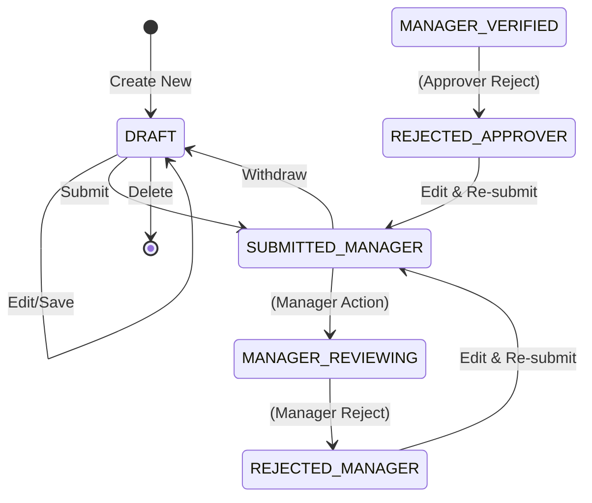

# DD_APPLICANT_01 — Module Overview

> **Doc ID:** PRWM-DD-APP-01 | **Version:** 1.0 | **Status:** Released  
> **Last Updated:** 2026-06-16

---

## 1. Module Overview

The **Applicant Module** (申請者モジュール) is the entry point for all end-users to create, track, and manage their payment requests. It restricts access so that an applicant can *only* see and interact with their own requests.

---

## 2. Supported Use Cases

| ID | Use Case | Description |
|---|----------|-------------|
| UC-APP-01 | View Dashboard | View a paginated list of own payment requests with status KPI cards. |
| UC-APP-02 | Create Draft | Start a new payment request and save it as a draft (partial data). |
| UC-APP-03 | Edit Request | Edit an existing request that is in a draft or rejected state. |
| UC-APP-04 | View Details | View the full read-only details of any own request. |
| UC-APP-05 | Submit to Manager | Validate all rules and transition a draft/rejected request to `SUBMITTED_MANAGER`. |
| UC-APP-06 | Delete Request | Soft-delete a request that is in `DRAFT` status. |
| UC-APP-07 | Withdraw Request | Change a submitted request back to `DRAFT` (if manager hasn't reviewed yet). |
| UC-APP-08 | Upload Receipt | Attach receipt files (PDF/Image) to a request. |

---

## 3. Status State Machine (Applicant Scope)

The Applicant module is primarily concerned with the beginning of the flow and handling rejections.

**Editable Statuses:**
- `1` (`DRAFT`)
- `5` (`REJECTED_MANAGER`)
- `9` (`REJECTED_APPROVER`)

---

## 4. Security & Permissions

1. **Authentication**: JWT token required.
2. **Authorization**: User must have `role_id = 1` (APPLICANT).
3. **Data Isolation**: All queries must append `WHERE applicant_user_id = :currentUserId`.
4. **Action Ownership Guard**: Before any update/delete/submit action, verify `applicant_user_id === currentUserId`.

---

## 5. Architectural Components Involved

| Layer | Files |
|-------|-------|
| **Frontend Pages** | `ApplicantDashboard.tsx`, `CreateRequest.tsx`, `EditRequest.tsx`, `RequestDetail.tsx` |
| **Frontend Components**| `RequestTable.tsx`, `PaymentRequestForm.tsx`, `BreakdownItemsGrid.tsx` |
| **Backend API** | `applicant.controller.ts` |
| **Backend Service**| `applicant.service.ts` |
| **Backend DTOs** | `create-payment-request.dto.ts`, `submit-to-manager.dto.ts` |

---

## 6. Cross-References

| Related Document | Purpose |
|-----------------|---------|
| [DD_APPLICANT_02](./DD_APPLICANT_02_FRONTEND_REQUEST_LIST.md) | Dashboard list view design |
| [DD_APPLICANT_03](./DD_APPLICANT_03_FRONTEND_REQUEST_FORM.md) | Create/Edit form design |
| [DD_APPLICANT_05](./DD_APPLICANT_05_API_ENDPOINTS.md) | Backend REST API contract |
| [DD_APPLICANT_07](./DD_APPLICANT_07_BUSINESS_LOGIC.md) | Backend business rules |
