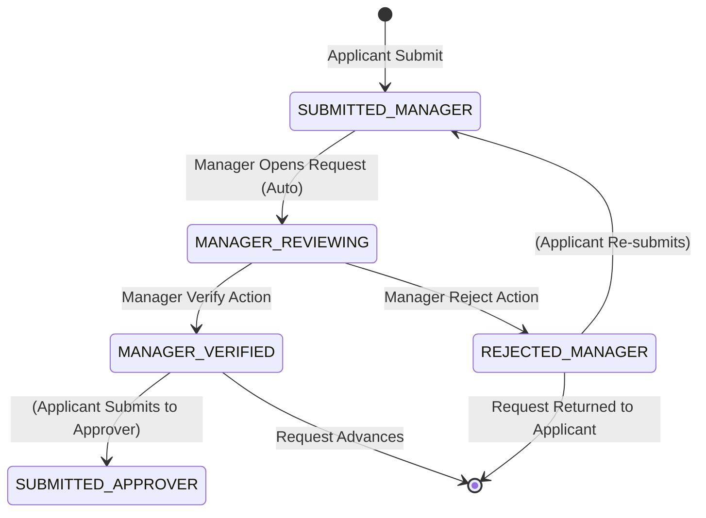

# DD_MANAGER_01 — Module Overview

> **Doc ID:** PRWM-DD-MGR-01 | **Version:** 1.0 | **Status:** Released  
> **Last Updated:** 2026-06-16

---

## 1. Module Overview

The **Manager Module** (担当マネージャーモジュール) is the verification and initial approval layer of the payment request workflow. It restricts access so that a manager can *only* see and interact with payment requests assigned to them and requests within their verification queue.

---

## 2. Supported Use Cases

| ID | Use Case | Description |
|---|----------|-------------|
| UC-MGR-01 | View Dashboard | View a paginated list of assigned payment requests with status KPI cards and queue metrics. |
| UC-MGR-02 | View Request Queue | View all pending payment requests submitted to the manager for verification. |
| UC-MGR-03 | View Request Details | View the full read-only details of an assigned payment request including receipt attachments. |
| UC-MGR-04 | View Receipt Attachments | Download or preview receipt files (PDF, JPG, PNG) attached to a request. |
| UC-MGR-05 | Verify Request | Approve a payment request after verification, transitioning it to `MANAGER_VERIFIED`. |
| UC-MGR-06 | Reject Request | Reject a payment request with mandatory comments, transitioning it to `REJECTED_MANAGER`. |
| UC-MGR-07 | Add Review Comments | Add comments and feedback during the verification process for audit trail. |
| UC-MGR-08 | View Approval History | View the complete approval log and historical comments for a request. |
| UC-MGR-09 | Search Requests | Search assigned requests by applicant name, request ID, or amount range. |
| UC-MGR-10 | Filter Requests | Filter requests by status, submission date range, amount range, and applicant branch. |

---

## 3. Status State Machine (Manager Scope)

The Manager module handles the initial verification stage of the payment request lifecycle.



**Manager-Relevant Statuses:**
- `2` (`SUBMITTED_MANAGER`) — Request awaiting manager verification
- `3` (`MANAGER_REVIEWING`) — Manager is actively reviewing
- `4` (`MANAGER_VERIFIED`) — Manager approved; request returns to applicant
- `5` (`REJECTED_MANAGER`) — Manager rejected; request returns to applicant for editing

---

## 4. Security & Permissions

1. **Authentication**: JWT token required.
2. **Authorization**: User must have `role_id = 2` (MANAGER).
3. **Data Isolation**: All queries must append `WHERE manager_user_id = :currentUserId AND status_id IN (2, 3, 4, 5)` to filter assigned requests.
4. **Action Ownership Guard**: Before any verification/rejection action, verify `manager_user_id === currentUserId`.
5. **Read-Only Access**: Managers can only VIEW request data; they cannot edit the payment request details (form fields are read-only).

---

## 5. Architectural Components Involved

| Layer | Files |
|-------|-------|
| **Frontend Pages** | `ManagerDashboard.tsx`, `ManagerQueue.tsx`, `RequestDetail.tsx`, `VerificationPanel.tsx` |
| **Frontend Components** | `RequestTable.tsx`, `RequestDetailCard.tsx`, `ReceiptPreview.tsx`, `VerificationForm.tsx`, `ApprovalHistory.tsx` |
| **Backend API** | `manager.controller.ts` |
| **Backend Service** | `manager.service.ts`, `verification.service.ts` |
| **Backend DTOs** | `verify-request.dto.ts`, `reject-request.dto.ts`, `manager-queue.dto.ts` |

---

## 6. Key Manager Responsibilities

### 6.1 Queue Management
- Monitor incoming payment requests assigned to the manager.
- Track requests by status (Submitted, Reviewing, Verified, Rejected).
- Identify overdue or high-priority requests requiring immediate attention.

### 6.2 Request Verification
- Review payment request details including:
  - Applicant information and department
  - Payment amount and breakdown items
  - Payment purpose and justification
  - Receipt attachments and supporting documents
  - Bank account or payment method details
- Validate request compliance with organizational policies.
- Assess the reasonableness of payment amount and purpose.

### 6.3 Decision Making
- **Verify (Approve):** Confirm the request meets organizational standards and forward to final approver stage.
- **Reject:** Return the request to the applicant with mandatory feedback for correction.
- Provide clear, actionable comments to guide applicants on rejections.

### 6.4 Audit & Compliance
- All verification actions are immutably recorded in the approval log.
- Comments and decisions are timestamped and attributed to the manager.
- System maintains complete audit trail for compliance purposes.

---

## 7. Cross-References

| Related Document | Purpose |
|-----------------|---------|
| [DD_MANAGER_02](./DD_MANAGER_02_FRONTEND_DASHBOARD.md) | Dashboard list view and queue metrics design |
| [DD_MANAGER_03](./DD_MANAGER_03_FRONTEND_VERIFICATION_PANEL.md) | Verification form and decision panel design |
| [DD_MANAGER_04](./DD_MANAGER_04_API_ENDPOINTS.md) | Backend REST API contract for manager operations |
| [DD_MANAGER_05](./DD_MANAGER_05_BUSINESS_LOGIC.md) | Backend business rules and verification logic |
| [MANAGER_05_画面項目設計書_SCREEN_ITEMS_v2](./MANAGER_05_画面項目設計書_SCREEN_ITEMS_v2.md) | Detailed UI screen items specification for manager dashboard |

---

## 8. Manager Module Workflow

```
┌─────────────────────────────────────────────────────────────────────┐
│                        Manager Module Flow                          │
└─────────────────────────────────────────────────────────────────────┘

1. LOGIN
   │
   ├─→ Authenticate with JWT token
   └─→ Verify role = MANAGER
   
2. VIEW DASHBOARD
   │
   ├─→ Display KPI cards: Queue count, average processing time, etc.
   ├─→ Display pending requests list (Status = SUBMITTED_MANAGER)
   ├─→ Display metrics: Total assigned, verified, rejected counts
   └─→ Real-time updates via WebSocket
   
3. SELECT REQUEST FROM QUEUE
   │
   ├─→ Click request row in queue table
   ├─→ Auto-transition status: SUBMITTED_MANAGER → MANAGER_REVIEWING
   ├─→ Fetch full request details from backend
   ├─→ Load receipt attachments and preview
   ├─→ Display request history and approval log
   └─→ Activate verification panel
   
4. REVIEW REQUEST DETAILS
   │
   ├─→ Read applicant information (read-only)
   ├─→ Read payment details: amount, date, method (read-only)
   ├─→ Read payment breakdown items (read-only)
   ├─→ Review receipt files: download or inline preview
   ├─→ Review approval log from previous stages (if any)
   ├─→ Check organizational policy compliance
   └─→ Decide: VERIFY or REJECT
   
5A. VERIFY REQUEST (Approval Path)
   │
   ├─→ Optional: Add verification comments
   ├─→ Click "Verify" button
   ├─→ Backend validates request data integrity
   ├─→ Backend performs optimistic locking check
   ├─→ Status transitions: MANAGER_REVIEWING → MANAGER_VERIFIED
   ├─→ Record action in ApprovalLog with timestamp
   ├─→ Notify applicant via WebSocket: Request approved by manager
   ├─→ Request returns to applicant queue
   ├─→ Applicant must submit to final approver to advance
   └─→ Display success confirmation
   
5B. REJECT REQUEST (Return Path)
   │
   ├─→ Enter rejection reason in comment field (required, min 10 chars)
   ├─→ Click "Reject" button
   ├─→ Backend validates comment length
   ├─→ Backend performs optimistic locking check
   ├─→ Status transitions: MANAGER_REVIEWING → REJECTED_MANAGER
   ├─→ Record action in ApprovalLog with comment and timestamp
   ├─→ Notify applicant via WebSocket: Request rejected by manager
   ├─→ Request returns to applicant for editing and resubmission
   ├─→ Display success confirmation
   └─→ Queue automatically refreshes
   
6. SEARCH & FILTER (Optional)
   │
   ├─→ Enter search keyword: applicant name, request ID, amount
   ├─→ Apply filters: status, date range, branch, amount range
   ├─→ Backend returns filtered results (paginated)
   ├─→ Update queue table with filtered data
   └─→ Manager can select from filtered results
   
7. VIEW APPROVAL HISTORY
   │
   ├─→ Click history/timeline button for a request
   ├─→ Display chronological approval log:
   │   - Creation by applicant
   │   - Status transitions
   │   - Current manager verification stage
   │   - Comments from applicant and manager
   └─→ Close history panel
   
8. LOGOUT
   │
   ├─→ Destroy JWT session token
   ├─→ Close WebSocket connection
   └─→ Redirect to login page

```

---

## 9. Key Business Rules (Manager Context)

### 9.1 Automatic Status Transition on Access
- When a Manager opens a request with status `SUBMITTED_MANAGER`, the system **automatically** transitions the status to `MANAGER_REVIEWING`.
- This indicates the manager is actively reviewing the request.
- The transition is recorded in the approval log.

### 9.2 Verification Decision Points
- **Verify:** Manager confirms the request meets organizational standards. Status → `MANAGER_VERIFIED`. Request is returned to applicant for submission to final approver.
- **Reject:** Manager identifies issues requiring correction. Status → `REJECTED_MANAGER`. Mandatory comment (min 10 characters) must be provided. Request is returned to applicant for editing and resubmission.

### 9.3 Mandatory Comment on Rejection
- When rejecting a request, the comment field is **mandatory**.
- Minimum comment length: **10 characters**.
- Comments are immutably recorded in the approval log.
- Clear, actionable feedback helps applicants correct issues efficiently.

### 9.4 Read-Only Request Details
- All payment request details (form fields, amounts, breakdowns) are **read-only** for managers.
- Managers cannot edit request data; they can only verify or reject.
- Receipt files can be viewed or downloaded but not modified.

### 9.5 Optimistic Locking for Concurrent Updates
- If another user (e.g., applicant or another manager) modifies the request while the current manager is reviewing, a concurrency conflict is detected.
- System displays an error notification: "This request's status has changed since it was loaded. The list will now refresh."
- Manager list automatically refreshes to show current state.
- Manager must re-open the request if needed.

### 9.6 Immutable Approval Log
- All manager actions (verify, reject, comments) are recorded in the approval log and **cannot be deleted or modified**.
- Approval log serves as the immutable audit trail for compliance purposes.

---

## 10. Performance & Real-Time Considerations

### 10.1 Real-Time Queue Updates
- Manager dashboard receives WebSocket notifications when:
  - New requests are assigned to the manager
  - Request statuses change (e.g., applicant edits after rejection)
  - Other managers verify or reject requests (if shared queue)
- Queue list updates automatically without page refresh.

### 10.2 Lazy Loading & Pagination
- Request queue is paginated (e.g., 10 rows per page) to improve load performance.
- Receipt files are loaded on-demand when manager views details.
- Approval history is fetched when manager clicks the history button.

### 10.3 Caching Strategy
- Manager information (role, assigned requests) is cached in session (Redis).
- Request metadata (ID, applicant name, amount) is cached for quick display.
- Full request details and receipt files are fetched fresh on request open to ensure accuracy.

---

## 11. Error Handling & Validation

### 11.1 Common Error Scenarios

| Error | Condition | User Action |
|-------|-----------|-------------|
| **ERR-MGR-401** | JWT token expired or invalid | Re-login to system |
| **ERR-MGR-403** | User role is not MANAGER | Contact system administrator |
| **ERR-MGR-409** | Concurrency conflict (request modified by another user) | Queue refreshes automatically; re-open if needed |
| **VAL-MGR-002** | Rejection comment is less than 10 characters | Expand comment with more detail |
| **ERR-MGR-500** | Database or server error | Contact system administrator with Error ID |

### 11.2 Validation Rules

- **Rejection Comment Length:** Minimum 10 characters, maximum 500 characters.
- **File Download:** Only authorized managers can download receipt files.
- **Request Assignment:** Manager can only verify requests assigned to them (`manager_user_id === currentUserId`).

---

## 12. Manager Module Metrics & KPIs

The manager dashboard displays the following metrics:

| Metric | Definition | Displayed |
|--------|-----------|-----------|
| **Pending Queue** | Count of requests with status = SUBMITTED_MANAGER | Dashboard header |
| **Currently Reviewing** | Count of requests with status = MANAGER_REVIEWING | Dashboard header |
| **Verified This Period** | Count of requests verified in last 7/30 days | Dashboard widget |
| **Rejected This Period** | Count of requests rejected in last 7/30 days | Dashboard widget |
| **Average Processing Time** | Average time from SUBMITTED_MANAGER to MANAGER_VERIFIED or REJECTED_MANAGER | Dashboard metric |
| **Overdue Requests** | Requests pending > 48 hours (configurable) | Priority indicator |

---

## 13. Manager Module Capabilities Summary

| Capability | Supported | Details |
|-----------|-----------|---------|
| **View Assigned Queue** | ✓ | List all pending requests for verification |
| **View Request Details** | ✓ | Full read-only access to request data |
| **View Receipt Files** | ✓ | Download or inline preview (PDF, JPG, PNG) |
| **Verify Requests** | ✓ | Approve and advance to final approver stage |
| **Reject Requests** | ✓ | Return to applicant with mandatory comments |
| **Edit Requests** | ✗ | Request details are read-only for managers |
| **Delete Requests** | ✗ | No delete capability for managers |
| **Search & Filter** | ✓ | By applicant name, request ID, amount, status, date |
| **View Approval History** | ✓ | Complete log of all prior actions and comments |
| **Real-Time Updates** | ✓ | WebSocket notifications for queue and status changes |
| **Generate Reports** | ✗ | Not in scope; future enhancement |

---

## 14. Manager Module User Experience Goals

1. **Efficiency:** Manager can quickly scan queue, select request, review details, and make decision without context switching.
2. **Clarity:** All required information is available at a glance; no need to navigate multiple screens.
3. **Accountability:** Clear audit trail ensures all actions are recorded and attributable.
4. **Feedback:** Actionable comments help applicants understand rejection reasons and correct issues.
5. **Real-Time Awareness:** Live updates on dashboard ensure manager always sees current queue state.

---

## 15. Cross-Functional Interactions

### 15.1 Interaction with Applicant Module
- Applicant submits request → Manager verifies or rejects
- If verified → Applicant sees "Manager Verified" status, must submit to final approver
- If rejected → Applicant sees "Rejected by Manager" with manager's comment, can edit and resubmit

### 15.2 Interaction with Final Approver Module
- After Manager verifies → Request transitions to Final Approver queue
- Manager cannot access final approval stage

### 15.3 Interaction with Accounting Module
- After Final Approver approves → Request transitions to Accounting queue
- Manager cannot access accounting stage

---

## Sign-Off

This Manager Module Overview document provides the architectural and functional foundation for the Manager verification workflow. It is referenced by detailed design documents and implementation specifications.

---

*End of DD_MANAGER_01_MODULE_OVERVIEW.md*