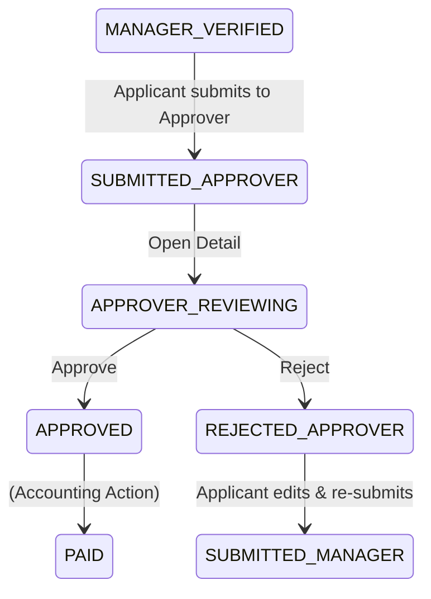

# DD_APPROVER_01 — Module Overview

> **Doc ID:** PRWM-DD-APPROVER-01 | **Version:** 1.0 | **Status:** Released  
> **Last Updated:** 2026-06-17

---

## 1. Module Overview

The **Approver Module** is the second-level approval area for payment requests that have already been verified by a Manager and submitted to the Final Approver. It allows the Final Approver to review request details, receipt files, and approval history, then either approve the request for Accounting or reject it back to the Applicant.

---

## 2. Supported Use Cases

| ID | Use Case | Description |
|---|----------|-------------|
| UC-APR-01 | View Dashboard | View a paginated list of requests awaiting Final Approver review. |
| UC-APR-02 | View Details | Review the full read-only details of a request, including breakdown, receipts, and approval history. |
| UC-APR-03 | Start Review | Automatically transition `SUBMITTED_APPROVER` to `APPROVER_REVIEWING` when the request is opened. |
| UC-APR-04 | Approve Request | Transition an approver-reviewing request to `APPROVED` and route it to Accounting. |
| UC-APR-05 | Reject Request | Transition an approver-reviewing request to `REJECTED_APPROVER` with a mandatory rejection comment. |
| UC-APR-06 | Receive Updates | Receive real-time WebSocket updates when related request statuses change. |

---

## 3. Status State Machine (Approver Scope)

The Approver module is primarily concerned with the final review decision after Manager verification.

**Handled Statuses:**
- `6` (`SUBMITTED_APPROVER`)
- `7` (`APPROVER_REVIEWING`)
- `8` (`APPROVED`)
- `9` (`REJECTED_APPROVER`)

---

## 4. Security & Permissions

1. **Authentication**: JWT token required.
2. **Authorization**: User must have `role_id = 3` (APPROVER).
3. **Queue Access**: All list/detail queries must restrict records to requests assigned to the current approver or available in the approver queue.
4. **Action Status Guard**: Before approve/reject actions, verify `status_id === 7 (APPROVER_REVIEWING)`.
5. **Read-only Review Guard**: Approver cannot update request content, breakdown items, receipt files, applicant fields, or manager fields.

---

## 5. Architectural Components Involved

| Layer | Files |
|-------|-------|
| **Frontend Pages** | `ApproverDashboard.tsx`, `ApproverRequestDetail.tsx` |
| **Frontend Components** | `ApproverActionPanel.tsx`, `DataTable.tsx`, `StatusBadge.tsx`, `ApprovalTimeline.tsx`, `ConfirmDialog.tsx` |
| **Backend API** | `approver.controller.ts` |
| **Backend Service** | `approver.service.ts` |
| **Backend DTOs** | `query-approver-requests.dto.ts`, `approve-payment-request.dto.ts`, `reject-payment-request.dto.ts` |

---

## 6. Cross-References

| Related Document | Purpose |
|-----------------|---------|
| [DD_APPROVER_02](./DD_APPROVER_02_FRONTEND_PAGE.md) | Dashboard and detail page design |
| [DD_APPROVER_03](./DD_APPROVER_03_API_ENDPOINTS.md) | Backend REST API contract |
| [DD_APPROVER_04](./DD_APPROVER_04_DTOS_AND_TYPES.md) | Full DTO definitions |
| [DD_APPROVER_05](./DD_APPROVER_05_BUSINESS_LOGIC.md) | Backend business rules |
