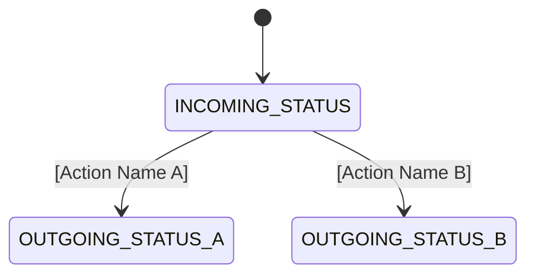

# DD_ACCOUNTING_01 窶・Module Overview

> **Doc ID:** PRWM-DD-ACCOUNTING-01 | **Version:** 1.0 | **Status:** Draft  
> **Last Updated:** YYYY-MM-DD

---

## 1. Overview

[Describe the purpose of this module. What business process does it handle?]

- **Target Role:** `{RoleName}` (e.g., Manager, Approver, Accounting)
- **Base Route (Frontend):** `/frontend/src/pages/accounting`
- **Base Route (Backend):** `src/modules/accounting`

---

## 2. Screen Map & Routing

| Screen Name | Route Path | Component Name | Purpose |
|-------------|------------|----------------|---------|
| Dashboard / List | `/accounting/dashboard` | `accountingDashboard` | Lists items needing attention |
| Detail View | `/accounting/requests/:id` | `RequestDetail` | View specific item |
| [Other Screen] | `/accounting/...` | `...` | ... |

---

## 3. Workflow & State Machine

[Describe how this module interacts with the PaymentRequest workflow.]

### 3.1 Handled Statuses
- **Incoming Statuses:** Which statuses appear in this module's queue? (e.g., `SUBMITTED_MANAGER`)
- **Outgoing Statuses:** Which statuses does this module produce? (e.g., `MANAGER_VERIFIED`, `REJECTED_MANAGER`)

### 3.2 State Transition Diagram (Mermaid)

---

## 4. Dependencies on Shared Layer

- **Entities:** `PaymentRequest`, `ApprovalLog`, etc.
- **Enums:** `PaymentStatus`, `UserRole`, etc.
- **Guards:** `JwtAuthGuard`, `RolesGuard`
- **Components:** `DataTable`, `StatusBadge`, `ConfirmDialog`
