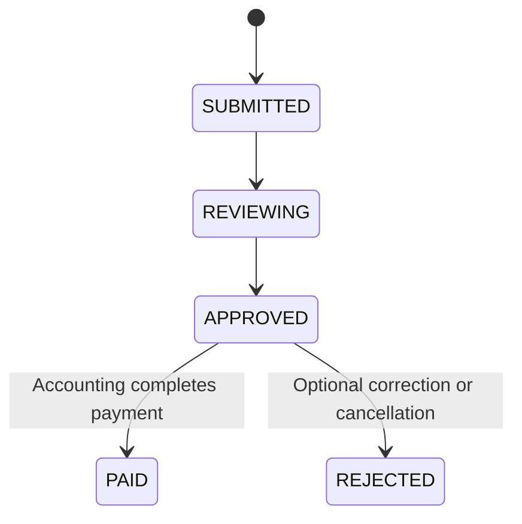

# DD_ACCOUNTING_01 — Module Overview

> **Doc ID:** PRWM-DD-ACC-01 | **Version:** 1.0 | **Status:** Released  
> **Last Updated:** 2026-06-17

---

## 1. Module Overview

The Accounting module is responsible for processing requests that have already been approved by the final approver. Its role is to review approved payment requests, confirm settlement completion, and provide clear branch-specific handling guidance.

- **Target Role:** Accounting
- **Base Route (Frontend):** `frontend/src/pages/accounting`
- **Base Route (Backend):** `src/modules/accounting`

---

## 2. Supported Use Cases

| ID | Use Case | Description |
|---|----------|-------------|
| UC-ACC-01 | View Approved Queue | Display all requests in `APPROVED` status for payment processing. |
| UC-ACC-02 | View Request Detail | Review applicant, breakdown, attachments, and approval history. |
| UC-ACC-03 | Complete Payment | Transition an approved request to `PAID`. |
| UC-ACC-04 | Show Branch Guidance | Display special instructions for Mandalay cash handling. |
| UC-ACC-05 | Receive Realtime Updates | Refresh the queue when workflow status changes. |

---

## 3. Workflow Scope

Accounting begins only after the request has passed all approval stages. The module is responsible for confirming that the request is ready for settlement, checking the final details, and marking it as paid once the payment action is completed.

### 3.1 Detailed Flow
1. The request reaches the accounting queue only when the approver has already approved it.
2. Accounting reviews the approved request details, attachments, and related payment information.
3. If the request is valid for settlement, the accounting user executes the payment completion action.
4. Once payment is completed, the status changes from `APPROVED` to `PAID`.
5. If the request cannot be processed, the request may remain in the approved state until the issue is resolved.

### 3.2 Handled Statuses
- **Incoming:** `APPROVED` (status 8)
- **Outgoing:** `PAID` (status 10)
- **Related Transitional Condition:** only approved requests are eligible for payment completion

---

## 4. Security & Permissions

1. JWT authentication is required.
2. Only `ACCOUNTING` users can access the endpoints and pages.
3. Accounting users may view but not modify applicant-owned request data directly.
4. Any update must enforce the current workflow status rules.

---

## 5. Architectural Components Involved

| Layer | Files |
|-------|-------|
| **Frontend Pages** | `AccountingDashboard.tsx`, `AccountingRequestDetail.tsx` |
| **Frontend Hooks** | `useAccountingRequests.ts`, `useAccountingDetail.ts` |
| **Backend API** | `accounting.controller.ts` |
| **Backend Service** | `accounting.service.ts` |
| **Backend DTOs** | `query-accounting-requests.dto.ts`, `complete-payment.dto.ts` |

---

## 6. Dependencies on Shared Layer

- **Entities:** `PaymentRequest`, `ApprovalLog`, `ReceiptFile`, `User`
- **Enums:** `PaymentStatus`, `UserRole`, `ApprovalActionType`
- **Guards:** `JwtAuthGuard`, `RolesGuard`
- **Shared Components:** `DataTable`, `StatusBadge`, `ConfirmDialog`, `ApprovalTimeline`, `CurrencyDisplay`
- **Shared Services:** `WebsocketGateway`

---

## 7. Cross-References

| Related Document | Purpose |
|-----------------|---------|
| [DD_ACCOUNTING_02](./DD_ACCOUNTING_02_FRONTEND_PAGE.md) | Dashboard layout and interaction details |
| [DD_ACCOUNTING_03](./DD_ACCOUNTING_03_API_ENDPOINTS.md) | API contract |
| [DD_ACCOUNTING_04](./DD_ACCOUNTING_04_DTOS_AND_TYPES.md) | DTOs and payload types |
| [DD_ACCOUNTING_05](./DD_ACCOUNTING_05_BUSINESS_LOGIC.md) | Service logic |
| [DD_COMMON_03](../00_common/DD_COMMON_03_SHARED_TYPES.md) | Shared type definitions |
| [Requirement Spec](../../core_ja/01_要件定義書_REQUIREMENT_SPEC.md) | Business rules |
