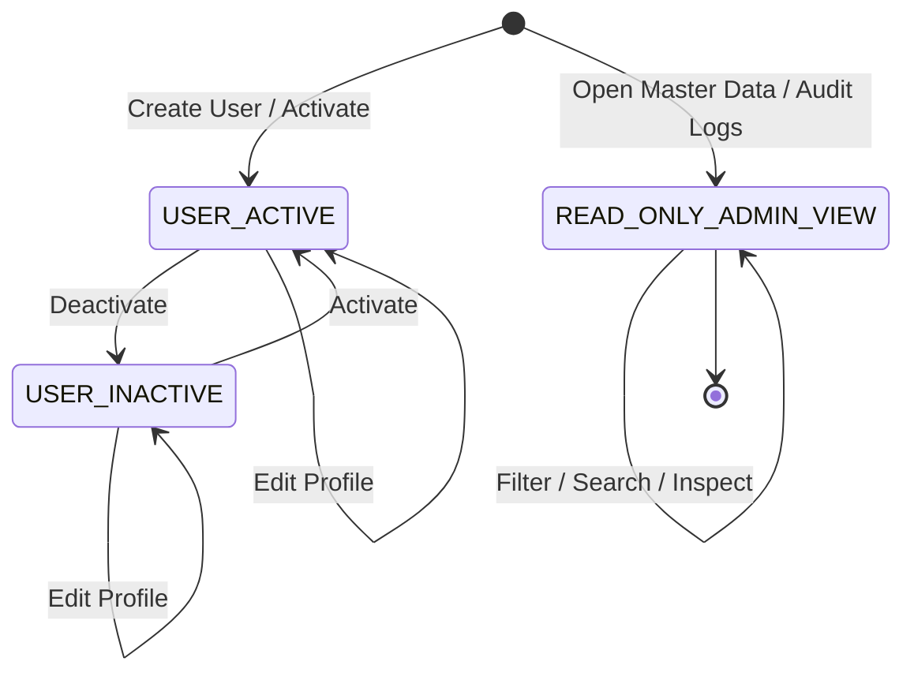

# DD_ADMIN_01 — Module Overview

> **Doc ID:** PRWM-DD-ADM-01 | **Version:** 1.0 | **Status:** Draft  
> **Last Updated:** 2026-06-16

---

## 1. Module Overview

The **Admin Panel Module** (管理者パネルモジュール) is the system administration
workspace for the Payment Request Workflow Management System. It provides
system-wide control for user account maintenance, read-only verification of
master configuration data, and inspection of immutable audit logs.

- **Target Role:** `ADMIN` (System Administrator)
- **Base Route (Frontend):** `frontend/src/pages/admin`
- **Base Route (Backend):** `src/modules/admin`

This module does **not** participate in payment request approval decisions.
Instead, it manages access control, account activation, and administrative
visibility over global system data.

The admin workspace is organized into three persistent areas:

- `USER MANAGEMENT`
- `MASTER DATA CONFIG`
- `AUDIT LOGS`

---

## 2. Supported Use Cases

| ID | Use Case | Description |
|---|----------|-------------|
| UC-ADM-01 | View Admin Dashboard | Open the persistent admin shell and switch between the available admin workspaces. |
| UC-ADM-02 | Search Users | Search the system user list by keyword, role, or active status. |
| UC-ADM-03 | Register User | Create a new user account with role assignment and activation state. |
| UC-ADM-04 | Edit User Profile | Update an existing user's name, email, branch, role, and active status. |
| UC-ADM-05 | Toggle User Activation | Activate or deactivate a user account without physically deleting the record. |
| UC-ADM-06 | View Master Configurations | Inspect read-only lookup tables and UI categories such as system roles, payment statuses, payment types, payment methods, and currencies. |
| UC-ADM-07 | Inspect Audit Logs | Browse global approval history and review immutable log metadata. |

---

## 3. Screen Map & Routing

The Admin Panel uses a persistent workspace shell with three primary screens.
These correspond to the `USER MANAGEMENT`, `MASTER DATA CONFIG`, and
`AUDIT LOGS` tabs described in the screen item specification.

| Screen Name | Route Path | Component Name | Purpose |
|-------------|------------|----------------|---------|
| User Management | `/admin/users` | `AdminPanel` / `UserManagementWorkspace` | Lists users, opens user modal, and toggles account state. |
| Master Data Configuration | `/admin/master-data` | `AdminPanel` / `MasterDataWorkspace` | Displays read-only lookup data for system configuration verification. |
| Audit Log History | `/admin/audit-logs` | `AdminPanel` / `AuditLogWorkspace` | Displays global audit history with filtering and detail inspection. |
| Admin Root Redirect | `/admin` | `AdminPanel` | Redirects to the default admin workspace. |

---

## 4. Workflow & State Machine

The Admin Panel is primarily responsible for user account administration and
read-only inspection of system master data and audit records.

### 4.1 Handled Statuses

- **Incoming Statuses:** All payment request statuses are visible for audit
  review only.
- **Outgoing Statuses:** `users.is_active = TRUE` / `FALSE`
- **Read-Only Data:** `payment_requests`, `approval_logs`, and master lookup
  tables are displayed without direct mutation from this module.

### 4.2 State Transition Diagram (Mermaid)

---

## 5. Security & Permissions

1. **Authentication**: JWT token required for every admin request.
2. **Authorization**: User must have `role_code = 'ADMIN'`.
3. **Data Scope**: Admins can manage users system-wide, but master tables and
   audit logs are read-only in this module.
4. **Self-Protection Rule**: The current logged-in administrator must not be
   able to deactivate or otherwise lock out their own account.
5. **Audit Integrity**: Audit records are immutable and must never be edited or
   deleted from the admin workspace.

---

## 6. Architectural Components Involved

| Layer | Files |
|-------|-------|
| **Frontend Pages** | `AdminPanel.tsx` |
| **Frontend Components** | `UserTable.tsx`, `UserFormModal.tsx`, `MasterDataGrid.tsx`, `AuditLogTable.tsx`, `ConfirmDialog.tsx` |
| **Backend API** | `admin.controller.ts` |
| **Backend Service** | `admin.service.ts` |
| **Backend DTOs** | `create-user.dto.ts`, `update-user.dto.ts`, `query-users.dto.ts`, `query-audit-logs.dto.ts` |
| **Shared Entities** | `User`, `PaymentRequest`, `ApprovalLog` |
| **Shared Lookups / Types** | `UserRole`, `PaymentStatus`, `PaymentType`, `PaymentMethod`, `Currency` |
| **Shared Guards** | `JwtAuthGuard`, `RolesGuard` |
| **Shared UI Components** | `DataTable`, `StatusBadge`, `ConfirmDialog`, `EmptyState`, `Pagination` |

---

## 7. Cross-References

| Related Document | Purpose |
|-----------------|---------|
| [DD_ADMIN_02](./DD_ADMIN_02_FRONTEND_ADMIN_PANEL.md) | Frontend Admin Panel design |
| [DD_ADMIN_03](./DD_ADMIN_03_API_ENDPOINTS.md) | Admin API endpoint design |
| [DD_ADMIN_04](./DD_ADMIN_04_DTOS_AND_TYPES.md) | Admin DTO and type design |
| [DD_ADMIN_05](./DD_ADMIN_05_BUSINESS_LOGIC.md) | Admin business logic design |
| [DD_ADMIN_06](./DD_ADMIN_06_TEST_SPEC.md) | Admin test specification |
| [ADMIN_04](../../screens/05_admin_panel/ADMIN_04_機能設計書_FUNCTIONAL_SPEC.md) | Functional specification for admin behavior |
| [ADMIN_05](../../screens/05_admin_panel/ADMIN_05_画面項目設計書_SCREEN_ITEMS.md) | Screen item specification for admin layout and fields |
| [DD_COMMON_02](../00_common/DD_COMMON_02_PROJECT_STRUCTURE.md) | Project directory structure |
| [DD_COMMON_03](../00_common/DD_COMMON_03_SHARED_TYPES.md) | Shared types and enums |
| [DD_COMMON_05](../00_common/DD_COMMON_05_SHARED_COMPONENTS.md) | Shared components specification |
| [DD_COMMON_07](../00_common/DD_COMMON_07_AUTH_AND_MIDDLEWARE.md) | Authentication and guard chain |

---

## 8. Notes for Implementation

- The Admin Panel should reuse the shared dashboard shell and table patterns
  defined in the common layer.
- User management is the only writable area in this module.
- Master data and audit log screens must remain read-only.
- Any future admin actions that mutate persistent data must still follow the
  global audit logging rules defined in the requirements and detailed design.
