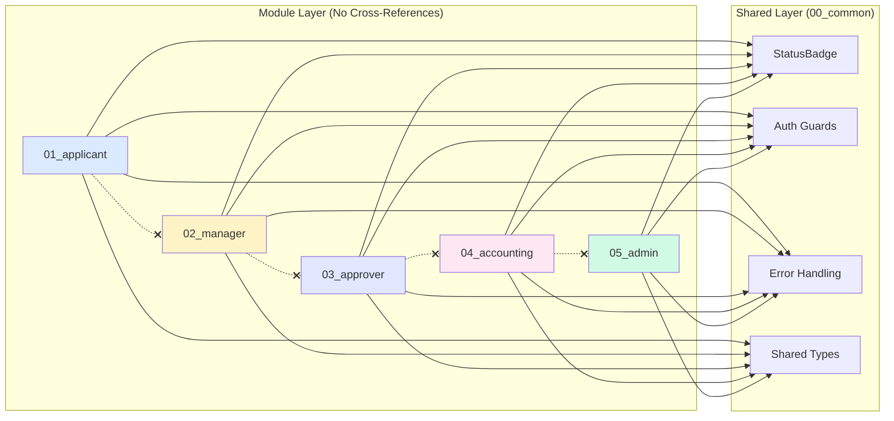

# ARCHITECTURE_EXPLANATION.md — Junior Developer Guide

> **Doc ID:** PRWM-DD-GUIDE-001  
> **Version:** 1.0  
> **Author:** System Architect  
> **Target Audience:** Junior Programmers, AI Coding Agents  
> **Last Updated:** 2026-06-16

---

## Table of Contents

1. [Why This File Structure?](#1-why-this-file-structure)
2. [How the "Common" Layer Prevents Team Conflicts](#2-how-the-common-layer-prevents-team-conflicts)
3. [How to Read the Detailed Design](#3-how-to-read-the-detailed-design)
4. [How to Feed These Documents to AI Agents](#4-how-to-feed-these-documents-to-ai-agents)
5. [Design-to-Code Mapping Reference](#5-design-to-code-mapping-reference)
6. [Quick Start Checklist](#6-quick-start-checklist)

---

## 1. Why This File Structure?

### 1.1 The Problem We're Solving

In enterprise Japanese software development, a Detailed Design (詳細設計 — Shousai Sekkei) is the final blueprint before coding begins. Unlike a requirements doc (what to build) or a functional spec (how it should behave), the detailed design specifies **exactly how to implement it** — down to the TypeScript interface, the database query, and the error message.

Our system has **5 dashboards** built by **5 developers** simultaneously. If we put everything in one giant file, we'd have:
- 🚫 **Merge conflicts** every time two developers touch the document
- 🚫 **Information overload** — a single developer doesn't need to read designs for modules they don't own
- 🚫 **AI context window limits** — large files can't be fed to AI assistants effectively

### 1.2 The Split Strategy

We split the Detailed Design into **two layers**:

```
docs/detailed_design/
├── 00_common/          ← Shared foundation (9 files)
│   ├── DD_COMMON_01_ARCHITECTURE_OVERVIEW.md
│   ├── DD_COMMON_02_PROJECT_STRUCTURE.md
│   ├── DD_COMMON_03_SHARED_TYPES.md
│   ├── DD_COMMON_04_SHARED_VALIDATION.md
│   ├── DD_COMMON_05_SHARED_COMPONENTS.md
│   ├── DD_COMMON_06_SHARED_SERVICES_AND_HOOKS.md
│   ├── DD_COMMON_07_AUTH_AND_MIDDLEWARE.md
│   ├── DD_COMMON_08_ERROR_HANDLING.md
│   └── DD_COMMON_09_DATABASE_ACCESS_PATTERNS.md
│
├── 01_applicant/       ← Applicant module (7 files) — YOUR PIONEER MODULE
│   ├── DD_APPLICANT_01_OVERVIEW.md
│   ├── DD_APPLICANT_02_FRONTEND_REQUEST_LIST.md
│   ├── DD_APPLICANT_03_FRONTEND_REQUEST_FORM.md
│   ├── DD_APPLICANT_04_FRONTEND_REQUEST_DETAIL.md
│   ├── DD_APPLICANT_05_API_ENDPOINTS.md
│   ├── DD_APPLICANT_06_DTOS_AND_TYPES.md
│   └── DD_APPLICANT_07_TEST_SPEC.md
│
└── ARCHITECTURE_EXPLANATION.md  ← You are here
```

### 1.3 Why This Exact Split?

| Decision | Rationale |
|----------|-----------|
| **`00_common/` prefix** | Sorts before all module folders (`01_`, `02_`, etc.) in any file explorer. Developers always see shared files first. |
| **`DD_` prefix on files** | Stands for "Detailed Design". Makes it immediately clear these are design docs, not specs or requirements. Also makes them easily searchable: `find . -name "DD_*"`. |
| **Numbered files** | Reading order matters. File 01 gives you the big picture; File 07 goes deep into testing. You read top-down. |
| **Separate common from module** | A developer working on the Manager dashboard reads `00_common/` + `02_manager/` — they never touch `01_applicant/`. This eliminates cross-module git conflicts. |
| **3 frontend files per module** | Each screen gets its own file (List, Form, Detail) because each screen has different components, state management, and API calls. One file per screen = one focused context. |
| **Backend split by concern** | API Endpoints (controller + service logic) are separate from DTOs/Types because they serve different audiences: backend developers read endpoints; frontend developers read DTOs to build API calls. |

---

## 2. How the "Common" Layer Prevents Team Conflicts

### 2.1 The Team Structure

| Developer | Branch | Module | Owns |
|-----------|--------|--------|------|
| Soe Htet Lin | `feature/applicant-soehtetlin` | Applicant | `01_applicant/`, `src/modules/applicant/`, `frontend/src/pages/applicant/` |
| Aye Thandar Moe | `feature/manager-ayethandarmoe` | Manager | `02_manager/`, `src/modules/manager/`, `frontend/src/pages/manager/` |
| Khaing Thin Thin Win | `feature/approver-khaingthinthinwin` | Approver | `03_approver/`, `src/modules/approver/`, `frontend/src/pages/approver/` |
| Shin Min Thant | `feature/accounting-shinminthant` | Accounting | `04_accounting/`, `src/modules/accounting/`, `frontend/src/pages/accounting/` |
| Ye Maung Maung | `feature/admin-yemaungmaung` | Admin | `05_admin/`, `src/modules/admin/`, `frontend/src/pages/admin/` |

### 2.2 What Lives in Common (and WHY)

```
00_common/ files define things that ALL 5 modules need:
```

| Common File | What It Defines | Why Shared? |
|-------------|----------------|-------------|
| `DD_COMMON_01` Architecture | System layers, tech stack | Every developer needs the same mental model |
| `DD_COMMON_02` Project Structure | Folder layout, file paths | Consistent structure across all 5 modules |
| `DD_COMMON_03` Shared Types | TypeScript enums, interfaces | `PaymentStatus` enum used by ALL dashboards |
| `DD_COMMON_04` Shared Validation | DTO patterns, validators | Same validation rules apply everywhere |
| `DD_COMMON_05` Shared Components | StatusBadge, ConfirmDialog, etc. | Manager dashboard shows StatusBadge too |
| `DD_COMMON_06` Shared Services | API client, auth hooks | Every module calls APIs the same way |
| `DD_COMMON_07` Auth & Middleware | JWT guards, RBAC | Every endpoint uses the same auth chain |
| `DD_COMMON_08` Error Handling | Error types, messages | Same error format system-wide |
| `DD_COMMON_09` Database Patterns | TypeORM queries, transactions | Same query patterns in every service |

### 2.3 The Conflict-Free Guarantee



**Rules that prevent conflicts:**

1. ✅ **Modules import FROM shared — never from each other**
   - `src/modules/applicant/` CAN import from `src/modules/shared/`
   - `src/modules/applicant/` CANNOT import from `src/modules/manager/`

2. ✅ **Shared layer is frozen during module development**
   - Common files are written FIRST (this pioneer Applicant sprint)
   - During parallel module development, changes to `00_common/` or `src/modules/shared/` require **Project Leader approval + regression testing**

3. ✅ **Each developer's git branch only touches their own files**
   - Soe Htet Lin's branch modifies `src/modules/applicant/*` and `frontend/src/pages/applicant/*`
   - No other developer touches those paths
   - Merge to `develop` will have ZERO file-level conflicts

4. ✅ **The Applicant module is the pioneer that DEFINES common patterns**
   - You (Soe Htet Lin) build the common components first
   - The other 4 developers REUSE what you built
   - Your code becomes the "Gold Standard" template

### 2.4 What Happens When Other Developers Start

When Aye Thandar Moe starts the Manager dashboard, they will:

1. Read `00_common/DD_COMMON_01` through `DD_COMMON_09` — understand the architecture
2. Read `01_applicant/` — understand the pattern (their "Gold Standard")
3. Create `docs/detailed_design/02_manager/` — write their own module design, following the same structure
4. Code in `src/modules/manager/` — using the same patterns from `src/modules/applicant/`
5. Reuse `frontend/src/components/shared/StatusBadge.tsx` — it already exists thanks to your pioneer work

They will NOT touch:
- ❌ Any file in `01_applicant/`
- ❌ Any file in `src/modules/applicant/`
- ❌ Any file in `frontend/src/pages/applicant/`

---

## 3. How to Read the Detailed Design

### 3.1 Reading Order (Recommended)

Follow this order for maximum comprehension:

```
📖 PHASE 1: Understand the System (Read Once)
┌─────────────────────────────────────────────────────┐
│ 1. DD_COMMON_01 — Architecture Overview             │
│    → Understand the 4-layer architecture            │
│    → See how frontend talks to backend              │
│                                                     │
│ 2. DD_COMMON_02 — Project Structure                 │
│    → Know exactly where every file goes             │
│    → See the target directory tree                  │
│                                                     │
│ 3. DD_COMMON_03 — Shared Types                      │
│    → Learn all the enums and interfaces             │
│    → This is the "data dictionary" of our system    │
└─────────────────────────────────────────────────────┘

📖 PHASE 2: Understand the Patterns (Read Once)
┌─────────────────────────────────────────────────────┐
│ 4. DD_COMMON_07 — Auth & Middleware                 │
│    → How every request is authenticated             │
│    → The 3-layer guard chain                        │
│                                                     │
│ 5. DD_COMMON_08 — Error Handling                    │
│    → Standard error response shape                  │
│    → Japanese error message catalog                 │
│                                                     │
│ 6. DD_COMMON_09 — Database Access Patterns          │
│    → TypeORM query patterns you'll copy-paste       │
│    → Transaction pattern for multi-table operations │
│                                                     │
│ 7. DD_COMMON_04 — Shared Validation                 │
│    → class-validator DTO patterns                   │
│    → Draft vs Submit validation modes               │
└─────────────────────────────────────────────────────┘

📖 PHASE 3: Understand the UI (Read Once)
┌─────────────────────────────────────────────────────┐
│ 8. DD_COMMON_05 — Shared Components                 │
│    → StatusBadge, ConfirmDialog, etc.               │
│    → Props interfaces and styling                   │
│                                                     │
│ 9. DD_COMMON_06 — Shared Services & Hooks           │
│    → API client, auth hook, WebSocket hook          │
│    → How frontend calls backend                     │
└─────────────────────────────────────────────────────┘

📖 PHASE 4: Build the Applicant Module (Reference During Coding)
┌─────────────────────────────────────────────────────┐
│ 10. DD_APPLICANT_01 — Overview                      │
│     → Screen map, routing, dependencies             │
│                                                     │
│ 11. DD_APPLICANT_05 — API Endpoints (Start Here!)   │
│     → Build backend FIRST                           │
│     → Each endpoint fully specified                 │
│                                                     │
│ 12. DD_APPLICANT_06 — DTOs and Types                │
│     → Create DTOs with class-validator decorators   │
│                                                     │
│ 13. DD_APPLICANT_02 — Frontend Request List         │
│     → Build the dashboard page                      │
│                                                     │
│ 14. DD_APPLICANT_03 — Frontend Request Form         │
│     → Build the create/edit form                    │
│                                                     │
│ 15. DD_APPLICANT_04 — Frontend Request Detail       │
│     → Build the detail view                         │
│                                                     │
│ 16. DD_APPLICANT_07 — Test Spec                     │
│     → Write tests AFTER implementation              │
└─────────────────────────────────────────────────────┘
```

### 3.2 How to Read Each File

Every file follows a consistent structure:

```markdown
# Title
> Doc ID, Version, Status metadata

## 1. Overview
   What this file covers and why

## 2-N. Technical Sections
   Tables, TypeScript code blocks, Mermaid diagrams

## Cross-References
   Links to related DD files
```

**Key elements to look for:**

| Element | What It Tells You |
|---------|------------------|
| **Tables** | Structured specs — field names, types, validations, DB mappings |
| **TypeScript code blocks** | Exact interfaces, classes, or function signatures to implement |
| **Mermaid diagrams** | Visual flows — component trees, sequence diagrams, state machines |
| **Pseudocode** | Step-by-step business logic for service methods |
| **Cross-references** | "See DD_COMMON_03 for type definitions" — tells you where to look for more detail |

### 3.3 Coding Workflow

When you sit down to code a feature (e.g., "Create Payment Request"), follow this path:

```
1. Open DD_APPLICANT_05 (API Endpoints)
   → Find "POST /api/v1/applicant/payment-requests"
   → Read the service method pseudocode
   → Implement applicant.service.ts#saveDraft()

2. Open DD_APPLICANT_06 (DTOs)
   → Find CreatePaymentRequestDto
   → Copy the class with class-validator decorators
   → Create src/modules/applicant/dto/create-payment-request.dto.ts

3. Open DD_COMMON_09 (Database Patterns)
   → Find "Transaction Pattern"
   → Copy the queryRunner pattern for multi-table insert

4. Open DD_APPLICANT_03 (Frontend Form)
   → Find "Section F5: Payment Breakdown Table"
   → Build the React component

5. Open DD_COMMON_05 (Shared Components)
   → Find "FileUploadDropzone"
   → Build or reuse the shared component

6. Open DD_APPLICANT_07 (Test Spec)
   → Find "saveDraft()" test cases
   → Write the unit tests
```

---

## 4. How to Feed These Documents to AI Agents

### 4.1 Context Priority for AI Agents

When using AI coding assistants (like Copilot, Cursor, or Claude), feed documents in this priority:

| Priority | Document | Why |
|----------|----------|-----|
| **P0 (Always)** | `DD_COMMON_02` (Project Structure) | AI needs to know WHERE to create files |
| **P0 (Always)** | `DD_COMMON_03` (Shared Types) | AI needs the exact TypeScript types |
| **P0 (Always)** | The specific DD file for the task | E.g., `DD_APPLICANT_05` for API work |
| **P1 (Important)** | `DD_COMMON_04` (Validation) | For DTO/validation work |
| **P1 (Important)** | `DD_COMMON_09` (Database Patterns) | For service layer work |
| **P2 (If Needed)** | `DD_COMMON_07` (Auth) | For guard/middleware work |
| **P2 (If Needed)** | `DD_COMMON_08` (Error Handling) | For error handling work |

### 4.2 Example AI Prompts

**For backend work:**
```
Context files:
- docs/detailed_design/00_common/DD_COMMON_02_PROJECT_STRUCTURE.md
- docs/detailed_design/00_common/DD_COMMON_03_SHARED_TYPES.md
- docs/detailed_design/00_common/DD_COMMON_09_DATABASE_ACCESS_PATTERNS.md
- docs/detailed_design/01_applicant/DD_APPLICANT_05_API_ENDPOINTS.md
- docs/detailed_design/01_applicant/DD_APPLICANT_06_DTOS_AND_TYPES.md

Task: Implement the createPaymentRequest service method in 
src/modules/applicant/applicant.service.ts following the exact 
specification in DD_APPLICANT_05, Section "Create Draft".
```

**For frontend work:**
```
Context files:
- docs/detailed_design/00_common/DD_COMMON_03_SHARED_TYPES.md
- docs/detailed_design/00_common/DD_COMMON_05_SHARED_COMPONENTS.md
- docs/detailed_design/00_common/DD_COMMON_06_SHARED_SERVICES_AND_HOOKS.md
- docs/detailed_design/01_applicant/DD_APPLICANT_03_FRONTEND_REQUEST_FORM.md

Task: Build the PaymentRequestForm component at 
frontend/src/pages/applicant/components/PaymentRequestForm.tsx
following DD_APPLICANT_03.
```

### 4.3 AI Guardrails

When using AI agents, enforce these rules (from our Development Rules):

| Rule | Enforcement |
|------|-------------|
| AI must NOT modify outside assigned module | Check file paths in the output |
| AI must NOT modify shared layer | Reject any changes to `src/modules/shared/` |
| AI must NOT auto-install packages | Review any `npm install` commands |
| AI must NOT generate migrations | Database changes need manual review |
| AI must NOT use `any` type | Check for TypeScript `any` in output |
| AI must NOT use `@ts-ignore` | Check for suppression directives |

---

## 5. Design-to-Code Mapping Reference

### 5.1 Backend Mapping

| Design Document | Creates These Code Files |
|----------------|--------------------------|
| `DD_COMMON_07` Auth | `src/modules/auth/auth.controller.ts`, `auth.service.ts`, `strategies/jwt.strategy.ts`, `strategies/local.strategy.ts` |
| `DD_COMMON_07` Guards | `src/modules/shared/guards/jwt-auth.guard.ts`, `roles.guard.ts`, `ownership.guard.ts` |
| `DD_COMMON_07` Decorators | `src/modules/shared/decorators/roles.decorator.ts`, `current-user.decorator.ts` |
| `DD_COMMON_08` Error Handling | `src/modules/shared/filters/http-exception.filter.ts`, `src/modules/shared/exceptions/*.ts` |
| `DD_COMMON_09` Database | `typeorm-cli.config.ts` (already exists), `src/database/migrations/*.ts` |
| `DD_APPLICANT_05` API | `src/modules/applicant/applicant.controller.ts`, `applicant.service.ts` |
| `DD_APPLICANT_06` DTOs | `src/modules/applicant/dto/create-payment-request.dto.ts`, `update-payment-request.dto.ts`, etc. |
| `DD_APPLICANT_07` Tests | `src/modules/applicant/tests/applicant.service.spec.ts`, `applicant.controller.spec.ts` |

### 5.2 Frontend Mapping

| Design Document | Creates These Code Files |
|----------------|--------------------------|
| `DD_COMMON_05` Components | `frontend/src/components/shared/StatusBadge.tsx`, `ConfirmDialog.tsx`, `LoadingSpinner.tsx`, etc. |
| `DD_COMMON_05` Layout | `frontend/src/components/layout/DashboardLayout.tsx`, `Sidebar.tsx`, `Header.tsx` |
| `DD_COMMON_06` Services | `frontend/src/services/api-client.ts`, `auth.service.ts`, `websocket.service.ts` |
| `DD_COMMON_06` Hooks | `frontend/src/hooks/useAuth.ts`, `useWebSocket.ts`, `useConfirmDialog.ts` |
| `DD_COMMON_06` Utils | `frontend/src/utils/format.ts`, `constants.ts` |
| `DD_COMMON_03` Types | `frontend/src/types/index.ts` |
| `DD_APPLICANT_02` List | `frontend/src/pages/applicant/ApplicantDashboard.tsx`, `components/RequestTable.tsx`, etc. |
| `DD_APPLICANT_03` Form | `frontend/src/pages/applicant/CreateRequest.tsx`, `EditRequest.tsx`, `components/PaymentRequestForm.tsx` |
| `DD_APPLICANT_04` Detail | `frontend/src/pages/applicant/RequestDetail.tsx` |

### 5.3 Key TypeScript Entities (Quick Reference)

| Entity | Backend Location | Frontend Location | Primary Key |
|--------|-----------------|-------------------|-------------|
| User | `src/modules/shared/entities/user.entity.ts` | `frontend/src/types/index.ts` | `userId: number` |
| PaymentRequest | `src/modules/shared/entities/payment-request.entity.ts` | `frontend/src/types/index.ts` | `paymentRequestId: number` |
| PaymentBreakdownItem | `src/modules/shared/entities/payment-breakdown-item.entity.ts` | `frontend/src/types/index.ts` | `paymentBreakdownItemId: number` |
| ApprovalLog | `src/modules/shared/entities/approval-log.entity.ts` | `frontend/src/types/index.ts` | `approvalLogId: string` (BIGINT) |
| ReceiptFile | `src/modules/shared/entities/receipt-file.entity.ts` | `frontend/src/types/index.ts` | `receiptFileId: number` |

---

## 6. Quick Start Checklist

### For Soe Htet Lin (Applicant Module Pioneer)

```
□ Read DD_COMMON_01 through DD_COMMON_09 (understand the system)
□ Read DD_APPLICANT_01 (understand your module scope)
□ Set up development environment (see ENVIRONMENT_SETUP_GUIDE.md)
□ Create branch: feature/applicant-soehtetlin
□ 
□ === BACKEND FIRST ===
□ Create DTOs (DD_APPLICANT_06)
□   - src/modules/applicant/dto/create-payment-request.dto.ts
□   - src/modules/applicant/dto/update-payment-request.dto.ts
□   - src/modules/applicant/dto/submit-to-manager.dto.ts
□   - src/modules/applicant/dto/query-payment-requests.dto.ts
□ Create Guards (DD_COMMON_07)
□   - src/modules/shared/guards/jwt-auth.guard.ts
□   - src/modules/shared/guards/roles.guard.ts
□   - src/modules/shared/guards/ownership.guard.ts
□ Update Controller (DD_APPLICANT_05)
□   - Add proper route prefix: /api/v1/applicant/payment-requests
□   - Add guard decorators
□   - Add DTO validation
□ Update Service (DD_APPLICANT_05)
□   - Implement full business logic with transactions
□   - Add approval_log creation
□   - Add WebSocket dispatch
□ Write Backend Tests (DD_APPLICANT_07)
□ 
□ === FRONTEND SECOND ===
□ Create Shared Components (DD_COMMON_05)
□   - frontend/src/components/shared/StatusBadge.tsx
□   - frontend/src/components/shared/ConfirmDialog.tsx
□   - frontend/src/components/layout/DashboardLayout.tsx
□   - (etc.)
□ Create Shared Services (DD_COMMON_06)
□   - frontend/src/services/api-client.ts
□   - frontend/src/hooks/useAuth.ts
□ Create Page Components (DD_APPLICANT_02, 03, 04)
□   - frontend/src/pages/applicant/ApplicantDashboard.tsx (rewrite)
□   - frontend/src/pages/applicant/CreateRequest.tsx
□   - frontend/src/pages/applicant/EditRequest.tsx
□   - frontend/src/pages/applicant/RequestDetail.tsx
□ 
□ === FINAL ===
□ Run all tests
□ Self-review against DD files
□ Create PR to develop
```

### For Other Developers (When They Start)

```
□ Read DD_COMMON_01 through DD_COMMON_09
□ Read 01_applicant/ files as your "Gold Standard" template
□ Create your module's detailed design in docs/detailed_design/0X_yourmodule/
□ Follow the EXACT same file structure as 01_applicant/
□ Reuse shared components — do NOT duplicate them
□ Stay within your module boundaries — do NOT cross-import
```

---

## Glossary

| Term | Japanese | Meaning |
|------|----------|---------|
| Detailed Design | 詳細設計 (Shousai Sekkei) | Implementation-level blueprint |
| Functional Spec | 機能設計書 (Kinou Sekkeisho) | What the system should do |
| Screen Items Spec | 画面項目設計書 (Gamen Koumoku Sekkeisho) | UI field-level specification |
| Requirements Spec | 要件定義書 (Youken Teigisho) | Business requirements |
| Database Spec | データベース設計書 (Database Sekkeisho) | Table/column definitions |
| Development Rules | 開発ルール (Kaihatsu Rule) | Coding standards and conventions |

---

> **Remember:** The Detailed Design is your **contract with the code**. If the code doesn't match the design, one of them is wrong. Always update the design when requirements change, and always follow the design when writing code.
