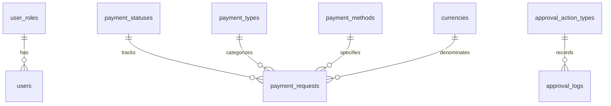
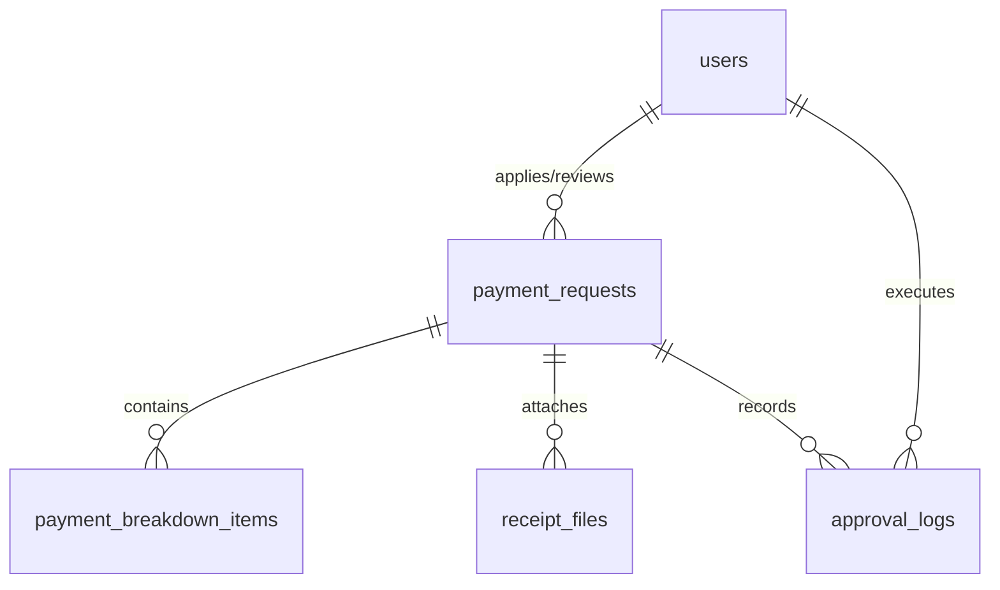

# ဒေတာဘေ့စ် ဒီဇိုင်း သတ်မှတ်ချက် (Database Design Specification)

**စနစ် (System):** ငွေပေးချေမှု တောင်းဆိုခြင်း လုပ်ငန်းအဆင့်ဆင့် စီမံခန့်ခွဲမှု စနစ် (Payment Request Workflow Management System)  
**အဆင့် (Phase):** နည်းပညာပိုင်းဆိုင်ရာ ဒီဇိုင်း (Technical Design)  
**ဗားရှင်း (Version):** 1.1  
**ရက်စွဲ (Date):** 2026-06-11  
**ရေးသားသူ (Author):** Lead Database Engineer  
**အခြေအနေ (Status):** Released (Draft for Approval)

---

## စာရွက်စာတမ်း သမိုင်းကြောင်း (Document History)

| ဗားရှင်း (Version) | ရက်စွဲ (Date) | ရေးသားသူ (Author) | ပြောင်းလဲမှုများ (Changes) |
| :--- | :--- | :--- | :--- |
| 1.1 | 2026-06-11 | Lead Database Engineer | Dynamic line manager selection နှင့် draft soft-deletion လုပ်ဆောင်ချက်များအတွက် schemas များကို အပ်ဒိတ်လုပ်ထားသည်။ (動的ラインマネージャー選択機能および下書き状態における論理削除機能追加に伴うスキーマ改定) |
| 1.0 | 2026-06-10 | Senior Database Architect & Lead Backend Engineer | ကနဦး နည်းပညာပိုင်းဆိုင်ရာ ဒီဇိုင်း သတ်မှတ်ချက် (新規作成) |

---

## ၁။ ဒေတာဘေ့စ် ခြုံငုံသုံးသပ်ချက်နှင့် အမည်ပေးစနစ် (Database Overview & Naming Conventions)

### ၁.၁ ဒေတာဘေ့စ် အင်ဂျင်ဆိုင်ရာ ကန့်သတ်ချက်များ (Database Engine Constraints)
* **အဓိက ဒေတာဘေ့စ် (Primary Database):** PostgreSQL 13+
* **သိမ်းဆည်းမှု အင်ဂျင် (Storage Engine):** transaction ထောက်ပံ့ပေးထားသော PostgreSQL Default Heap Storage (InnoDB နှင့် တူညီသော ACID လိုက်နာမှုရှိသည်)။
* **အထီးကျန်မှု အဆင့် (Isolation Level):** Read Committed (Default ဖြစ်ပြီး၊ တစ်ပြိုင်နက် လုပ်ဆောင်မှု မြင့်မားနေချိန်တွင် dirty reads ဖြစ်ပွားမှုကို တားဆီးပေးသည်)။
* **ကုဒ်စနစ် (Encoding):** ဘာသာစကားအမျိုးမျိုး သုံးစွဲနိုင်ရန်အတွက် `UTF8` ဖြစ်သည် (ဝန်ထမ်းအမည်များ၊ ဌာနများနှင့် အသေးစိတ်ဖော်ပြချက်များတွင် ဂျပန်စာလုံးများ ထည့်သွင်းမှုကို ထောက်ပံ့ရန် အပါအဝင်)။
* **စီစစ်မှုစနစ် (Collation):** သတ်မှတ်ထားသော ဒေသဆိုင်ရာ အစီအစဉ်ချမှတ်မှု စည်းမျဉ်းများအတွက် `C` သို့မဟုတ် `ja_JP.utf8` ဖြစ်သည်။

### ၁.၂ အမည်ပေးစနစ် (Naming Conventions)
လုပ်ငန်းတစ်ခုလုံးတွင် ကိုက်ညီမှုရှိစေရန်အတွက်၊ ဒေတာဘေ့စ်သည် တင်းကျပ်သော snake_case စနစ်ကို လိုက်နာသည်-
* **ဇယားများ (Tables):** အများကိန်းဖြစ်ရမည်၊ စာလုံးအသေး ဖြစ်ရမည်၊ underscore ဖြင့် ခြားရမည် (ဥပမာ - `payment_requests`, `receipt_files`)။
* **ကော်လံများ (Columns):** စာလုံးအသေး ဖြစ်ရမည်၊ ဧကဝုစ်ဖြစ်ရမည်၊ underscore ဖြင့် ခြားရမည် (ဥပမာ - `payment_request_id`, `employee_number`)။
* **မူလကီးများ (Primary Keys):** `<table_singular>_id` အဖြစ် စံသတ်မှတ်ထားသည် (ဥပမာ - `user_id`, `payment_request_id`)။ logs ကဲ့သို့သော ကြီးမားသော transaction ဇယားများတွင် `BIGINT` ကို အသုံးပြုသည်။
* **ပြင်ပကီးများ (Foreign Keys):** `<referenced_table_singular>_id` အဖြစ် အမည်ပေးသည် (ဥပမာ - `role_id` referencing `user_roles`)။
* **အညွှန်းကိန်းများ (Indexes):** ရှေ့ဆက်အနေဖြင့် `idx_` ဟုသုံးပြီး နောက်တွင် ဇယားအမည်နှင့် အညွှန်းပြုလုပ်ထားသော ကော်လံများ လိုက်ရမည် (ဥပမာ - `idx_payment_requests_status_id`)။ ထူးခြားသော (Unique) အညွှန်းကိန်းများတွင် `uq_` ရှေ့ဆက်ကို အသုံးပြုသည်။
* **ကန့်သတ်ချက်များ (Constraints):** check constraints များအတွက် `chk_`၊ foreign keys များအတွက် `fk_` နှင့် primary keys များအတွက် `pk_` ကို ရှေ့ဆက်အသုံးပြုသည်။

### ၁.၃ အချိန်ဇုန်နှင့် အချိန်ဆိုင်ရာ သတ်မှတ်ချက်များ (Timezone & Temporal Configuration)
* ရက်စွဲနှင့် အချိန်ပြ ကော်လံများအားလုံးသည် `TIMESTAMP WITH TIME ZONE` (သို့မဟုတ် PostgreSQL တွင် `TIMESTAMPTZ`) ကို အသုံးပြုရမည်။
* **သိမ်းဆည်းမှု စံနှုန်း (Storage Standard):** တန်ဖိုးအားလုံးကို ပုံမှန်ညှိနှိုင်းပြီး ဒေတာဘေ့စ်အဆင့်တွင် **UTC** (Coordinated Universal Time) ဖြင့် သိမ်းဆည်းသည်။
* **အပလီကေးရှင်းတွင် ကိုင်တွယ်ဆောင်ရွက်မှု (Application Handling):** NestJS/TypeORM backend သည် UTC ဖြင့် ရက်စွဲများကို လက်ခံခြင်းနှင့် ရှာဖွေခြင်းအတွက် တာဝန်ရှိပြီး၊ ဒေသဆိုင်ရာ အချိန်ဇုန် ပြောင်းလဲခြင်းများကိုမူ (ဥပမာ - ဂျပန်စံတော်ချိန် JST၊ UTC+9 သို့မဟုတ် မြန်မာစံတော်ချိန် MMT၊ UTC+6:30) presentation/client အဆင့်တွင် လုပ်ဆောင်သည်။
* **အချိန်မပါသော ရက်စွဲများ (Dates without time):** နာရီ/မိနစ် မပါဝင်ဘဲ ပြက္ခဒိန်ရက်စွဲများကိုသာ ခြေရာခံသော ကော်လံများ (ဥပမာ - ကုန်ကျစရိတ်ဖြစ်ပွားသည့်ရက်စွဲနှင့် ငွေပေးချေမှု တောင်းဆိုသည့် နောက်ဆုံးရက်စွဲ) တွင် `DATE` အမျိုးအစားကို အသုံးပြုရမည်။

---

## ၂။ မာစတာ / လူခ်အပ်ပ် ဇယားများ DDL (Enums ထောက်ပံ့မှု) (Master / Lookup Tables DDL (Enums Support))

ဒေတာခိုင်မာမှုကို ကာကွယ်ရန်နှင့် ရည်ညွှန်းမဲ့ အခြေအနေများကို ရှောင်ရှားရန်အတွက် အဆိုပါ ဇယားများကို ဒေတာဘေ့စ်အဆင့်ရှိ ပြင်ပကီး (foreign keys) များဖြင့် ကန့်သတ်ထားသည်။



### ၂.၁ SQL DDL စကရစ်များ (SQL DDL Scripts)

```sql
-- =========================================================================
-- ၁။ အသုံးပြုသူ အခန်းကဏ္ဍ လူခ်အပ်ပ် ဇယား (USER ROLES LOOKUP TABLE)
-- =========================================================================
CREATE TABLE user_roles (
    role_id SERIAL,
    role_code VARCHAR(20) NOT NULL,
    role_name VARCHAR(50) NOT NULL,
    description VARCHAR(500),
    is_active BOOLEAN NOT NULL DEFAULT TRUE,
    created_date TIMESTAMP WITH TIME ZONE NOT NULL DEFAULT CURRENT_TIMESTAMP,
    CONSTRAINT pk_user_roles PRIMARY KEY (role_id),
    CONSTRAINT uq_user_roles_role_code UNIQUE (role_code),
    CONSTRAINT uq_user_roles_role_name UNIQUE (role_name)
);

-- =========================================================================
-- ၂။ ငွေပေးချေမှု အခြေအနေ လူခ်အပ်ပ် ဇယား (PAYMENT STATUSES LOOKUP TABLE)
-- =========================================================================
CREATE TABLE payment_statuses (
    status_id SERIAL,
    status_code VARCHAR(30) NOT NULL,
    status_name VARCHAR(50) NOT NULL,
    display_order INTEGER NOT NULL,
    is_editable_state BOOLEAN NOT NULL DEFAULT FALSE,
    is_terminal_state BOOLEAN NOT NULL DEFAULT FALSE,
    description VARCHAR(500),
    CONSTRAINT pk_payment_statuses PRIMARY KEY (status_id),
    CONSTRAINT uq_payment_statuses_status_code UNIQUE (status_code),
    CONSTRAINT uq_payment_statuses_status_name UNIQUE (status_name)
);

-- =========================================================================
-- ၃။ ငွေပေးချေမှု အမျိုးအစား လူခ်အပ်ပ် ဇယား (PAYMENT TYPES LOOKUP TABLE)
-- =========================================================================
CREATE TABLE payment_types (
    payment_type_id SERIAL,
    payment_type_code VARCHAR(30) NOT NULL,
    payment_type_name VARCHAR(100) NOT NULL,
    is_active BOOLEAN NOT NULL DEFAULT TRUE,
    created_date TIMESTAMP WITH TIME ZONE NOT NULL DEFAULT CURRENT_TIMESTAMP,
    CONSTRAINT pk_payment_types PRIMARY KEY (payment_type_id),
    CONSTRAINT uq_payment_types_payment_type_code UNIQUE (payment_type_code),
    CONSTRAINT uq_payment_types_payment_type_name UNIQUE (payment_type_name)
);

-- =========================================================================
-- ၄။ ငွေပေးချေမှု နည်းလမ်း လူခ်အပ်ပ် ဇယား (PAYMENT METHODS LOOKUP TABLE)
-- =========================================================================
CREATE TABLE payment_methods (
    payment_method_id SERIAL,
    payment_method_code VARCHAR(20) NOT NULL,
    payment_method_name VARCHAR(50) NOT NULL,
    is_active BOOLEAN NOT NULL DEFAULT TRUE,
    created_date TIMESTAMP WITH TIME ZONE NOT NULL DEFAULT CURRENT_TIMESTAMP,
    CONSTRAINT pk_payment_methods PRIMARY KEY (payment_method_id),
    CONSTRAINT uq_payment_methods_payment_method_code UNIQUE (payment_method_code),
    CONSTRAINT uq_payment_methods_payment_method_name UNIQUE (payment_method_name)
);

-- =========================================================================
-- ၅။ ငွေကြေးအမျိုးအစား လူခ်အပ်ပ် ဇယား (CURRENCIES LOOKUP TABLE)
-- =========================================================================
CREATE TABLE currencies (
    currency_id SERIAL,
    currency_code VARCHAR(3) NOT NULL,
    currency_name VARCHAR(100) NOT NULL,
    is_active BOOLEAN NOT NULL DEFAULT TRUE,
    created_date TIMESTAMP WITH TIME ZONE NOT NULL DEFAULT CURRENT_TIMESTAMP,
    CONSTRAINT pk_currencies PRIMARY KEY (currency_id),
    CONSTRAINT uq_currencies_currency_code UNIQUE (currency_code)
);

-- =========================================================================
-- ၆။ အတည်ပြုချက် လုပ်ဆောင်မှု အမျိုးအစား လူခ်အပ်ပ် ဇယား (APPROVAL ACTION TYPES LOOKUP TABLE)
-- =========================================================================
CREATE TABLE approval_action_types (
    action_type_id SERIAL,
    action_code VARCHAR(30) NOT NULL,
    action_type VARCHAR(50) NOT NULL,
    description VARCHAR(500),
    CONSTRAINT pk_approval_action_types PRIMARY KEY (action_type_id),
    CONSTRAINT uq_approval_action_types_action_code UNIQUE (action_code),
    CONSTRAINT uq_approval_action_types_action_type UNIQUE (action_type)
);
```

### ၂.၂ DML မာစတာ ဒေတာထည့်သွင်းခြင်း စကရစ်များ (DML Master Seeding Scripts)

```sql
-- အသုံးပြုသူ အခန်းကဏ္ဍများ ထည့်သွင်းခြင်း (Seed User Roles)
INSERT INTO user_roles (role_code, role_name, description, is_active) VALUES
('APPLICANT', 'Applicant', 'Employee submitting payment requests and managing own drafts', TRUE),
('MANAGER', 'Manager', 'First-level verifier of payment requests', TRUE),
('APPROVER', 'Final Approver', 'Second-level ultimate approver of payment requests', TRUE),
('ACCOUNTING', 'Accounting', 'Finance processing team for approved requests', TRUE),
('ADMIN', 'System Administrator', 'IT system administrator managing users and configurations', TRUE);

-- Ngwe Pay Chay Mhu A Chay A Nay Myar (Seed Payment Statuses)
INSERT INTO payment_statuses (status_code, status_name, display_order, is_editable_state, is_terminal_state, description) VALUES
('DRAFT', 'Draft', 1, TRUE, FALSE, 'Initial state; applicant is composing the request'),
('SUBMITTED_MANAGER', 'Submitted to Manager', 2, FALSE, FALSE, 'Applicant submitted; awaiting Manager verification'),
('MANAGER_REVIEWING', 'Manager Reviewing', 3, FALSE, FALSE, 'Manager is actively reviewing (triggered on open)'),
('MANAGER_VERIFIED', 'Manager Verified (OK)', 4, FALSE, FALSE, 'Manager verified; awaiting Applicant to submit to Approver'),
('REJECTED_MANAGER', 'Rejected by Manager', 5, TRUE, FALSE, 'Manager rejected request; Applicant can modify and resubmit'),
('SUBMITTED_APPROVER', 'Submitted to Approver', 6, FALSE, FALSE, 'Ready for Final Approver review'),
('APPROVER_REVIEWING', 'Approver Reviewing', 7, FALSE, FALSE, 'Final Approver is actively reviewing (triggered on open)'),
('APPROVED', 'Approved', 8, FALSE, FALSE, 'Final approved; sent to Accounting for payment processing'),
('REJECTED_APPROVER', 'Rejected by Approver', 9, TRUE, FALSE, 'Final Approver rejected; restarts workflow back to Manager'),
('PAID', 'Paid (Completed)', 10, FALSE, TRUE, 'Payment process completed by Accounting; terminal state');

-- Ngwe Pay Chay Mhu အမျိုးအစားများ ထည့်သွင်းခြင်း (Seed Payment Types)
INSERT INTO payment_types (payment_type_code, payment_type_name, is_active) VALUES
('EXPENSE_REIMBURSE', 'Expense Reimbursement', TRUE),
('SERVICE_PAYMENT', 'Service Payment', TRUE),
('ADVANCE_PAYMENT', 'Advance Payment', TRUE),
('OTHER', 'Other', TRUE);

-- Ngwe Pay Chay Mhu Nee Lan Myar (Seed Payment Methods)
INSERT INTO payment_methods (payment_method_code, payment_method_name, is_active) VALUES
('BANK_TRANSFER', 'Bank Transfer', TRUE),
('CASH', 'Cash', TRUE),
('CHECK', 'Check', TRUE);

-- Seed Currencies
INSERT INTO currencies (currency_code, currency_name, is_active) VALUES
('MMK', 'Myanmar Kyat', TRUE),
('USD', 'US Dollar', TRUE),
('JPY', 'Japanese Yen', TRUE),
('THB', 'Thai Baht', TRUE);

-- Seed Approval Action Types (Auditing logs classifications)
INSERT INTO approval_action_types (action_code, action_type, description) VALUES
('CREATED', 'Created', 'Payment request draft initialized'),
('EDITED', 'Edited', 'Draft or rejected request details modified by applicant'),
('SUBMITTED', 'Submitted', 'Request submitted by applicant for review'),
('MGR_REVIEW_START', 'Manager Review Started', 'System changed status to Manager Reviewing upon entry'),
('MGR_VERIFIED', 'Manager Verified', 'Manager completed verification successfully'),
('MGR_REJECTED', 'Manager Rejected', 'Manager rejected request back to applicant'),
('APPR_REVIEW_START', 'Approver Review Started', 'System changed status to Approver Reviewing upon entry'),
('APPROVED', 'Approved', 'Final Approver authorized the payment request'),
('APPR_REJECTED', 'Approver Rejected', 'Final Approver rejected request back to applicant'),
('PAYMENT_COMPLETED', 'Payment Completed', 'Accounting completed bank transfer or cash payout');
```

---

## ၃။ အဓိက အရာဝတ္ထု ဇယားများ DDL နှင့် တည်ဆောက်ပုံဆိုင်ရာ ခိုင်မာမှု (Core Entity Tables DDL & Structural Integrity)

လုပ်ငန်းဆိုင်ရာ အရာဝတ္ထုများသည် အသုံးပြုသူ အထောက်အထားများ၊ ငွေပေးချေမှု တောင်းဆိုချက်များ၊ အသေးစိတ်စာရင်းများ၊ တင်ထားသော ပြေစာဖိုင်များနှင့် မှတ်တမ်းများကို ကိုင်တွယ်သည်။ ဆက်ဆံရေးများကို ရှင်းလင်းသော သမိုင်းကြောင်းများကို ထိန်းသိမ်းထားစဉ် ရည်ညွှန်းမဲ့ မှတ်တမ်းများ မဖြစ်ပေါ်စေရန် ပုံစံထုတ်ထားသည်။



### ၃.၁ Users ဇယား (`users` - အသုံးပြုသူ မာစတာ)
စနစ်အသုံးပြုသူ အချက်အလက်များကို စီမံခန့်ခွဲသည်။

#### ဒေတာ အဘိဓာန် (Data Dictionary)
| စဉ် (No) | Logical Name (論理名 / မြန်မာအမည်) | Physical Name (物理名 / အင်္ဂလိပ်အမည်) | Data Type & Length (データ型・桁数 / ဒေတာအမျိုးအစားနှင့် အရှည်) | PK | FK | Nullable (NULL許容 / NULL ခွင့်ပြုချက်) | Default Value (初期値 / မူလတန်ဖိုး) | Constraints & Remarks (制約・備考 / ကန့်သတ်ချက်များနှင့် မှတ်ချက်များ) |
|---|---|---|---|---|---|---|---|---|
| 1 | အသုံးပြုသူ ID | `user_id` | SERIAL | Y | - | N | - | မူလကီး။ စနစ်မှ အလိုအလျောက် တိုးပေးသည်။ |
| 2 | အီးမေးလ်လိပ်စာ | `email` | VARCHAR(255) | - | - | N | - | ထူးခြားသောကီး (`uq_users_email`)။ ဝင်ရောက်ရန် ID အဖြစ် အသုံးပြုသည်။ |
| 3 | စကားဝှက် ဟက်ရှ် (Password Hash) | `password_hash` | VARCHAR(512) | - | - | N | - | စစ်ဆေးအတည်ပြုရန် လုံခြုံရေးစကားဝှက် ဟက်ရှ်။ |
| 4 | နာမည်အပြည့်အစုံ | `full_name` | VARCHAR(200) | - | - | N | - | အသုံးပြုသူ၏ နာမည်အပြည့်အစုံ။ |
| 5 | ဝန်ထမ်းနံပါတ် | `employee_number` | VARCHAR(20) | - | - | N | - | ထူးခြားသောကီး (`uq_users_employee_number`)။ |
| 6 | ဌာနအမည် | `department` | VARCHAR(100) | - | - | Y | NULL | တာဝန်ကျဌာန။ |
| 7 | ဘဏ်ခွဲ/ရုံးခွဲအမည် | `branch` | VARCHAR(100) | - | - | N | - | တာဝန်ကျရုံးခွဲ။ |
| 8 | အခန်းကဏ္ဍ ID | `role_id` | INT | - | Y | N | - | ပြင်ပကီး (`fk_users_role`)။ `user_roles(role_id)` ကို ရည်ညွှန်းသည်။ ON DELETE RESTRICT ON UPDATE CASCADE။ |
| 9 | အသုံးပြုနိုင်မှု အလံ (Active Flag) | `is_active` | BOOLEAN | - | - | N | TRUE | အကောင့် အသုံးပြုနိုင်မှု အခြေအနေ (TRUE) သို့မဟုတ် အသုံးမပြုနိုင်မှု အခြေအနေ (FALSE)။ |
| 10 | ဖန်တီးသည့်ရက်စွဲနှင့်အချိန် | `created_date` | TIMESTAMPTZ | - | - | N | CURRENT_TIMESTAMP | မှတ်တမ်းဖန်တီးသည့် ရက်စွဲနှင့် အချိန်။ |
| 11 | ပြင်ဆင်သည့်ရက်စွဲနှင့်အချိန် | `modified_date` | TIMESTAMPTZ | - | - | N | CURRENT_TIMESTAMP | မှတ်တမ်းနောက်ဆုံး ပြင်ဆင်သည့် ရက်စွဲနှင့် အချိန်။ |
| 12 | နောက်ဆုံး ဝင်ရောက်သည့် ရက်စွဲနှင့်အချိန် | `last_login_date` | TIMESTAMPTZ | - | - | Y | NULL | အသုံးပြုသူ နောက်ဆုံးဝင်ရောက်ခဲ့သည့် စနစ် ရက်စွဲနှင့် အချိန်။ |

#### Reference SQL DDL
```sql
CREATE TABLE users (
    user_id SERIAL,
    email VARCHAR(255) NOT NULL,
    password_hash VARCHAR(512) NOT NULL,
    full_name VARCHAR(200) NOT NULL,
    employee_number VARCHAR(20) NOT NULL,
    department VARCHAR(100),
    branch VARCHAR(100) NOT NULL,
    role_id INTEGER NOT NULL,
    is_active BOOLEAN NOT NULL DEFAULT TRUE,
    created_date TIMESTAMP WITH TIME ZONE NOT NULL DEFAULT CURRENT_TIMESTAMP,
    modified_date TIMESTAMP WITH TIME ZONE NOT NULL DEFAULT CURRENT_TIMESTAMP,
    last_login_date TIMESTAMP WITH TIME ZONE,
    CONSTRAINT pk_users PRIMARY KEY (user_id),
    CONSTRAINT uq_users_email UNIQUE (email),
    CONSTRAINT uq_users_employee_number UNIQUE (employee_number),
    CONSTRAINT fk_users_role FOREIGN KEY (role_id) 
        REFERENCES user_roles(role_id) 
        ON DELETE RESTRICT 
        ON UPDATE CASCADE
);
```

---

### ၃.၂ Payment Requests Table (`payment_requests` - ငွေပေးချေမှု တောင်းဆိုချက် ဇယား)
ငွေပေးချေမှု တောင်းဆိုချက်၏ ခေါင်းစဉ် အချက်အလက်များနှင့် လုပ်ငန်းအဆင့်ဆင့် အခြေအနေများကို စီမံခန့်ခွဲသည်။

#### ဒေတာ အဘိဓာန် (Data Dictionary)
| စဉ် (No) | Logical Name (論理名 / မြန်မာအမည်) | Physical Name (物理名 / အင်္ဂလိပ်အမည်) | Data Type & Length (データ型・桁数 / ဒေတာအမျိုးအစားနှင့် အရှည်) | PK | FK | Nullable (NULL許容 / NULL ခွင့်ပြုချက်) | Default Value (初期値 / မူလတန်ဖိုး) | Constraints & Remarks (制約・備考 / ကန့်သတ်ချက်များနှင့် မှတ်ချက်များ) |
|---|---|---|---|---|---|---|---|---|
| 1 | ငွေပေးချေမှု တောင်းဆိုချက် ID | `payment_request_id` | SERIAL | Y | - | N | - | မူလကီး။ စနစ်မှ အလိုအလျောက် တိုးပေးသည်။ |
| 2 | တောင်းဆိုချက် နံပါတ် | `request_number` | VARCHAR(50) | - | - | N | - | ထူးခြားသောကီး (`uq_payment_requests_number`)။ ပုံစံ ကန့်သတ်ချက် - `^PRF-[0-9]{4}-[0-9]{3,6}$` |
| 3 | တောင်းဆိုသူ အသုံးပြုသူ ID | `applicant_user_id` | INT | - | Y | N | - | ပြင်ပကီး (`fk_payment_requests_applicant`)။ `users(user_id)` ကို ရည်ညွှန်းသည်။ ON DELETE RESTRICT ON UPDATE CASCADE။ |
| 4 | အတည်ပြုသူ မန်နေဂျာ ID | `manager_user_id` | INT | - | Y | Y | NULL | ပြင်ပကီး (`fk_payment_requests_manager`)။ `users(user_id)` ကို ရည်ညွှန်းသည်။ **[လုပ်ငန်းစည်းမျဉ်းသစ်]** တောင်းဆိုသူမှ UI dropdown မှ ရွေးချယ်ထားသော လက်ရှိတာဝန်ထမ်းဆောင်နေသည့် မန်နေဂျာသို့ အလိုအလျောက် သတ်မှတ်ပေးသည်။ ON DELETE SET NULL ON UPDATE CASCADE။ |
| 5 | နောက်ဆုံး အတည်ပြုသူ အသုံးပြုသူ ID | `final_approver_user_id` | INT | - | Y | Y | NULL | ပြင်ပကီး (`fk_payment_requests_approver`)။ `users(user_id)` ကို ရည်ညွှန်းသည်။ ON DELETE SET NULL ON UPDATE CASCADE။ |
| 6 | စာရင်းကိုင် ဝန်ထမ်း ID | `accounting_user_id` | INT | - | Y | Y | NULL | ပြင်ပကီး (`fk_payment_requests_accounting`)။ `users(user_id)` ကို ရည်ညွှန်းသည်။ ON DELETE SET NULL ON UPDATE CASCADE။ |
| 7 | လက်ရှိ ဆောင်ရွက်နေသူ ID | `current_assigned_to_user_id` | INT | - | Y | Y | NULL | ပြင်ပကီး (`fk_payment_requests_assigned`)။ `users(user_id)` ကို ရည်ညွှန်းသည်။ **[လုပ်ငန်းစည်းမျဉ်းသစ်]** လက်ရှိ လုပ်ငန်းလုပ်ဆောင်မှု အခြေအနေနှင့် မန်နေဂျာ ရွေးချယ်မှုအပေါ် မူတည်၍ အလိုအလျောက် တာဝန်ပေးအပ်သည်။ ON DELETE SET NULL ON UPDATE CASCADE။ |
| 8 | 申請日 (တောင်းဆိုသည့်ရက်စွဲ) | `application_date` | DATE | - | - | N | - | တောင်းဆိုလွှာ တင်သွင်းခဲ့သည့် ပြက္ခဒိန် ရက်စွဲ။ |
| 9 | 希望支払日 (လိုချင်သည့် ငွေပေးချေရက်စွဲ) | `desired_payment_date` | DATE | - | - | N | - | လိုလားသော ငွေပေးချေမှုအတွက် နောက်ဆုံး ပြက္ခဒိန်ရက်စွဲ။ |
| 10 | စုစုပေါင်း ပမာဏ | `total_amount` | NUMERIC(12,2) | - | - | N | - | စစ်ဆေးမှု ကန့်သတ်ချက် (`chk_payment_requests_total_amount`): `total_amount > 0` |
| 11 | Ngwe Kyay အမျိုးအစား ID | `currency_id` | INT | - | Y | N | - | ပြင်ပကီး (`fk_payment_requests_currency`)။ `currencies(currency_id)` ကို ရည်ညွှန်းသည်။ ON DELETE RESTRICT ON UPDATE CASCADE။ |
| 12 | Ngwe Pay Chay Mhu အမျိုးအစား ID | `payment_type_id` | INT | - | Y | N | - | ပြင်ပကီး (`fk_payment_requests_type`)။ `payment_types(payment_type_id)` ကို ရည်ညွှန်းသည်။ ON DELETE RESTRICT ON UPDATE CASCADE။ |
| 13 | Ngwe Pay Chay Mhu နည်းလမ်း ID | `payment_method_id` | INT | - | Y | N | - | ပြင်ပကီး (`fk_payment_requests_method`)။ `payment_methods(payment_method_id)` ကို ရည်ညွှန်းသည်။ ON DELETE RESTRICT ON UPDATE CASCADE။ |
| 14 | တောင်းဆိုရသည့် ရည်ရွယ်ချက်/အသုံးပြုပုံ | `purpose` | VARCHAR(500) | - | - | N | - | ငွေပေးချေမှု တောင်းဆိုချက်၏ လုပ်ငန်းဆိုင်ရာ ရည်ရွယ်ချက်နှင့် အသုံးပြုပုံ။ |
| 15 | ဘဏ်အကောင့် အချက်အလက် | `bank_account_info` | VARCHAR(200) | - | - | Y | NULL | ငွေလွှဲရန်အတွက် ဘဏ်အကောင့် အချက်အလက်။ |
| 16 | တောင်းဆိုချက် အသေးစိတ် အကြောင်းအရာ | `request_content` | TEXT | - | - | N | - | တောင်းဆိုချက်၏ အသေးစိတ် ဖော်ပြချက် အကြောင်းအရာ။ |
| 17 | ပြေစာ ပူးတွဲပါရှိမှု ရှိ/မရှိ | `has_receipt` | BOOLEAN | - | - | N | TRUE | ပြေစာဖိုင် ပူးတွဲပါရှိခြင်း ရှိမရှိ ဖော်ပြသည့် အလံ။ |
| 18 | အခြေအနေ ID | `status_id` | INT | - | Y | N | - | ပြင်ပကီး (`fk_payment_requests_status`)။ `payment_statuses(status_id)` ကို ရည်ညွှန်းသည်။ ON DELETE RESTRICT ON UPDATE CASCADE။ |
| 19 | မန်နေဂျာထံ တင်သွင်းသည့် ရက်စွဲနှင့်အချိန် | `submitted_to_manager_date` | TIMESTAMPTZ | - | - | Y | NULL | တောင်းဆိုသူမှ မန်နေဂျာထံ တင်သွင်းခဲ့သည့် အချိန်မှတ်။ |
| 20 | မန်နေဂျာ စစ်ဆေးပြီးသည့် ရက်စွဲနှင့်အချိန် | `manager_verification_date` | TIMESTAMPTZ | - | - | Y | NULL | မန်နေဂျာမှ စစ်ဆေးမှု ပြီးစီးခဲ့သည့် အချိန်မှတ်။ |
| 21 | နောက်ဆုံးအတည်ပြုသူထံ တင်သွင်းသည့် ရက်စွဲနှင့်အချိန် | `submitted_to_approver_date` | TIMESTAMPTZ | - | - | Y | NULL | နောက်ဆုံး အတည်ပြုသူထံ တောင်းဆိုချက် တင်သွင်းခဲ့သည့် အချိန်မှတ်။ |
| 22 | နောက်ဆုံး အတည်ပြုသည့် ရက်စွဲနှင့်အချိန် | `approval_date` | TIMESTAMPTZ | - | - | Y | NULL | နောက်ဆုံး အတည်ပြုသူမှ အတည်ပြုခဲ့သည့် အချိန်မှတ်။ |
| 23 | ငွေပေးချေမှု ဆောင်ရွက်ပြီးစီးသည့် ရက်စွဲနှင့်အချိန် | `payment_completed_date` | TIMESTAMPTZ | - | - | Y | NULL | စာရင်းကိုင်ဌာနမှ ငွေပေးချေမှု ပြီးစီးကြောင်း မှတ်သားခဲ့သည့် အချိန်မှတ်။ |
| 24 | ဖန်တီးသည့် ရက်စွဲနှင့်အချိန် | `created_date` | TIMESTAMPTZ | - | - | N | CURRENT_TIMESTAMP | မှတ်တမ်းဖန်တီးသည့် ရက်စွဲနှင့် အချိန်။ |
| 25 | ပြင်ဆင်သည့် ရက်စွဲနှင့်အချိန် | `modified_date` | TIMESTAMPTZ | - | - | N | CURRENT_TIMESTAMP |  မှတ်တမ်းနောက်ဆုံး ပြင်ဆင်သည့် ရက်စွဲနှင့် အချိန်။ |
| 26 | 論理削除ဖလတ် (Soft Delete Flag) | `is_deleted` | BOOLEAN | - | - | N | FALSE | **[လုပ်ငန်းစည်းမျဉ်းသစ်]** Soft delete လုပ်ဆောင်ရန် အလံ။ တောင်းဆိုသူ (Applicant) မှ အခြေအနေသည် `DRAFT` (下書き) ဖြစ်နေချိန်တွင်သာ `TRUE` သို့ ပြောင်းလဲခွင့်ရှိသည်။ အခြားသော အခြေအနေများတွင် ပြောင်းလဲခြင်းကို တင်းကျပ်စွာ တားဆီးထားသည်။ |

#### Reference SQL DDL
```sql
CREATE TABLE payment_requests (
    payment_request_id SERIAL,
    request_number VARCHAR(50) NOT NULL,
    applicant_user_id INTEGER NOT NULL,
    manager_user_id INTEGER,
    final_approver_user_id INTEGER,
    accounting_user_id INTEGER,
    current_assigned_to_user_id INTEGER,
    application_date DATE NOT NULL,
    desired_payment_date DATE NOT NULL,
    total_amount NUMERIC(12, 2) NOT NULL,
    currency_id INTEGER NOT NULL,
    payment_type_id INTEGER NOT NULL,
    payment_method_id INTEGER NOT NULL,
    purpose VARCHAR(500) NOT NULL,
    bank_account_info VARCHAR(200),
    request_content TEXT NOT NULL,
    has_receipt BOOLEAN NOT NULL DEFAULT TRUE,
    status_id INTEGER NOT NULL,
    submitted_to_manager_date TIMESTAMP WITH TIME ZONE,
    manager_verification_date TIMESTAMP WITH TIME ZONE,
    submitted_to_approver_date TIMESTAMP WITH TIME ZONE,
    approval_date TIMESTAMP WITH TIME ZONE,
    payment_completed_date TIMESTAMP WITH TIME ZONE,
    created_date TIMESTAMP WITH TIME ZONE NOT NULL DEFAULT CURRENT_TIMESTAMP,
    modified_date TIMESTAMP WITH TIME ZONE NOT NULL DEFAULT CURRENT_TIMESTAMP,
    is_deleted BOOLEAN NOT NULL DEFAULT FALSE,
    
    CONSTRAINT pk_payment_requests PRIMARY KEY (payment_request_id),
    CONSTRAINT uq_payment_requests_number UNIQUE (request_number),
    CONSTRAINT chk_payment_requests_number_format CHECK (request_number ~ '^PRF-[0-9]{4}-[0-9]{3,6}$'),
    CONSTRAINT chk_payment_requests_total_amount CHECK (total_amount > 0),
    
    CONSTRAINT fk_payment_requests_applicant FOREIGN KEY (applicant_user_id)
        REFERENCES users(user_id) ON DELETE RESTRICT ON UPDATE CASCADE,
    CONSTRAINT fk_payment_requests_manager FOREIGN KEY (manager_user_id)
        REFERENCES users(user_id) ON DELETE SET NULL ON UPDATE CASCADE,
    CONSTRAINT fk_payment_requests_approver FOREIGN KEY (final_approver_user_id)
        REFERENCES users(user_id) ON DELETE SET NULL ON UPDATE CASCADE,
    CONSTRAINT fk_payment_requests_accounting FOREIGN KEY (accounting_user_id)
        REFERENCES users(user_id) ON DELETE SET NULL ON UPDATE CASCADE,
    CONSTRAINT fk_payment_requests_assigned FOREIGN KEY (current_assigned_to_user_id)
        REFERENCES users(user_id) ON DELETE SET NULL ON UPDATE CASCADE,
    CONSTRAINT fk_payment_requests_currency FOREIGN KEY (currency_id)
        REFERENCES currencies(currency_id) ON DELETE RESTRICT ON UPDATE CASCADE,
    CONSTRAINT fk_payment_requests_type FOREIGN KEY (payment_type_id)
        REFERENCES payment_types(payment_type_id) ON DELETE RESTRICT ON UPDATE CASCADE,
    CONSTRAINT fk_payment_requests_method FOREIGN KEY (payment_method_id)
        REFERENCES payment_methods(payment_method_id) ON DELETE RESTRICT ON UPDATE CASCADE,
    CONSTRAINT fk_payment_requests_status FOREIGN KEY (status_id)
        REFERENCES payment_statuses(status_id) ON DELETE RESTRICT ON UPDATE CASCADE
);
```

---

### ၃. ၃ Payment Breakdown Items ဇယား (`payment_breakdown_items` - ငွေပေးချေမှု အသေးစိတ် ဇယား)
ငွေပေးချေမှု တောင်းဆိုချက်တစ်ခုစီနှင့် သက်ဆိုင်သော တစ်ဦးချင်းစီ အသေးစိတ်စာရင်းများကို စီမံခန့်ခွဲသည်။

#### ဒေတာ အဘိဓာန် (Data Dictionary)
| စဉ် (No) | Logical Name (論理名 / မြန်မာအမည်) | Physical Name (物理名 / အင်္ဂလိပ်အမည်) | Data Type & Length (データ型・桁数 / ဒေတာအမျိုးအစားနှင့် အရှည်) | PK | FK | Nullable (NULL許容 / NULL ခွင့်ပြုချက်) | Default Value (初期値 / မူလတန်ဖိုး) | Constraints & Remarks (制約・備考 / ကန့်သတ်ချက်များနှင့် မှတ်ချက်များ) |
|---|---|---|---|---|---|---|---|---|
| 1 | ငွေပေးချေမှု အသေးစိတ် ID | `payment_breakdown_item_id` | SERIAL | Y | - | N | - | မူလကီး။ စနစ်မှ အလိုအလျောက် တိုးပေးသည်။ |
| 2 | ငွေပေးချေမှု တောင်းဆိုချက် ID | `payment_request_id` | INT | - | Y | N | - | ပြင်ပကီး (`fk_payment_breakdown_items_request`)။ `payment_requests(payment_request_id)` ကို ရည်ညွှန်းသည်။ ပေါင်းစပ်ထူးခြားသော ကန့်သတ်ချက် (compound unique constraint) `(payment_request_id, line_number)` ၏ အစိတ်အပိုင်း ဖြစ်သည်။ ON DELETE CASCADE ON UPDATE CASCADE။ |
| 3 | အကြောင်းအရာ စဉ်နံပါတ် (Line Number) | `line_number` | INT | - | - | N | - | အကြောင်းအရာစဉ်နံပါတ် အစီအစဉ်။ စစ်ဆေးမှု ကန့်သတ်ချက် (`chk_payment_breakdown_items_line_range`) - `line_number >= 1 AND line_number <= 15` (တောင်းဆိုချက်တစ်ခုလျှင် အများဆုံး ၁ မှ ၁၅ ခုအထိ ကန့်သတ်ထားသည်)။ |
| 4 | အသုံးပြုသည့် ရက်စွဲ | `item_date` | DATE | - | - | N | - | ကုန်ကျစရိတ် အသုံးပြုခဲ့သည့် သို့မဟုတ် ငွေပေးချေမှု ဖြစ်ပွားခဲ့သည့် ပြက္ခဒိန် ရက်စွဲ။ |
| 5 | အကြောင်းအရာ ဖော်ပြချက် | `description` | VARCHAR(200) | - | - | N | - | အသေးစိတ်အကြောင်းအရာ၏ ဖော်ပြချက်။ |
| 6 | ပမာဏ | `amount` | NUMERIC(10,2) | - | - | N | - | အသေးစိတ်အကြောင်းအရာ၏ ငွေပမာဏ။ စစ်ဆေးမှု ကန့်သတ်ချက် - `amount > 0`။ |
| 7 | အရေအတွက် | `quantity` | NUMERIC(10,2) | - | - | Y | 1.00 | ဝယ်ယူသည့် အရေအတွက်။ မူလတန်ဖိုးမှာ ၁.၀၀ ဖြစ်သည်။ |
| 8 | တစ်ခုချင်းစီ ဈေးနှုန်း (Unit Price) | `unit_price` | NUMERIC(10,2) | - | - | Y | NULL | ပစ္စည်း သို့မဟုတ် ဝန်ဆောင်မှု၏ တစ်ခုချင်းစီ ဈေးနှုန်း။ |
| 9 | ဖန်တီးသည့် ရက်စွဲနှင့်အချိန် | `created_date` | TIMESTAMPTZ | - | - | N | CURRENT_TIMESTAMP | မှတ်တမ်းဖန်တီးသည့် ရက်စွဲနှင့် အချိန်။ |
| 10 | ပြင်ဆင်သည့် ရက်စွဲနှင့်အချိန် | `modified_date` | TIMESTAMPTZ | - | - | N | CURRENT_TIMESTAMP | မှတ်တမ်းနောက်ဆုံး ပြင်ဆင်သည့် ရက်စွဲနှင့် အချိန်။ |

#### Reference SQL DDL
```sql
CREATE TABLE payment_breakdown_items (
    payment_breakdown_item_id SERIAL,
    payment_request_id INTEGER NOT NULL,
    line_number INTEGER NOT NULL,
    item_date DATE NOT NULL,
    description VARCHAR(200) NOT NULL,
    amount NUMERIC(10, 2) NOT NULL,
    quantity NUMERIC(10, 2) DEFAULT 1.00,
    unit_price NUMERIC(10, 2),
    created_date TIMESTAMP WITH TIME ZONE NOT NULL DEFAULT CURRENT_TIMESTAMP,
    modified_date TIMESTAMP WITH TIME ZONE NOT NULL DEFAULT CURRENT_TIMESTAMP,
    
    CONSTRAINT pk_payment_breakdown_items PRIMARY KEY (payment_breakdown_item_id),
    CONSTRAINT uq_payment_breakdown_items_line UNIQUE (payment_request_id, line_number),
    CONSTRAINT chk_payment_breakdown_items_line_range CHECK (line_number >= 1 AND line_number <= 15),
    CONSTRAINT chk_payment_breakdown_items_amount CHECK (amount > 0),
    CONSTRAINT fk_payment_breakdown_items_request FOREIGN KEY (payment_request_id)
        REFERENCES payment_requests(payment_request_id) ON DELETE CASCADE ON UPDATE CASCADE
);
```

---

### ၃.၄ Approval Logs ဇယား (`approval_logs` - အတည်ပြုချက် မှတ်တမ်း ဇယား)
ငွေပေးချေမှု တောင်းဆိုချက်များအတွက် လုပ်ငန်းအဆင့်ဆင့် ဆောင်ရွက်ချက်များနှင့် အခြေအနေ ပြောင်းလဲမှု သမိုင်းကြောင်းများကို သိမ်းဆည်းသည်။

#### ဒေတာ အဘိဓာန် (Data Dictionary)
| စဉ် (No) | Logical Name (論理名 / မြန်မာအမည်) | Physical Name (物理名 / အင်္ဂလိပ်အမည်) | Data Type & Length (データ型・桁数 / ဒေတာအမျိုးအစားနှင့် အရှည်) | PK | FK | Nullable (NULL許容 / NULL ခွင့်ပြုချက်) | Default Value (初期値 / မူလတန်ဖိုး) | Constraints & Remarks (制約・備考 / ကန့်သတ်ချက်များနှင့် မှတ်ချက်များ) |
|---|---|---|---|---|---|---|---|---|
| 1 | အတည်ပြုချက် မှတ်တမ်း ID | `approval_log_id` | BIGSERIAL | Y | - | N | - | မူလကီး။ အလိုအလျောက်တိုးခြင်း (မှတ်တမ်းအများအပြား သိမ်းဆည်းရန်အတွက် BIGINT အမျိုးအစားဖြစ်သည်)။ |
| 2 | ငွေပေးချေမှု တောင်းဆိုချက် ID | `payment_request_id` | INT | - | Y | N | - | ပြင်ပကီး (`fk_approval_logs_request`)။ `payment_requests(payment_request_id)` ကို ရည်ညွှန်းသည်။ ON DELETE CASCADE ON UPDATE CASCADE။ |
| 3 | ဆောင်ရွက်သူ အသုံးပြုသူ ID | `action_taken_by_user_id` | INT | - | Y | N | - | ပြင်ပကီး (`fk_approval_logs_user`)။ လုပ်ဆောင်ချက်ကို လုပ်ဆောင်သည့် အသုံးပြုသူ `users(user_id)` ကို ရည်ညွှန်းသည်။ ON DELETE RESTRICT ON UPDATE CASCADE။ |
| 4 | လုပ်ဆောင်ချက် အမျိုးအစား ID | `action_type_id` | INT | - | Y | N | - | ပြင်ပကီး (`fk_approval_logs_action`)။ `approval_action_types(action_type_id)` ကို ရည်ညွှန်းသည်။ ON DELETE RESTRICT ON UPDATE CASCADE။ |
| 5 | ယခင် အခြေအနေ ID | `previous_status_id` | INT | - | Y | Y | NULL | ပြင်ပကီး (`fk_approval_logs_prev_status`)။ ယခင်အခြေအနေ `payment_statuses(status_id)` ကို ရည်ညွှန်းသည်။ ON DELETE SET NULL ON UPDATE CASCADE။ |
| 6 | အသစ် ပြောင်းလဲလိုက်သော အခြေအနေ ID | `new_status_id` | INT | - | Y | Y | NULL | ပြင်ပကီး (`fk_approval_logs_new_status`)။ အသစ်ပြောင်းလဲလိုက်သော အခြေအနေ `payment_statuses(status_id)` ကို ရည်ညွှန်းသည်။ ON DELETE SET NULL ON UPDATE CASCADE။ |
| 7 | မှတ်ချက် | `comment` | TEXT | - | - | Y | NULL | စိတ်ကြိုက်ထည့်သွင်းနိုင်သော စစ်ဆေးမှုမှတ်ချက် (ဥပမာ - ငြင်းပယ်ခြင်း သို့မဟုတ် ပြန်လည်ပြင်ဆင်ခိုင်းသည့် အကြောင်းရင်း)။ |
| 8 | IP လိပ်စာ | `ip_address` | VARCHAR(50) | - | - | N | - | လုပ်ဆောင်ချက်ကို လုပ်ဆောင်သည့် client စက်၏ IP လိပ်စာ။ |
| 9 | User Agent | `user_agent` | VARCHAR(500) | - | - | N | - | client စက်၏ browser user agent စာသား။ |
| 10 | ဆောင်ရွက်သည့် အချိန် | `timestamp` | TIMESTAMPTZ | - | - | N | CURRENT_TIMESTAMP | လုပ်ဆောင်ချက်ကို လုပ်ဆောင်ခဲ့သည့် အချိန်မှတ်။ |

* **မပြင်ဆင်နိုင်သော ကန့်သတ်ချက် (Immutability Constraint):** ဤဇယားသည် အသစ်ထည့်သွင်းရုံသာ ခွင့်ပြုပြီး ပြင်ဆင်ခြင်း မပြုလုပ်နိုင်ပါ။ ဒေတာဘေ့စ်အဆင့်ရှိ trigger `trg_approval_logs_immutable` သည် စစ်ဆေးမှုကာကွယ်ရေးကို အပြည့်အဝသေချာစေရန်အတွက် `UPDATE` နှင့် `DELETE` တောင်းဆိုချက်များအားလုံးကို ပိတ်ပင်ထားသည် (အနည်းဆုံး ၅ နှစ်ကြာ သိမ်းဆည်းထားရန် လိုအပ်ချက်)။

#### Reference SQL DDL
```sql
CREATE TABLE approval_logs (
    approval_log_id BIGSERIAL,
    payment_request_id INTEGER NOT NULL,
    action_taken_by_user_id INTEGER NOT NULL,
    action_type_id INTEGER NOT NULL,
    previous_status_id INTEGER,
    new_status_id INTEGER,
    comment TEXT,
    ip_address VARCHAR(50) NOT NULL,
    user_agent VARCHAR(500) NOT NULL,
    timestamp TIMESTAMP WITH TIME ZONE NOT NULL DEFAULT CURRENT_TIMESTAMP,
    
    CONSTRAINT pk_approval_logs PRIMARY KEY (approval_log_id),
    CONSTRAINT fk_approval_logs_request FOREIGN KEY (payment_request_id)
        REFERENCES payment_requests(payment_request_id) ON DELETE CASCADE ON UPDATE CASCADE,
    CONSTRAINT fk_approval_logs_user FOREIGN KEY (action_taken_by_user_id)
        REFERENCES users(user_id) ON DELETE RESTRICT ON UPDATE CASCADE,
    CONSTRAINT fk_approval_logs_action FOREIGN KEY (action_type_id)
        REFERENCES approval_action_types(action_type_id) ON DELETE RESTRICT ON UPDATE CASCADE,
    CONSTRAINT fk_approval_logs_prev_status FOREIGN KEY (previous_status_id)
        REFERENCES payment_statuses(status_id) ON DELETE SET NULL ON UPDATE CASCADE,
    CONSTRAINT fk_approval_logs_new_status FOREIGN KEY (new_status_id)
        REFERENCES payment_statuses(status_id) ON DELETE SET NULL ON UPDATE CASCADE
);

-- PL/pgSQL Immutability Protection Trigger
CREATE OR REPLACE FUNCTION protect_approval_logs_immutability()
RETURNS TRIGGER AS $$
BEGIN
    RAISE EXCEPTION 'Table "approval_logs" is immutable. Updates or deletions are strictly prohibited.';
END;
$$ LANGUAGE plpgsql;

CREATE TRIGGER trg_approval_logs_immutable
BEFORE UPDATE OR DELETE ON approval_logs
FOR EACH ROW
EXECUTE FUNCTION protect_approval_logs_immutability();
```

---

### ၃.၅ Receipt Files ဇယား (`receipt_files` - ပြေစာဖိုင် ဇယား)
ငွေပေးချေမှု တောင်းဆိုချက်များနှင့် ချိတ်ဆက်ထားသော ပြေစာတွဲများ (ပုံများ၊ PDF များ) ၏ သိမ်းဆည်းမှုဆိုင်ရာ မက်တာဒေတာကို စီမံခန့်ခွဲသည်။

#### ဒေတာ အဘိဓာန် (Data Dictionary)
| စဉ် (No) | Logical Name (論理名 / မြန်မာအမည်) | Physical Name (物理名 / အင်္ဂလိပ်အမည်) | Data Type & Length (データ型・桁数 / ဒေတာအမျိုးအစားနှင့် အရှည်) | PK | FK | Nullable (NULL許容 / NULL ခွင့်ပြုချက်) | Default Value (初期値 / မူလတန်ဖိုး) | Constraints & Remarks (制約・備考 / ကန့်သတ်ချက်များနှင့် မှတ်ချက်များ) |
|---|---|---|---|---|---|---|---|---|
| 1 | ပြေစာဖိုင် ID | `receipt_file_id` | SERIAL | Y | - | N | - | မူလကီး။ စနစ်မှ အလိုအလျောက် တိုးပေးသည်။ |
| 2 | Ngwe Pay Chay Mhu တောင်းဆိုချက် ID | `payment_request_id` | INT | - | Y | N | - | ပြင်ပကီး (`fk_receipt_files_request`)။ `payment_requests(payment_request_id)` ကို ရည်ညွှန်းသည်။ ON DELETE CASCADE ON UPDATE CASCADE။ |
| 3 | မူရင်းဖိုင်အမည် | `original_file_name` | VARCHAR(255) | - | - | N | - | အသုံးပြုသူမှ တင်သွင်းခဲ့သော မူရင်း ဖိုင်အမည်။ |
| 4 | သိမ်းဆည်းထားသော ဖိုင်အမည် | `stored_file_name` | VARCHAR(255) | - | - | N | - | ဖိုင်များ ထပ်မံတိုက်မိခြင်းမှ ရှောင်ရှားရန်အတွက် ရုပ်ပိုင်းဆိုင်ရာ သိုလှောင်မှုတွင် အသုံးပြုသော ထူးခြားသည့် ထုတ်လုပ်ထားသော ဖိုင်အမည်။ |
| 5 | ဖိုင်သိမ်းဆည်းသည့် လမ်းကြောင်း (File Storage Path) | `file_storage_path` | VARCHAR(500) | - | - | N | - | ဖိုင်တည်ရှိသည့် သိမ်းဆည်းရာ လမ်းကြောင်း။ |
| 6 | ဖိုင်အရွယ်အစား | `file_size` | BIGINT | - | - | N | - | ဖိုင်အရွယ်အစား (bytes ဖြင့်)။ စစ်ဆေးမှု ကန့်သတ်ချက် (`chk_receipt_files_file_size`) - `file_size > 0 AND file_size <= 10485760` (အများဆုံး 10MB)။ |
| 7 | MIME အမျိုးအစား | `mime_type` | VARCHAR(100) | - | - | N | - | MIME အမျိုးအစား ပုံစံ (ဥပမာ - application/pdf, image/png)။ |
| 8 | Upload တင်သည့် အသုံးပြုသူ ID | `uploaded_by_user_id` | INT | - | Y | N | - | ပြင်ပကီး (`fk_receipt_files_uploader`)။ တင်ယူသူ `users(user_id)` ကို ရည်ညွှန်းသည်။ ON DELETE RESTRICT ON UPDATE CASCADE။ |
| 9 | Upload တင်သည့် ရက်စွဲနှင့်အချိန် | `uploaded_date` | TIMESTAMPTZ | - | - | N | CURRENT_TIMESTAMP | ဖိုင်တင်ယူမှုကို လုပ်ဆောင်ခဲ့သည့် အချိန်မှတ်။ |
| 10 | 論理削除ဖလတ် (Soft Delete Flag) | `is_deleted` | BOOLEAN | - | - | N | FALSE | ပူးတွဲဖိုင်ကို ပိတ်ပင်ထားခြင်း ရှိမရှိ ဖော်ပြသော soft delete အလံ။ |

#### Reference SQL DDL
```sql
CREATE TABLE receipt_files (
    receipt_file_id SERIAL,
    payment_request_id INTEGER NOT NULL,
    original_file_name VARCHAR(255) NOT NULL,
    stored_file_name VARCHAR(255) NOT NULL,
    file_storage_path VARCHAR(500) NOT NULL,
    file_size BIGINT NOT NULL,
    mime_type VARCHAR(100) NOT NULL,
    uploaded_by_user_id INTEGER NOT NULL,
    uploaded_date TIMESTAMP WITH TIME ZONE NOT NULL DEFAULT CURRENT_TIMESTAMP,
    is_deleted BOOLEAN NOT NULL DEFAULT FALSE,
    
    CONSTRAINT pk_receipt_files PRIMARY KEY (receipt_file_id),
    CONSTRAINT chk_receipt_files_file_size CHECK (file_size > 0 AND file_size <= 10485760),
    CONSTRAINT fk_receipt_files_request FOREIGN KEY (payment_request_id)
        REFERENCES payment_requests(payment_request_id) ON DELETE CASCADE ON UPDATE CASCADE,
    CONSTRAINT fk_receipt_files_uploader FOREIGN KEY (uploaded_by_user_id)
        REFERENCES users(user_id) ON DELETE RESTRICT ON UPDATE CASCADE
);
```

---

## ၄။ စွမ်းဆောင်ရည် မြှင့်တင်ရေး အဆင့် (အညွှန်းကိန်းများ) (Performance Optimization Layer (Indexes))

စွမ်းဆောင်ရည်ဆိုင်ရာ သတ်မှတ်ချက် **NFR-004** (တစ်စက္ကန့်အောက် တုံ့ပြန်မှု မြန်နှုန်း) ကို ပြည့်မီစေရန်နှင့် တစ်ပြိုင်နက် လုပ်ဆောင်မှုများအောက်တွင် ရှာဖွေမှုအချိန်များကို မြှင့်တင်ရန်အတွက်၊ ကျွန်ုပ်တို့သည် သီးခြား B-Tree အညွှန်းကိန်း တည်ဆောက်ပုံများကို သတ်မှတ်ထားသည်။

### ၄.၁ Index Mapping Matrix (အညွှန်းကိန်း မြေပုံညွှန်း ဇယား)

| စဉ် (No) | Index Physical Name (အညွှန်းကိန်း အင်္ဂလိပ်အမည်) | Target Table (ပစ်မှတ်ဇယား) | Key Columns (သော့ချက်ကော်လံများ) | Target Optimization Purpose (မြှင့်တင်ရန် ရည်ရွယ်ချက်) |
|---|---|---|---|---|
| 1 | `idx_users_email` | `users` | `email` | login ဝင်ရောက်ချိန်နှင့် တစ်မူထူးခြားမှု စစ်ဆေးခြင်းများတွင် အီးမေးလ်ရှာဖွေမှုကို မြှင့်တင်ပေးသည်။ |
| 2 | `idx_users_employee_number` | `users` | `employee_number` | ဝန်ထမ်းအထောက်အထား တိုက်ဆိုင်စစ်ဆေးမှုကို မြှင့်တင်ပေးသည်။ |
| 3 | `idx_users_role_id` | `users` | `role_id` | အသုံးပြုသူအခန်းကဏ္ဍ ချိတ်ဆက်ခြင်းနှင့် ခွင့်ပြုချက်များ စီစဉ်ခြင်းကို မြှင့်တင်ပေးသည်။ |
| 4 | `idx_users_branch` | `users` | `branch` | ရုံးခွဲအလိုက် ရှာဖွေမှု အုပ်စုဖွဲ့ခြင်းကို မြှင့်တင်ပေးသည်။ |
| 5 | `idx_users_is_active` | `users` | `is_active` | အသုံးပြုဆဲ အသုံးပြုသူများကို စစ်ထုတ်ရှာဖွေမှုကို မြန်ဆန်စေသည်။ |
| 6 | `idx_payment_requests_applicant_id` | `payment_requests` | `applicant_user_id` | လက်ရှိအသုံးပြုသူ တင်သွင်းထားသော တောင်းဆိုချက်များကို ပြသသည့် dashboard စုံစမ်းမှုများကို မြန်ဆန်စေသည်။ |
| 7 | `idx_payment_requests_manager_id` | `payment_requests` | `manager_user_id` | မန်နေဂျာများအား စစ်ဆေးရန် တာဝန်ပေးထားသော တောင်းဆိုချက်များကို ပြန်လည်ရယူမှုကို မြန်ဆန်စေသည်။ |
| 8 | `idx_payment_requests_approver_id` | `payment_requests` | `final_approver_user_id` | နောက်ဆုံးအတည်ပြုသူထံ တာဝန်ပေးထားသော တောင်းဆိုချက်များကို ပြန်လည်ရယူမှုကို မြန်ဆန်စေသည်။ |
| 9 | `idx_payment_requests_accounting_id` | `payment_requests` | `accounting_user_id` | ငွေပေးချေမှု ဆောင်ရွက်ရန် တောင်းဆိုချက်စာရင်းများကို ရှာဖွေမှုကို မြန်ဆန်စေသည်။ |
| 10 | `idx_payment_requests_assigned_to` | `payment_requests` | `current_assigned_to_user_id` | ကိုယ်ပိုင်လုပ်ဆောင်ရန် လုပ်ငန်းစဉ်များ ရှာဖွေမှုကို မြင့်တင်ပေးသည်။ |
| 11 | `idx_payment_requests_status_id` | `payment_requests` | `status_id` | လုပ်ငန်းအဆင့်ဆင့် အခြေအနေအလိုက် စစ်ထုတ်မှုကို မြန်ဆန်စေသည်။ |
| 12 | `idx_payment_requests_is_deleted` | `payment_requests` | `is_deleted` | Soft delete ပြုလုပ်ထားသော မှတ်တမ်းများကို ဖယ်ထုတ်၍ ရှာဖွေမှုကို မြန်ဆန်စေသည်။ |
| 13 | `idx_payment_requests_status_created` | `payment_requests` | `status_id`, `created_date DESC` | ရက်စွဲအလိုက် အုပ်စုဖွဲ့ထားသော dashboard စုံစမ်းမှုများတွင် စီစဉ်မှုဝန်ထုပ်ဝန်ပိုးကို ရှောင်ရှားစေသည် (ပေါင်းစပ်အညွှန်းကိန်း)။ |
| 14 | `idx_payment_requests_number` | `payment_requests` | `request_number` | သတ်မှတ်ထားသော တောင်းဆိုချက်နံပါတ်ဖြင့် အတိအကျ ရှာဖွေမှုကို မြှင့်တင်ပေးသည်။ |
| 15 | `idx_payment_requests_assigned_status` | `payment_requests` | `current_assigned_to_user_id`, `status_id` | လုပ်ငန်းစဉ်အလိုက် အုပ်စုဖွဲ့ထားသော ကိုယ်ပိုင်အလုပ်စာရင်းများကို ရှာဖွေမှုကို မြန်ဆန်စေသည် (ပေါင်းစပ်အညွှန်းကိန်း)။ |
| 16 | `idx_payment_requests_active_created` | `payment_requests` | `created_date DESC` | အသုံးပြုဆဲ တောင်းဆိုချက်စာရင်းများကို စီစဉ်ရန်အတွက် အစိတ်အပိုင်း အညွှန်းကိန်း ဖြစ်သည် (`WHERE is_deleted = FALSE`)။ |
| 17 | `idx_payment_breakdown_items_request_id` | `payment_breakdown_items` | `payment_request_id` | တောင်းဆိုချက် အသေးစိတ် စာမျက်နှာကို ဖော်ပြသည့်အခါ အသေးစိတ်စာရင်းများ ပြန်လည်ရယူမှုကို မြှင့်တင်ပေးသည်။ |
| 18 | `idx_payment_breakdown_items_item_date` | `payment_breakdown_items` | `item_date` | ကုန်ကျစရိတ်ဖြစ်ပွားသည့်ရက်စွဲအလိုက် စုစည်းအစီရင်ခံခြင်းနှင့် အပိုင်းအလိုက်ရှာဖွေခြင်းကို မြန်ဆန်စေသည်။ |
| 19 | `idx_approval_logs_request_id` | `approval_logs` | `payment_request_id` | တောင်းဆိုချက်တစ်ခု၏ အခြေအနေစစ်ဆေးမှု မှတ်တမ်းကို ပြန်လည်ရယူမှုကို မြင့်တင်ပေးသည်။ |
| 20 | `idx_approval_logs_user_id` | `approval_logs` | `action_taken_by_user_id` | သီးခြားစနစ်ဆောင်ရွက်သူများ၏ လုပ်ဆောင်ချက်များကို စစ်ဆေးရာတွင် မြန်ဆန်စေသည်။ |
| 21 | `idx_approval_logs_timestamp` | `approval_logs` | `timestamp DESC` | တစ်ကမ္ဘာလုံးဆိုင်ရာ သမိုင်းကြောင်းဖြစ်ရပ်များ ရှာဖွေမှုကို မြန်ဆန်စေသည်။ |
| 22 | `idx_approval_logs_request_timestamp` | `approval_logs` | `payment_request_id`, `timestamp DESC` | အတည်ပြုချက်မှတ်တမ်းသမိုင်းကြောင်းကို အချိန်နှင့်တပြေးညီ ပြန်လည်စီစဉ်ရန်အတွက် ပေါင်းစပ်အညွှန်းကိန်း ဖြစ်သည်။ |
| 23 | `idx_receipt_files_request_id` | `receipt_files` | `payment_request_id` | အသေးစိတ်စာမျက်နှာများတွင် ပူးတွဲတင်ပြထားသော ပြေစာမက်တာဒေတာကို ရယူခြင်းကို မြှင့်တင်ပေးသည်။ |
| 24 | `idx_receipt_files_uploaded_date` | `receipt_files` | `uploaded_date DESC` | ဖိုင်တင်သွင်းမှု စစ်ဆေးခြင်းများကို မြန်ဆန်စေသည်။ |

### ၄.၂ DDL Index စကရစ်များ (DDL Index Scripts)

```sql
-- Users ဇယားအတွက် အညွှန်းကိန်းများ (Indexes for Users Table)
CREATE INDEX idx_users_email ON users (email);
CREATE INDEX idx_users_employee_number ON users (employee_number);
CREATE INDEX idx_users_role_id ON users (role_id);
CREATE INDEX idx_users_branch ON users (branch);
CREATE INDEX idx_users_is_active ON users (is_active);

-- Payment Requests ဇယားအတွက် အညွှန်းကိန်းများ (Indexes for Payment Requests Table)
CREATE INDEX idx_payment_requests_applicant_id ON payment_requests (applicant_user_id);
CREATE INDEX idx_payment_requests_manager_id ON payment_requests (manager_user_id);
CREATE INDEX idx_payment_requests_approver_id ON payment_requests (final_approver_user_id);
CREATE INDEX idx_payment_requests_accounting_id ON payment_requests (accounting_user_id);
CREATE INDEX idx_payment_requests_assigned_to ON payment_requests (current_assigned_to_user_id);
CREATE INDEX idx_payment_requests_status_id ON payment_requests (status_id);
CREATE INDEX idx_payment_requests_is_deleted ON payment_requests (is_deleted);
CREATE INDEX idx_payment_requests_number ON payment_requests (request_number);

-- ပေါင်းစပ်အညွှန်းကိန်းများ (Compound Indexes)
CREATE INDEX idx_payment_requests_status_created ON payment_requests (status_id, created_date DESC);
CREATE INDEX idx_payment_requests_assigned_status ON payment_requests (current_assigned_to_user_id, status_id);

-- အသုံးပြုဆဲပစ္စည်းများအတွက် အစိတ်အပိုင်း အညွှန်းကိန်း (Soft Delete Filters) (Partial Indexing for Active Items)
CREATE INDEX idx_payment_requests_active_created ON payment_requests (created_date DESC) 
WHERE is_deleted = FALSE;

-- လက်အောက်ခံ ဇယားများအတွက် အညွှန်းကိန်းများ (Indexes for Child Entities)
CREATE INDEX idx_payment_breakdown_items_request_id ON payment_breakdown_items (payment_request_id);
CREATE INDEX idx_payment_breakdown_items_item_date ON payment_breakdown_items (item_date);

CREATE INDEX idx_approval_logs_request_id ON approval_logs (payment_request_id);
CREATE INDEX idx_approval_logs_user_id ON approval_logs (action_taken_by_user_id);
CREATE INDEX idx_approval_logs_timestamp ON approval_logs (timestamp DESC);
CREATE INDEX idx_approval_logs_request_timestamp ON approval_logs (payment_request_id, timestamp DESC);

CREATE INDEX idx_receipt_files_request_id ON receipt_files (payment_request_id);
CREATE INDEX idx_receipt_files_uploaded_date ON receipt_files (uploaded_date DESC);
```

---

## ၅။ Redis Caching ဖွဲ့စည်းမှု တည်ဆောက်ပုံ (Redis Caching Layout Architecture)

စွမ်းဆောင်ရည်ညွှန်းကိန်းများကို ပြည့်မီရန်အတွက် Redis 6+ ကို မျှဝေအသုံးပြုသော မြန်နှုန်းမြင့် memory အတွင်း သိမ်းဆည်းမှုအဖြစ် အသုံးပြုသည်။ Caching သည် PostgreSQL ၏ ဝန်ထုပ်ဝန်ပိုးကို လျှော့ချပေးရန်အတွက် session စီမံခန့်ခွဲမှု၊ lookup ဇယားများ နှင့် အကြိမ်ရေများစွာ ကြည့်ရှုသော ငွေပေးချေမှု တောင်းဆိုချက် payload caches များအဖြစ် ကန့်သတ်ပေးသည်။

```
┌──────────────────────────────────────────────────────────────────┐
│                          Redis Memory                            │
│ ဤနေရာတွင် သိမ်းဆည်းထားသော အချက်အလက်များ                             │
├───────────────────┬──────────────────────────┬───────────────────┤
│ Sessions Hash     │ Lookups String           │ Payloads String   │
│ (အသုံးပြုသူ Session များ)│ (မတ်စတာ လူခ်အပ်ပ်များ)     │ (ဒေတာများ)          │
│ TTL: 1h / 24h     │ TTL: 24h                 │ TTL: 10m          │
│ session:<token>   │ lookup:<table_name>      │ payment_req:payload:<id>│
└───────────────────┴──────────────────────────┴───────────────────┘
```

### ၅.၁ Key Namespace နှင့် Schema ပုံစံထုတ်ချက် (Key Namespace & Schema Design)

| Cache Domain (Cache နယ်ပယ်) | Key Pattern (Key ပုံစံ) | Redis Data Type (Redis ဒေတာ အမျိုးအစား) | Serialized Format (စီရီရယ်လ်အသွင်ပြောင်းပုံစံ) | သက်တမ်းကုန်ဆုံးချိန် (TTL Expiration) | Cache ဖျက်သိမ်းရန် အကြောင်းရင်း (Cache Invalidation Trigger) |
| :--- | :--- | :--- | :--- | :--- | :--- |
| **User Session** | `session:<session_token>` | **Hash** | Field-value pairs (အသုံးပြုသူအသေးစိတ်၊ ခွင့်ပြုချက်များ၊ အချိန်မှတ်များ) | `3600s` (၁ နာရီ၊ sliding window) | Session သက်တမ်းကုန်ဆုံးခြင်း သို့မဟုတ် အသုံးပြုသူမှ ထွက်လိုက်ခြင်း (logout) ဖြစ်ရပ်။ |
| **Master Tables Cache** | `lookup:<table_name>` (ဥပမာ - `lookup:user_roles`, `lookup:payment_statuses`) | **String** | JSON Array of objects | `86400s` (၂၄ နာရီ) | စနစ်အုပ်ချုပ်သူမှ သတ်မှတ်ချက်များ သို့မဟုတ် မက်တာဒေတာ ပြင်ဆင်ခြင်း။ |
| **Live Request Payload** | `payment_request:payload:<payment_request_id>` | **String** | schema အပြည့်အစုံ ပါဝင်သော JSON Object | `600s` (၁၀ မိနစ်) | သက်တမ်းကုန်ဆုံးခြင်း သို့မဟုတ် အခြေအနေပြောင်းလဲခြင်း၊ အပ်ဒိတ်လုပ်ခြင်း သို့မဟုတ် တောင်းဆိုချက်အပေါ် ဆောင်ရွက်ချက်တစ်ခုခု လုပ်ဆောင်ခြင်း။ |
| **Active Sockets Mapping** | `websocket:user:<user_id>:sockets` | **Set** | Set of Socket Connection IDs | `7200s` (၂ နာရီ) | Client ဆက်သွယ်မှု ဖြတ်တောက်ခြင်း ဖြစ်ရပ်။ |
| **API Rate Limiter** | `ratelimit:<ip_address>:<endpoint>` | **String** | ကိန်းပြည့်ရေတွက်မှု (Integer Counter) | `60s` (၁ မိနစ်) | အလိုအလျောက် သက်တမ်းကုန်ဆုံးခြင်း။ |

### ၅.၂ Cache ဖျက်သိမ်းခြင်းနှင့် ဖြစ်ရပ်များ ထပ်တူပြုခြင်း လုပ်ငန်းစဉ်များ (Cache Invalidation & Event Sync Workflows)

၁။ **ငွေပေးချေမှုများအတွက် Write-Through / Evict နည်းဗျူဟာ (Write-Through / Evict Strategy for Payments):**  
   ဒေတာခိုင်မာမှုကို သေချာစေရန်အတွက်၊ အပြောင်းအလဲများကို ဆက်စပ်ဒေတာဘေ့စ် (relational database) ထံ အမြဲတမ်း ဦးစွာသိမ်းဆည်းသည်။ transaction commit ဖြစ်သည်နှင့်တပြိုင်နက် backend သည် `DEL` မှတစ်ဆင့် သက်ဆိုင်ရာ cache key ကို Redis မှ ဖယ်ရှားပြီး တာဝန်ရှိသူများနှင့် စောင့်ကြည့်သူများထံ ချက်ချင်းအချိန်နှင့်တပြေးညီ WebSocket အသိပေးချက်များကို ပေးပို့သည်။
   ```
   [NestJS Backend] ─► ၁. Save changes to PostgreSQL (PostgreSQL တွင် အပြောင်းအလဲများကို သိမ်းဆည်းသည်)
                    ─► ၂. Evict cache key: DEL payment_request:payload:<id> (cache key ကို ဖယ်ရှားသည်)
                    ─► ၃. Broadcast WebSocket notification to rooms (WebSocket အသိပေးချက်ကို ထုတ်လွှင့်သည်)
   ```

၂။ **Master Lookup အလွယ်တကူရရှိစေရန် Cache ပြုလုပ်ခြင်း (Hot Caching):**  
   ပုံသေ သတ်မှတ်ချက်များနှင့် lookup များကို Cache-Aside ပုံစံကို အသုံးပြု၍ စီမံခန့်ခွဲသည်။ အပလီကေးရှင်းသည် Redis ကို ဦးစွာစစ်ဆေးပြီး၊ cache key မရှိပါက PostgreSQL မှ ဖတ်ရှုပြီး Redis တွင် ၂၄ နာရီ သက်တမ်း (TTL) ဖြင့် သိမ်းဆည်းသည်။

၃။ **အသုံးပြုဆဲ WebSockets များ ခြေရာခံခြင်း:**  
   စက်အများအပြားဖြင့် စနစ်ကို ချဲ့ထွင်နိုင်မှုကို ထောက်ပံ့ရန်အတွက်၊ အသုံးပြုသူတစ်ဦးစီ၏ အသုံးပြုဆဲ WebSocket connection ID များကို Redis Set အတွင်း စီမံခန့်ခွဲသည်။ ၎င်းသည် စက်အမျိုးမျိုးကြား ဖြစ်ရပ်များကို ပေးပို့နိုင်စေသည်။

---

## ၆။ TypeORM ပေါင်းစပ်မြေပုံညွှန်းမှုဆိုင်ရာ မှတ်စုများ (TypeORM Integration Mapping Notes)

NestJS backend entities များကို တည်ဆောက်ရန်အတွက် အရေးကြီးသော အကောင်အထည်ဖော်မှု လမ်းညွှန်ချက်များ -

၁။ **ဒေတာအမျိုးအစား မြေပုံညွှန်းခြင်း (Type Mapping):**  
   * ကိန်းဂဏန်းများ လုံးဝန်းခြင်း ပြဿနာများကို ရှောင်ရှားရန်အတွက် PostgreSQL ၏ `NUMERIC` ကော်လံများကို TypeORM တွင် JavaScript `string` အဖြစ် မြေပုံညွှန်းသည်။ သင်္ချာတွက်ချက်မှုများအတွက် စိတ်ကြိုက်ပြင်ဆင်ထားသော decimal transformers များကို အသုံးပြုပါ။
   * `TIMESTAMPTZ` ကော်လံများသည် JS `Date` အရာဝတ္ထုများထံ အတိအကျ မြေပုံညွှန်းသည်။

၂။ **ဆက်တိုက်လုပ်ဆောင်မှုများ (Cascades):**  
   * မရည်ရွယ်ဘဲ ဖြစ်ပေါ်လာနိုင်သော ဘေးထွက်ဆိုးကျိုးများနှင့် memory ယိုစိမ့်မှုများကို တားဆီးရန်အတွက် TypeORM အဆင့်ရှိ အပလီကေးရှင်း ဆက်တိုက်လုပ်ဆောင်မှုများ (`cascade: true`) ကို ရှောင်ရှားပါ။
   * ရည်ညွှန်းချက် ခိုင်မာမှု လုပ်ဆောင်ချက်များကို (ဥပမာ - cascade ဖျက်သိမ်းခြင်းများ) PostgreSQL ၏ ကန့်သတ်ချက်များ (`ON DELETE CASCADE` နှင့် `ON DELETE RESTRICT`) သို့သာ လွှဲအပ်ပေးထားသည်။

၃။ **ယာယီဖျက်သိမ်းခြင်းများ (Soft Deletes):**  
   * `payment_requests` အတွက် ယာယီဖျက်သိမ်းခြင်းများကို စုံစမ်းမှုများ ပြုလုပ်ရာတွင် `is_deleted = FALSE` ကို စစ်ဆေးခြင်းဖြင့် စစ်ထုတ်ရမည်။
