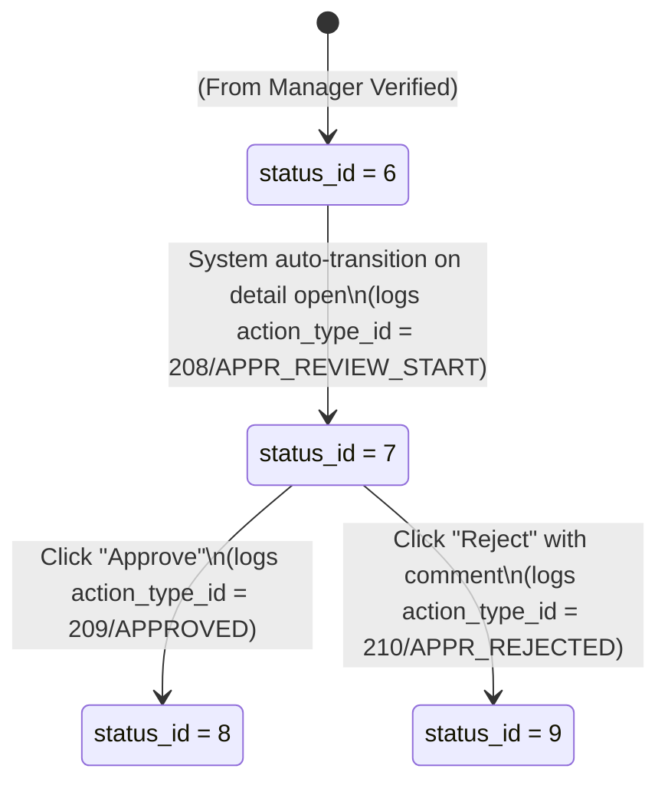

# Data Model Design: Final Approver Dashboard

This document details the database entities, validation constraints, and state transitions utilized by the Final Approver Dashboard.

---

## 1. Entity Specifications

### 1.1 PaymentRequest (payment_requests)
Represents the main payment request header.

- **Attributes**:
  - `paymentRequestId` (`payment_request_id`): `SERIAL`, PK.
  - `requestNumber` (`request_number`): `VARCHAR(50)`, Unique, format matching `^PRF-[0-9]{4}-[0-9]{3,6}$`.
  - `applicantUserId` (`applicant_user_id`): `INT`, FK referencing `users(user_id)`.
  - `managerUserId` (`manager_user_id`): `INT`, FK referencing `users(user_id)`.
  - `finalApproverUserId` (`final_approver_user_id`): `INT`, FK referencing `users(user_id)`.
  - `accountingUserId` (`accounting_user_id`): `INT`, FK referencing `users(user_id)`.
  - `currentAssignedToUserId` (`current_assigned_to_user_id`): `INT`, FK referencing `users(user_id)`.
  - `applicationDate` (`application_date`): `DATE`.
  - `desiredPaymentDate` (`desired_payment_date`): `DATE`.
  - `totalAmount` (`total_amount`): `NUMERIC(12,2)`, must be `> 0`.
  - `currencyId` (`currency_id`): `INT`, FK referencing `currencies(currency_id)`.
  - `paymentTypeId` (`payment_type_id`): `INT`, FK referencing `payment_types(payment_type_id)`.
  - `paymentMethodId` (`payment_method_id`): `INT`, FK referencing `payment_methods(payment_method_id)`.
  - `purpose` (`purpose`): `VARCHAR(500)`.
  - `bankAccountInfo` (`bank_account_info`): `VARCHAR(200)`, optional.
  - `requestContent` (`request_content`): `TEXT`.
  - `hasReceipt` (`has_receipt`): `BOOLEAN`, defaults to `true`.
  - `statusId` (`status_id`): `INT`, FK referencing `payment_statuses(status_id)`.
  - `submittedToManagerDate` (`submitted_to_manager_date`): `TIMESTAMPTZ`.
  - `managerVerificationDate` (`manager_verification_date`): `TIMESTAMPTZ`.
  - `submittedToApproverDate` (`submitted_to_approver_date`): `TIMESTAMPTZ`.
  - `approvalDate` (`approval_date`): `TIMESTAMPTZ`.
  - `paymentCompletedDate` (`payment_completed_date`): `TIMESTAMPTZ`.
  - `createdDate` (`created_date`): `TIMESTAMPTZ`.
  - `modifiedDate` (`modified_date`): `TIMESTAMPTZ`.
  - `isDeleted` (`is_deleted`): `BOOLEAN`, defaults to `false`.

- **Relationships**:
  - Many-to-One: `applicant` -> `User`
  - Many-to-One: `manager` -> `User`
  - Many-to-One: `finalApprover` -> `User`
  - Many-to-One: `currentAssignedTo` -> `User`
  - One-to-Many: `breakdownItems` -> `PaymentBreakdownItem`
  - One-to-Many: `receiptFiles` -> `ReceiptFile`
  - One-to-Many: `approvalLogs` -> `ApprovalLog`

---

### 1.2 PaymentBreakdownItem (payment_breakdown_items)
Represents the individual line items in a payment request.

- **Attributes**:
  - `paymentBreakdownItemId` (`payment_breakdown_item_id`): `SERIAL`, PK.
  - `paymentRequestId` (`payment_request_id`): `INT`, FK referencing `payment_requests(payment_request_id)`.
  - `lineNumber` (`line_number`): `INT`, compound unique with `paymentRequestId`, must be `1 <= lineNumber <= 15`.
  - `itemDate` (`item_date`): `DATE`.
  - `description` (`description`): `VARCHAR(200)`.
  - `amount` (`amount`): `NUMERIC(10,2)`, must be `> 0`.
  - `quantity` (`quantity`): `NUMERIC(10,2)`, defaults to `1.00`.
  - `unitPrice` (`unit_price`): `NUMERIC(10,2)`, optional.

- **Relationships**:
  - Many-to-One: `paymentRequest` -> `PaymentRequest` (Cascade Delete)

---

### 1.3 ReceiptFile (receipt_files)
Represents uploaded digital documents.

- **Attributes**:
  - `receiptFileId` (`receipt_file_id`): `SERIAL`, PK.
  - `paymentRequestId` (`payment_request_id`): `INT`, FK referencing `payment_requests(payment_request_id)`.
  - `originalFileName` (`original_file_name`): `VARCHAR(255)`.
  - `storedFileName` (`stored_file_name`): `VARCHAR(255)`.
  - `fileStoragePath` (`file_storage_path`): `VARCHAR(500)`.
  - `fileSize` (`file_size`): `BIGINT`, must be `0 < fileSize <= 10MB`.
  - `mimeType` (`mime_type`): `VARCHAR(100)`.
  - `uploadedByUserId` (`uploaded_by_user_id`): `INT`, FK referencing `users(user_id)`.
  - `uploadedDate` (`uploaded_date`): `TIMESTAMPTZ`.
  - `isDeleted` (`is_deleted`): `BOOLEAN`, defaults to `false`.

- **Relationships**:
  - Many-to-One: `paymentRequest` -> `PaymentRequest` (Cascade Delete)

---

### 1.4 ApprovalLog (approval_logs)
Represents append-only immutable audit trail records.

- **Attributes**:
  - `approvalLogId` (`approval_log_id`): `BIGSERIAL`, PK.
  - `paymentRequestId` (`payment_request_id`): `INT`, FK referencing `payment_requests(payment_request_id)`.
  - `actionTakenByUserId` (`action_taken_by_user_id`): `INT`, FK referencing `users(user_id)`.
  - `actionTypeId` (`action_type_id`): `INT`, FK referencing `approval_action_types(action_type_id)`.
  - `previousStatusId` (`previous_status_id`): `INT`, FK referencing `payment_statuses(status_id)`.
  - `newStatusId` (`new_status_id`): `INT`, FK referencing `payment_statuses(status_id)`.
  - `comment` (`comment`): `TEXT`, optional (mandatory on reject, minimum 10 characters).
  - `ipAddress` (`ip_address`): `VARCHAR(50)`.
  - `userAgent` (`user_agent`): `VARCHAR(500)`.
  - `timestamp` (`timestamp`): `TIMESTAMPTZ`, default `CURRENT_TIMESTAMP`.

- **Immutability Protection**: Trigger `trg_approval_logs_immutable` prevents updates/deletes.

---

## 2. Workflow State Transitions

### Transition State Mappings
- **On Open Request Detail (TR-APPR-01)**:
  - Source Status: `SUBMITTED_APPROVER (6)`
  - Target Status: `APPROVER_REVIEWING (7)`
  - Assignee update: Set `current_assigned_to_user_id = approverUserId`. Set `final_approver_user_id = approverUserId`.
- **On Approve Request (TR-APPR-02)**:
  - Source Status: `APPROVER_REVIEWING (7)`
  - Target Status: `APPROVED (8)`
  - Assignee update: Clear individual assignee (`current_assigned_to_user_id = accountingUserId ?? null`).
- **On Reject Request (TR-APPR-03)**:
  - Source Status: `APPROVER_REVIEWING (7)`
  - Target Status: `REJECTED_APPROVER (9)`
  - Assignee update: Set `current_assigned_to_user_id = applicantUserId` (assigns back to applicant).
