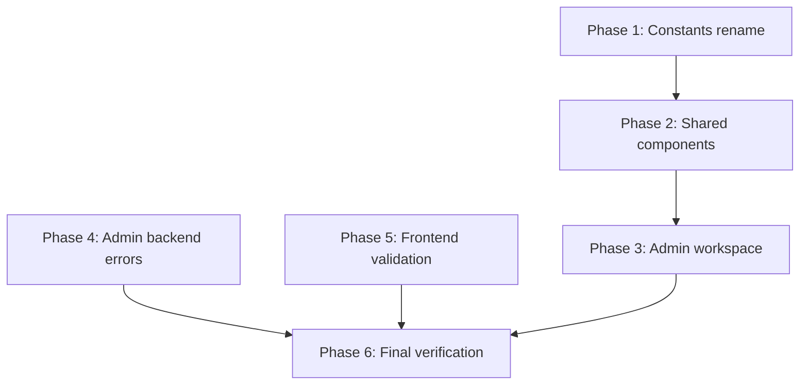

---

description: "Task list for English Localization feature"
---

# Tasks: English Localization

**Input**: Design documents from `specs/005-english-localization/`

**Prerequisites**: plan.md, spec.md, research.md, quickstart.md

**Organization**: Tasks are grouped by user story to enable independent implementation and testing of each story.

## Format: `[ID] [P?] [Story] Description`

- **[P]**: Can run in parallel (different files, no dependencies)
- **[Story]**: Which user story this task belongs to (e.g., US1, US2, US3)
- Include exact file paths in descriptions

## Path Conventions

- **Backend**: `src/` for NestJS server changes
- **Frontend**: `frontend/src/` for React SPA changes

---

## Phase 1: Shared Label Constants (Priority: P1) — US2 (Status/Action Labels)

**Goal**: Rename `*_LABELS_JP` → `*_LABELS_EN` and translate all label values in both frontend and backend copies.

**Independent Test**: After this phase, importing `STATUS_LABELS_EN["DRAFT"]` returns `"Draft"` instead of `"下書き"`.

- [X] T001 [P] [US2] Rename and translate `STATUS_LABELS_JP`→`STATUS_LABELS_EN` in `frontend/src/types/index.ts` — 10 status values to English
- [X] T002 [P] [US2] Rename and translate `ACTION_LABELS_JP`→`ACTION_LABELS_EN` in `frontend/src/types/index.ts` — 10 action values to English
- [X] T003 [P] [US2] Rename and translate `PAYMENT_TYPE_LABELS_JP`→`PAYMENT_TYPE_LABELS_EN` in `frontend/src/types/index.ts` — 4 type values to English
- [X] T004 [P] [US2] Rename and translate `PAYMENT_METHOD_LABELS_JP`→`PAYMENT_METHOD_LABELS_EN` in `frontend/src/types/index.ts` — 3 method values to English
- [X] T005 [P] [US2] Rename and translate `ROLE_LABELS_JP`→`ROLE_LABELS_EN` in `frontend/src/types/index.ts` — 5 role values to English
- [X] T006 [P] [US2] Rename and translate all 5 label constants in `src/modules/shared/types/index.ts` — same `_JP`→`_EN` rename and English values as T001–T005

**Checkpoint**: All label constants renamed and translated. Import paths will break until Phase 2 updates consumer files.

---

## Phase 2: Frontend Shared Components (Priority: P1) — US1 (All Screen Labels)

**Goal**: Update all shared component imports and inline Japanese text to use `_EN` constants and English strings.

**Depends on**: Phase 1 (T001–T006) — renamed `_EN` constants must exist.

**Independent Test**: Shared components (DataTable, StatusBadge, ConfirmDialog, ErrorBoundary, FileUploadDropzone, ApprovalTimeline) render all text in English.

- [X] T007 [US1] Update `frontend/src/components/shared/StatusBadge.tsx` — change `STATUS_LABELS_JP` import to `STATUS_LABELS_EN`, replace `不明`→`Unknown`
- [X] T008 [US1] Update `frontend/src/components/shared/ApprovalTimeline.tsx` — change `ACTION_LABELS_JP` import to `ACTION_LABELS_EN`, replace `承認履歴はありません`→`No approval history`, `不明`→`Unknown`
- [X] T009 [US1] Update `frontend/src/components/shared/DataTable.tsx` — replace pagination labels (`件`→`items`, `全`, `表示中`, `前へ`→`Previous`, `次へ`→`Next`), replace `データがありません`→`No data found`
- [X] T010 [US1] Update `frontend/src/components/shared/ConfirmDialog.tsx` — change default `確認`→`Confirm`, `キャンセル`→`Cancel`
- [X] T011 [US1] Update `frontend/src/components/shared/ErrorBoundary.tsx` — replace `エラーが発生しました`→`An error occurred`, `予期せぬエラー...`→`An unexpected error occurred. Please reload the page.`, `再読み込み`→`Reload`
- [X] T012 [US1] Update `frontend/src/components/shared/FileUploadDropzone.tsx` — replace toast errors (lines 38, 42), help text (lines 86-87), `削除`→`Remove` (line 112)

**Checkpoint**: `npm run build` in frontend → 0 TypeScript errors. All shared components show English text.

---

## Phase 3: Admin Workspace Pages (Priority: P1) — US1 (All Screen Labels)

**Goal**: Replace all Japanese labels and text in admin page components with English.

**Depends on**: Phase 2 (T007–T012) — shared components must be updated first since admin pages import them.

**Independent Test**: Navigate to each admin workspace tab — all text displays in English.

- [X] T013 [US1] Update `frontend/src/pages/admin/AdminDashboardShell.tsx` — translate sidebar nav labels (`ユーザー管理`→`User Management`, `マスターデータ`→`Master Data`, `監査ログ`→`Audit Logs`), `ログアウト`→`Logout`
- [X] T014 [US1] Update `frontend/src/pages/admin/AuditLogWorkspace.tsx` — translate page title, subtitle, filter labels, placeholder, table headers, action type options (10 items), date validation error, empty message, tooltip (~30 strings)
- [X] T015 [US1] Update `frontend/src/pages/admin/UserManagementWorkspace.tsx` — translate page title, subtitle, table headers, role/status dropdown options, placeholder, empty message, tooltips (~20 strings)
- [X] T016 [US1] Update `frontend/src/pages/admin/MasterDataWorkspace.tsx` — translate tab labels (`役割`→`Roles`, `ステータス`→`Statuses`, `支払タイプ`→`Payment Types`, `支払方法`→`Payment Methods`, `通貨`→`Currencies`), page title, subtitle, empty message
- [X] T017 [US1] Update `frontend/src/pages/admin/components/UserFormModal.tsx` — translate form labels, role options, button text, password reset messages, modal titles
- [X] T018 [US1] Update `frontend/src/pages/admin/components/MetadataDetailPanel.tsx` — translate action labels, detail field labels (`ログ詳細`→`Log Details`, `ログID`→`Log ID`, `リクエストID`→`Request ID`, `実行者`→`Actor`, `アクション`→`Action`, `日時`→`Timestamp`, `IPアドレス`→`IP Address`, `ユーザーエージェント`→`User Agent`, `コメント`→`Comment`, `不明`→`Unknown`)

**Checkpoint**: `npm run build` → 0 errors. Visual walkthrough of all admin pages shows zero Japanese text.

---

## Phase 4: Admin Backend Error Messages (Priority: P2) — US3 (Validation & Error Messages)

**Goal**: Translate Japanese error messages in admin service to English.

**Independent Test**: `npm run test` passes; `npm run build` passes; admin API error responses return English messages.

- [X] T019 [US3] Translate 9 Japanese error messages in `src/modules/admin/admin.service.ts`

**Checkpoint**: `npm run lint && npm run build && npm run test` → 0 errors, all tests pass.

---

## Phase 5: Frontend Validation & API Client Messages (Priority: P2) — US3 (Validation & Error Messages)

**Goal**: Translate Japanese validation messages and toast error messages in frontend.

**Independent Test**: Submit invalid form → English validation error. Trigger API error → English toast.

- [X] T032 [P] [US3] Translate 12 Japanese validation messages in `frontend/src/pages/applicant/utils/validation.ts`
- [X] T033 [P] [US3] Translate 5 Japanese toast error messages in `frontend/src/services/api-client.ts`

**Checkpoint**: `npm run build` → 0 errors.

---

## Phase 6: Final Verification (Priority: P3)

**Goal**: Confirm no regressions and zero Japanese text remains in the codebase.

- [X] T034 Run `npm run lint` in backend → 0 errors, 0 warnings
- [X] T035 Run `npm run build` in backend → 0 errors
- [X] T036 Run `npm run test` in backend → all tests pass
- [X] T037 Run `npm run build` in frontend → 0 errors
- [X] T038 Search for remaining Japanese characters: `rg '[ぁ-んァ-ン亜-熙]' src/ frontend/src/ --include '*.ts' --include '*.tsx' -g '!*.spec.ts'` → confirm zero matches (excluding `LanguageSwitcher.tsx` `日本語` label)
- [X] T039 Visual walkthrough: login page, applicant dashboard, admin workspace (all 3 tabs), user form modal — confirm no Japanese text visible

---

## Dependencies & Execution Order

### Phase Dependencies

### Parallel Opportunities

| Tasks | Can run in parallel with |
|-------|-------------------------|
| T001–T006 (Phase 1) | Each other (different constants) |
| T007–T012 (Phase 2) | Phase 4, Phase 5 |
| T013–T018 (Phase 3) | Phase 4, Phase 5 |
| T019 (Phase 4) | Phase 1, Phase 2, Phase 3, Phase 5 |
| T032–T033 (Phase 5) | Phase 2, Phase 3, Phase 4 |
| T034–T039 (Phase 6) | Nothing — runs last |

### Within Each Phase

- Tasks marked [P] can run in parallel
- Tasks without [P] should be done in sequence (same file, incremental edits)

---

## Implementation Strategy

### Recommended Execution Order

1. **Phase 1** (Constants rename) — foundational for Phase 2 imports
2. **Phase 4** (Backend errors) — can run in parallel with Phase 1
3. **Phase 5** (Frontend validation) — can run in parallel with Phase 1 + 4
4. **Phase 2** (Shared components) — depends on Phase 1
5. **Phase 3** (Admin workspace) — depends on Phase 2
6. **Phase 6** (Final verification) — depends on all

### Incremental Delivery

1. Phase 1 + Phase 4 + Phase 5 done → MVP: Labels and error messages are English, backend speaks English
2. Phase 2 done → Shared components show English
3. Phase 3 done → Full admin workspace in English
4. Phase 6 done → All verified

### Notes

- `LanguageSwitcher.tsx` `日本語` label is kept as-is — it's the native language name, not user-facing UI text
- No new files, no new dependencies, no npm install needed
